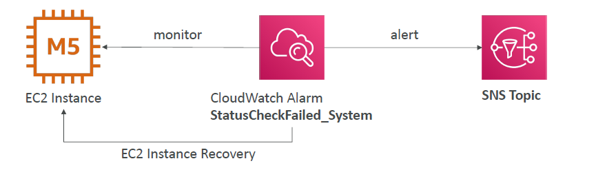

# CloudWatch Alarms

- Alarms are used to trigger notifications for any metric
- Various options (sampling, %, max, min, etc…)
- Alarm States:
  - OK
  - INSUFFICIENT_DATA
  - ALARM
- Period:
  - Length of time in seconds to evaluate the metric
  - High resolution custom metrics: 10 sec, 30 sec or multiples of 60 sec

## CloudWatch Alarm Targets

- Stop, Terminate, Reboot, or Recover an EC2 Instance
- Trigger Auto Scaling Action
- Send notification to SNS (from which you can do pretty much anything)

## CloudWatch Alarms – Composite Alarms

- CloudWatch Alarms are on a single metric
- Composite Alarms are monitoring the states of multiple other alarms
- AND and OR conditions
- Helpful to reduce “alarm noise” by creating complex composite alarms

## EC2 Instance Recovery

- Status Check:
  - Instance status = check the EC2 VM
  - System status = check the underlying hardware

- Recovery: Same Private, Public, Elastic IP, metadata, placement group

## CloudWatch Alarm: good to know

- Alarms can be created based on CloudWatch Logs Metrics Filters
- To test alarms and notifications, set the alarm state to Alarm using CLI
  `aws cloudwatch set-alarm-state --alarm-name "myalarm" --state-value ALARM --state-reason "testing purposes"`
