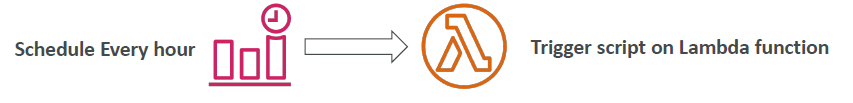
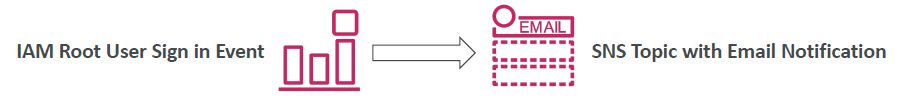
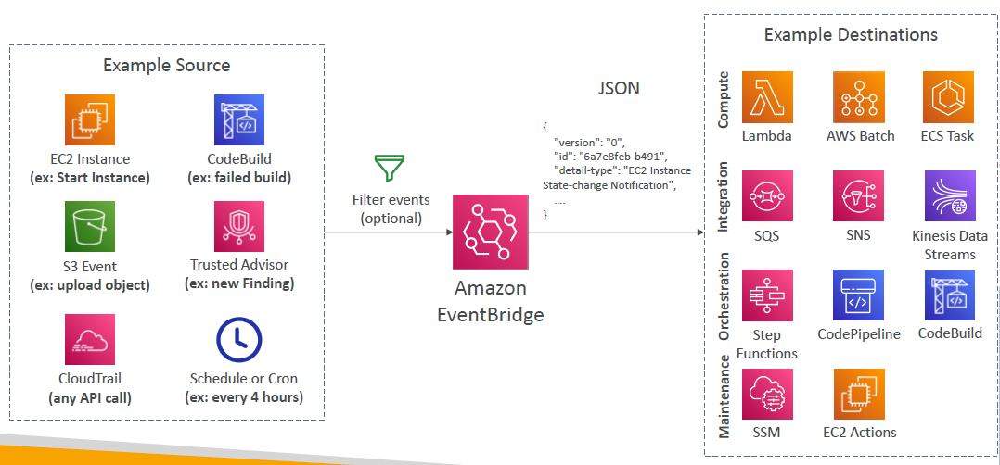
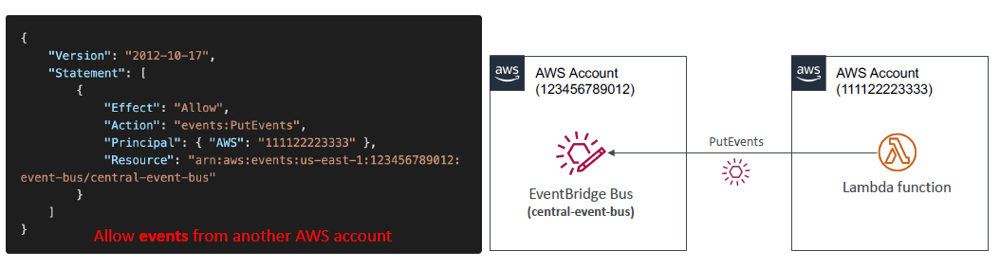
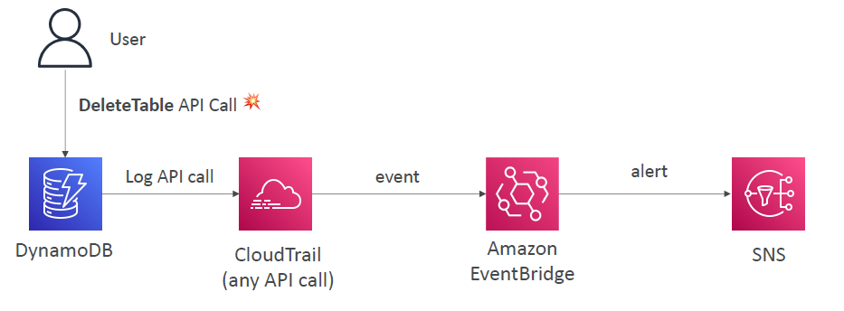
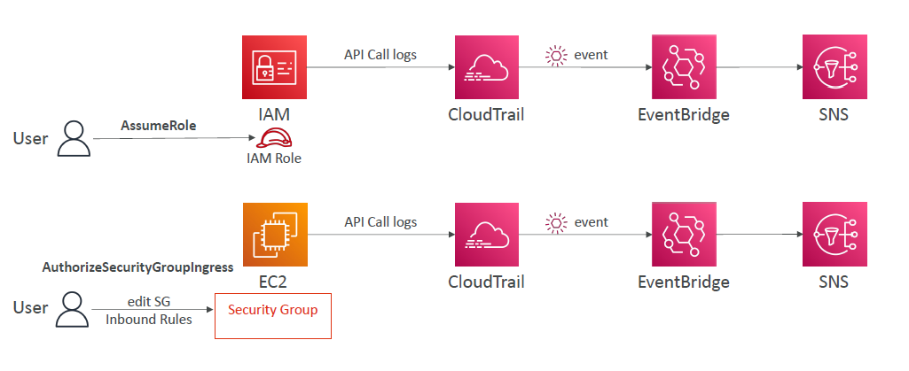

# Amazon EventBridge (formerly CloudWatch Events)

- Schedule: Cron jobs (scheduled scripts)

- Event Pattern: Event rules to react to a service doing something

- Trigger Lambda functions, send SQS/SNS messages…

- Event buses can be accessed by other AWS accounts using Resource-based Policies
- You can archive events (all/filter) sent to an event bus (indefinitely or set period)
- Ability to replay archived events

# EventBridge Rules

# Amazon EventBridge – Schema Registry

- EventBridge can analyze the events in your bus and infer the schema
- The Schema Registry allows you to generate code for your application, that will know in advance how data is structured in the event bus
- Schema can be versioned

# Amazon EventBridge – Resource-based Policy

- Manage permissions for a specific Event Bus
- Example: allow/deny events from another AWS account or AWS region
- Use case: aggregate all events from your AWS Organization in a single AWS account or AWS region

# Intercept API Calls

# Amazon EventBridge + CloudTrail

