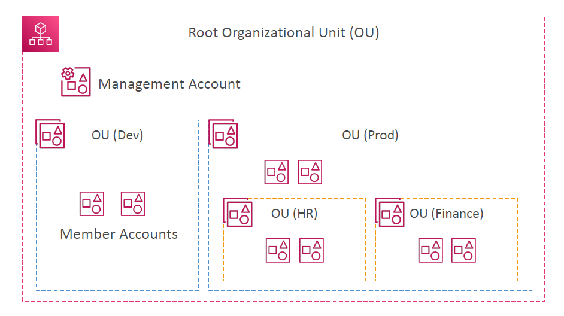
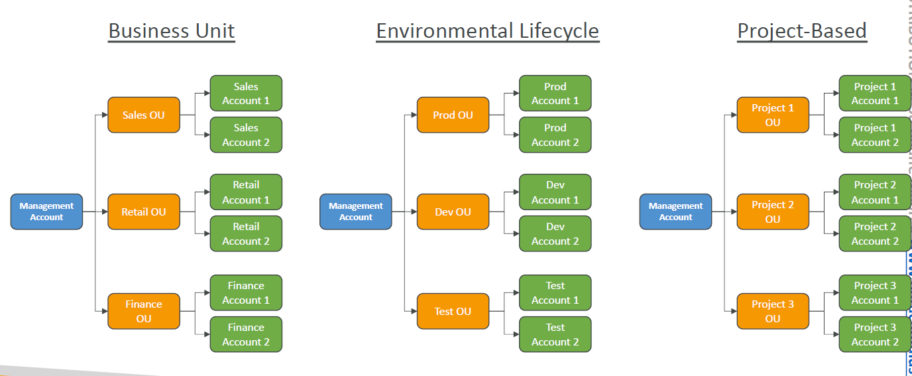
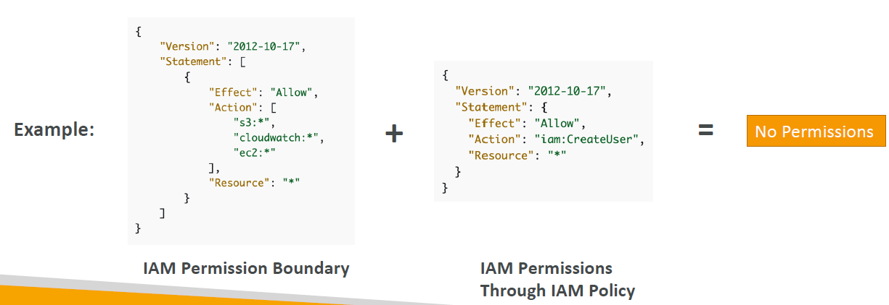
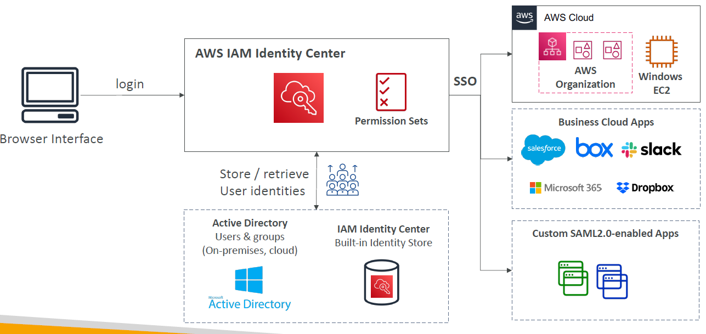
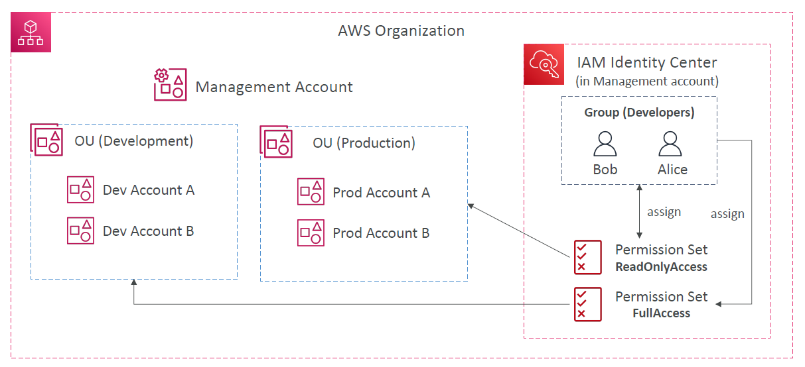
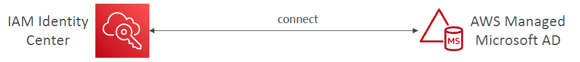
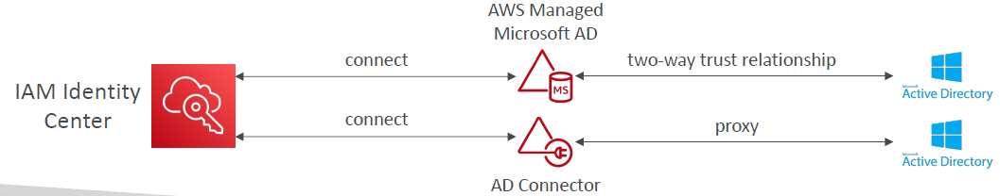
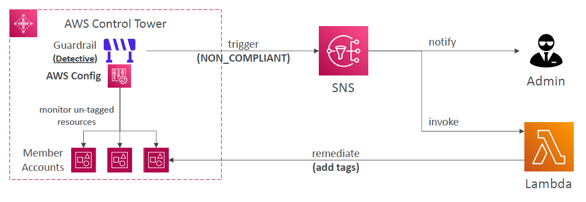

# AWS Organizations

- Global service
- Allows to manage multiple AWS accounts
- The main account is the management account
- Other accounts are member accounts
- Member accounts can only be part of one organization
- Consolidated Billing across all accounts - single payment method
- Pricing benefits from aggregated usage (volume discount for EC2, S3…)
- Shared reserved instances and Savings Plans discounts across accounts
- API is available to automate AWS account creation

## Diagram

## Organization Unit

## Benefits of Organization

- Advantages
  - Multi Account vs One Account Multi VPC
  - Use tagging standards for billing purposes
  - Enable CloudTrail on all accounts, send logs to central S3 account
  - Send CloudWatch Logs to central logging account
  - Establish Cross Account Roles for Admin purposes
- Security: Service Control Policies (SCP)
  - IAM policies applied to OU or Accounts to restrict Users and Roles
  - They do not apply to the management account (full admin power)
  - Must have an explicit allow from the root through each OU in the direct path to the target account (does not allow anything by default – like IAM)

# IAM Conditions

Slide 637 - 640

# IAM Roles vs Resource Based Policies

- Cross account:
  - attaching a resource-based policy to a resource (example: S3 bucket policy)
  - OR using a role as a proxy

- When you assume a role (user, application or service), you give up your original permissions and take the permissions assigned to the role
- When using a resource-based policy, the principal doesn’t have to give up his permissions
- Example: User in account A needs to scan a DynamoDB table in Account A and dump it in an S3 bucket in Account B.
- Supported by: Amazon S3 buckets, SNS topics, SQS queues, etc…

# Amazon EventBridge – Security

- When a rule runs, it needs permissions on the target
- Resource-based policy: Lambda, SNS, SQS, S3 buckets, API Gateway…
- IAM role: Kinesis stream, Systems Manager Run Command, ECS task…

# IAM Permission Boundaries

- IAM Permission Boundaries are supported for users and roles (not groups)
- Advanced feature to use a managed policy to set the maximum permissions an IAM entity can get.

- Can be used in combinations of AWS Organizations SCP

https://docs.aws.amazon.com/IAM/latest/UserGuide/reference_policies_evaluation-logic.html

- Use cases
  - Delegate responsibilities to non administrators within their permission boundaries, for example create new IAM users
  - Allow developers to self-assign policies and manage their own permissions, while making sure they can’t “escalate” their privileges (= make themselves admin)
  - Useful to restrict one specific user (instead of a whole account using Organizations & SCP)

# IAM Policy Evaluation Logic

https://docs.aws.amazon.com/IAM/latest/UserGuide/reference_policies_evaluation-logic.html

# AWS IAM Identity Center (successor to AWS Single Sign-On)

- One login (single sign-on) for all your
  - AWS accounts in AWS Organizations
  - Business cloud applications (e.g., Salesforce, Box, Microsoft 365, …)
  - SAML2.0-enabled applications
  - EC2 Windows Instances
- Identity providers
  - Built-in identity store in IAM Identity Center
  - 3rd party: Active Directory (AD), OneLogin, Okta…

## How it works

## AWS IAM Identity Center Fine-grained Permissions and Assignments

- Multi-Account Permissions
  - Manage access across AWS accounts in your AWS Organization
  - Permission Sets – a collection of one or more IAM Policies assigned to users and groups to define AWS access
- Application Assignments
  - SSO access to many SAML 2.0 business applications (Salesforce, Box, Microsoft 365, …)
  - Provide required URLs, certificates, and metadata
- Attribute-Based Access Control (ABAC)
  - Fine-grained permissions based on users’ attributes stored in IAM Identity Center Identity Store
  - Example: cost center, title, locale, …
  - Use case: Define permissions once, then modify AWS access by changing the attributes

# AWS Directory Services

- AWS Managed Microsoft AD
  - Create your own AD in AWS, manage users locally, supports MFA
  - Establish “trust” connections with your onpremises AD
- AD Connector
  - Directory Gateway (proxy) to redirect to onpremises AD, supports MFA
  - Users are managed on the on-premises AD
- Simple AD
  - AD-compatible managed directory on AWS
  - Cannot be joined with on-premises AD

## What is Microsoft Active Directory (AD)?

- Found on any Windows Server with AD Domain Services
- Database of objects: User Accounts, Computers, Printers, File Shares, Security Groups
- Centralized security management, create account, assign permissions
- Objects are organized in trees
- A group of trees is a forest

## IAM Identity Center – Active Directory Setup

- Connect to an AWS Managed Microsoft AD (Directory Service)
  - Integration is out of the box

- Connect to a Self-Managed Directory
  - Create Two-way Trust Relationship using AWS Managed Microsoft AD
  - Create an AD Connector

# AWS Control Tower

- Easy way to set up and govern a secure and compliant multi-account AWS environment based on best practices
- AWS Control Tower uses AWS Organizations to create accounts
- Benefits:
  - Automate the set up of your environment in a few clicks
  - Automate ongoing policy management using guardrails
  - Detect policy violations and remediate them
  - Monitor compliance through an interactive dashboard

## AWS Control Tower – Guardrails

- Provides ongoing governance for your Control Tower environment (AWS Accounts)
- Preventive Guardrail – using SCPs (e.g., Restrict Regions across all your accounts)
- Detective Guardrail – using AWS Config (e.g., identify untagged resources)

