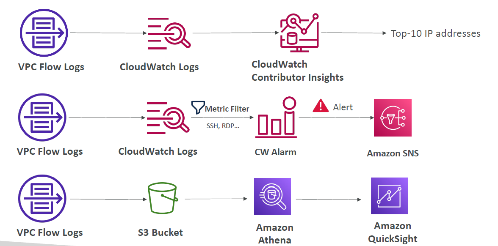

# Virtual Private Cloud (VPC)

## Understanding CIDR

### IPv4

- Classless Inter-Domain Routing – a method for allocating IP addresses
- Used in Security Groups rules and AWS networking in general
- They help to define an IP address range:

  - We’ve seen WW.XX.YY.ZZ/32 => one IP
  - We’ve seen 0.0.0.0/0 => all IPs
  - But we can define:192.168.0.0/26 =>192.168.0.0 – 192.168.0.63 (64 IP addresses)

- A CIDR consists of two components
- Base IP
  - Represents an IP contained in the range (XX.XX.XX.XX)
  - Example: 10.0.0.0, 192.168.0.0, …
- Subnet Mask
  - Defines how many bits can change in the IP
  - Example: /0, /24, /32
  - Can take two forms:
    - /8 <-> 255.0.0.0
    - /16 <-> 255.255.0.0
    - /24 <-> 255.255.255.0
    - /32 <-> 255.255.255.255

### Subnet Mask

- The Subnet Mask basically allows part of the underlying IP to get additional next values from the base IP

Useful site: https://www.ipaddressguide.com/cidr

## Public vs. Private IP (IPv4)

- The Internet Assigned Numbers Authority (IANA) established certain blocks of IPv4 addresses for the use of private (LAN) and public (Internet) addresses
- Private IP can only allow certain values:
  - 10.0.0.0 – 10.255.255.255 (10.0.0.0/8) <= in big networks
  - 172.16.0.0 – 172.31.255.255 (172.16.0.0/12) <= AWS default VPC in that range
  - 192.168.0.0 – 192.168.255.255 (192.168.0.0/16) <= e.g., home networks
- All the rest of the IP addresses on the Internet are Public

## Default VPC Walkthrough

- All new AWS accounts have a default VPC
- New EC2 instances are launched into the default VPC if no subnet is specified
- Default VPC has Internet connectivity and all EC2 instances inside it have public IPv4 addresses
- We also get a public and a private IPv4 DNS names

## VPC in AWS – IPv4

- You can have multiple VPCs in an AWS region (max. 5 per region – soft limit)
- Max. CIDR per VPC is 5, for each CIDR:
  - Min. size is /28 (16 IP addresses)
  - Max. size is /16 (65536 IP addresses)
- Because VPC is private, only the Private IPv4 ranges are allowed:
  - 10.0.0.0 – 10.255.255.255 (10.0.0.0/8)
  - 172.16.0.0 – 172.31.255.255 (172.16.0.0/12)
  - 192.168.0.0 – 192.168.255.255 (192.168.0.0/16)
- Your VPC CIDR should NOT overlap with your other networks (e.g., corporate)

## VPC - Subnet (IPv4)

- AWS reserves 5 IP addresses (first 4 & last 1) in each subnet
- These 5 IP addresses are not available for use and can’t be assigned to an EC2 instance
- Example: if CIDR block 10.0.0.0/24, then reserved IP addresses are:
  - 10.0.0.0 – Network Address
  - 10.0.0.1 – reserved by AWS for the VPC router
  - 10.0.0.2 – reserved by AWS for mapping to Amazon-provided DNS
  - 10.0.0.3 – reserved by AWS for future use
  - 10.0.0.255 – Network Broadcast Address. AWS does not support broadcast in a VPC, therefore the address is reserved
- Exam Tip, if you need 29 IP addresses for EC2 instances:
  - You can’t choose a subnet of size /27 (32 IP addresses, 32 – 5 = 27 < 29)
  - You need to choose a subnet of size /26 (64 IP addresses, 64 – 5 = 59 > 29)

## Internet Gateway (IGW)

- Allows resources (e.g., EC2 instances) in a VPC connect to the Internet
- It scales horizontally and is highly available and redundant
- Must be created separately from a VPC
- One VPC can only be attached to one IGW and vice versa
- Internet Gateways on their own do not allow Internet access…
- Route tables must also be edited!

### Adding Internet Gateway + Editing Route Tables

## Bastion Hosts

- We can use a Bastion Host to SSH into our private EC2 instances
- The bastion is in the public subnet which is then connected to all other private subnets
- Bastion Host security group must allow inbound from the internet on port 22 from restricted CIDR, for example the public CIDR of your corporation
- Security Group of the EC2 Instances must allow the Security Group of the Bastion Host, or the private IP of the Bastion host

## NAT Instance (outdated, but still at the exam)

- NAT = Network Address Translation
- Allows EC2 instances in private subnets to connect to the Internet
- Must be launched in a public subnet
- Must disable EC2 setting: Source / destination Check
- Must have Elastic IP attached to it
- Route Tables must be configured to route traffic from private subnets to the NAT Instance

### NAT Instance – Comments

- Pre-configured Amazon Linux AMI is available
  - Reached the end of standard support on December 31, 2020
- Not highly available / resilient setup out of the box
  - You need to create an ASG in multi-AZ + resilient user-data script
- Internet traffic bandwidth depends on EC2 instance type
- You must manage Security Groups & rules:
  - Inbound:
    - Allow HTTP / HTTPS traffic coming from Private Subnets
    - Allow SSH from your home network (access is provided through Internet Gateway)
  - Outbound:
    - Allow HTTP / HTTPS traffic to the Internet

## NAT Gateway

- AWS-managed NAT, higher bandwidth, high availability, no administration
- Pay per hour for usage and bandwidth
- NATGW is created in a specific Availability Zone, uses an Elastic IP
- Can’t be used by EC2 instance in the same subnet (only from other subnets)
- Requires an IGW (Private Subnet => NATGW => IGW)
- 5 Gbps of bandwidth with automatic scaling up to 100 Gbps
- No Security Groups to manage / required

### NAT Gateway with High Availability

- NAT Gateway is resilient within a single Availability Zone
- Must create multiple NAT Gateways in multiple AZs for fault-tolerance
- There is no cross-AZ failover needed because if an AZ goes down it doesn't need NAT

### NAT Gateway vs. NAT Instance

https://docs.aws.amazon.com/vpc/latest/userguide/vpc-nat-comparison.html

## Security Groups & NACLs

### Network Access Control List (NACL)

- NACL are like a firewall which control traffic from and to subnets
- One NACL per subnet, new subnets are assigned the Default NACL
- You define NACL Rules:
  - Rules have a number (1-32766), higher precedence with a lower number
  - First rule match will drive the decision
  - Example: if you define #100 ALLOW 10.0.0.10/32 and #200 DENY 10.0.0.10/32, the IP address will be allowed because 100 has a higher precedence over 200
  - The last rule is an asterisk (\*) and denies a request in case of no rule match
  - AWS recommends adding rules by increment of 100
- Newly created NACLs will deny everything
- NACL are a great way of blocking a specific IP address at the subnet level

#### Default NACL

- Accepts everything inbound/outbound with the subnets it’s associated with
- Do NOT modify the Default NACL, instead create custom NACLs

### Ephemeral Ports

- For any two endpoints to establish a connection, they must use ports
- Clients connect to a defined port, and expect a response on an ephemeral port
- Different Operating Systems use different port ranges, examples:
  - IANA & MS Windows 10 -> 49152 – 65535
  - Many Linux Kernels -> 32768 – 60999

#### NACL with Ephemeral Ports

https://docs.aws.amazon.com/vpc/latest/userguide/vpc-network-acls.html

#### Create NACL rules for each target subnets CIDR

### Security Group vs. NACLs

https://docs.aws.amazon.com/vpc/latest/userguide/vpc-network-acls.html

### VPC Peering

- Privately connect two VPCs using AWS’ network
- Make them behave as if they were in the same network
- Must not have overlapping CIDRs
- VPC Peering connection is NOT transitive (must be established for each VPC that need to communicate with one another)
- You must update route tables in each VPC’s subnets to ensure EC2 instances can communicate with each other

#### VPC Peering – Good to know

- You can create VPC Peering connection between VPCs in different AWS accounts/regions
- You can reference a security group in a peered VPC (works cross accounts – same region)

### VPC Endpoints

- Every AWS service is publicly exposed (public URL)
- VPC Endpoints (powered by AWS PrivateLink) allows you to connect to AWS services using a private network instead of using the public Internet
- They’re redundant and scale horizontally
- They remove the need of IGW, NATGW, … to access AWS Services
- In case of issues:
  - Check DNS Setting Resolution in your VPC
  - Check Route Tables

#### Types of Endpoints

- Interface Endpoints (powered by PrivateLink)
  - Provisions an ENI (private IP address) as an entry point (must attach a Security Group)
  - Supports most AWS services
  - $ per hour + $ per GB of data processed
- Gateway Endpoints
  - Provisions a gateway and must be used as a target in a route table (does not use security groups)
  - Supports both S3 and DynamoDB
  - Free

#### Gateway or Interface Endpoint for S3?

- Gateway is most likely going to be preferred all the time at the exam
- Cost: free for Gateway, $ for interface endpoint
- Interface Endpoint is preferred access is required from onpremises (Site to Site VPN or Direct Connect), a different VPC or a different region

### VPC Flow Logs

- Capture information about IP traffic going into your interfaces:
  - VPC Flow Logs
  - Subnet Flow Logs
  - Elastic Network Interface (ENI) Flow Logs
- Helps to monitor & troubleshoot connectivity issues
- Flow logs data can go to S3, CloudWatch Logs, and Kinesis Data Firehose
- Captures network information from AWS managed interfaces too: ELB, RDS, ElastiCache, Redshift, WorkSpaces, NATGW, Transit Gateway…

#### VPC Flow Logs Syntax

- srcaddr & dstaddr – help identify problematic IP
- srcport & dstport – help identity problematic ports
- Action – success or failure of the request due to Security Group / NACL
- Can be used for analytics on usage patterns, or malicious behavior
- Query VPC flow logs using Athena on S3 or CloudWatch Logs Insights
- Flow Logs examples: https://docs.aws.amazon.com/vpc/latest/userguide/flow-logsrecords-examples.html

#### VPC Flow Logs - Architectures

