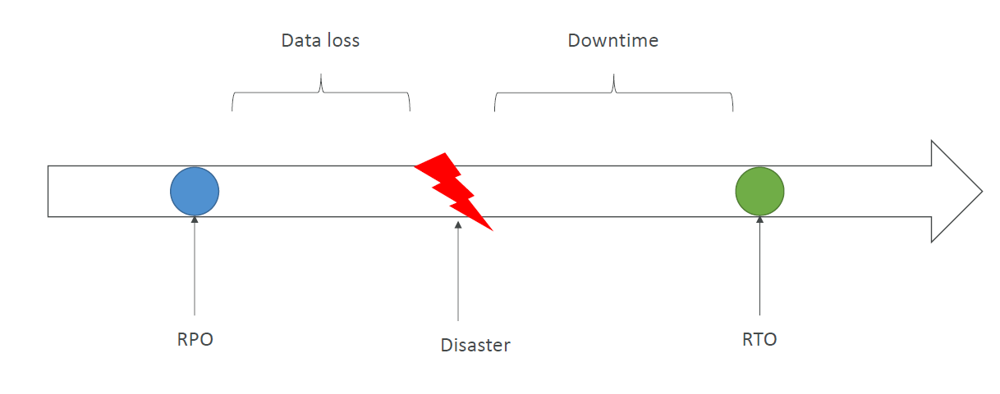
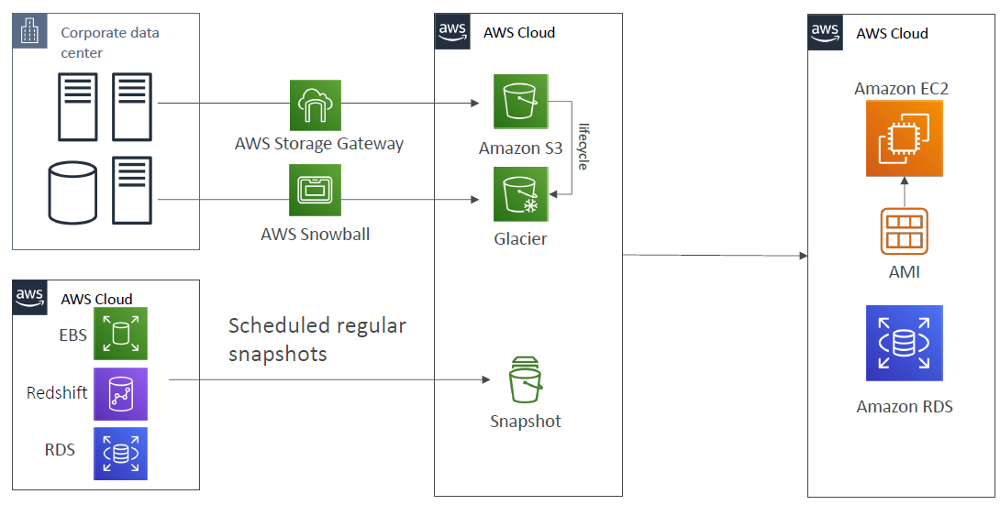
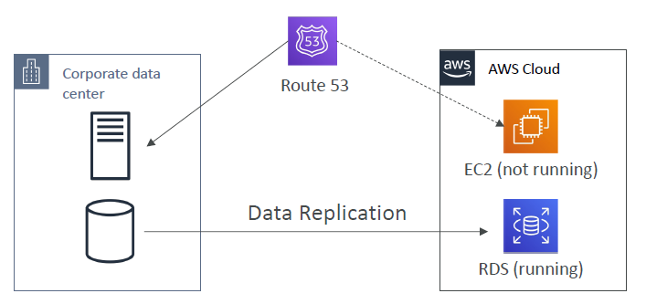
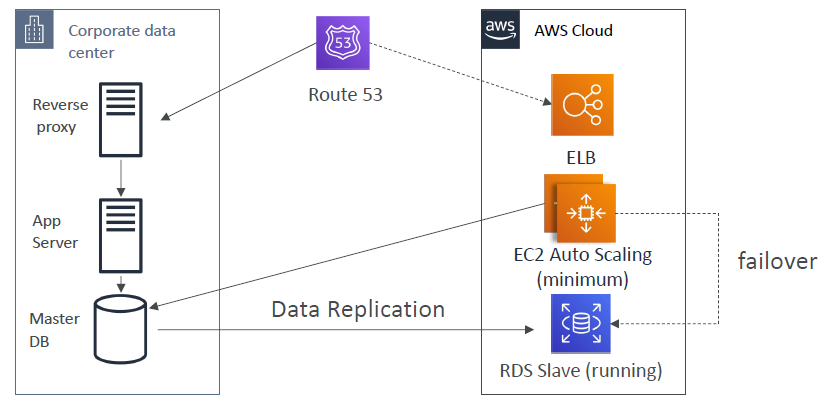
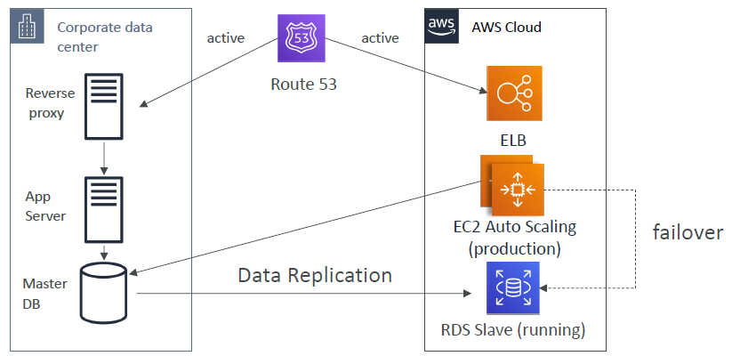
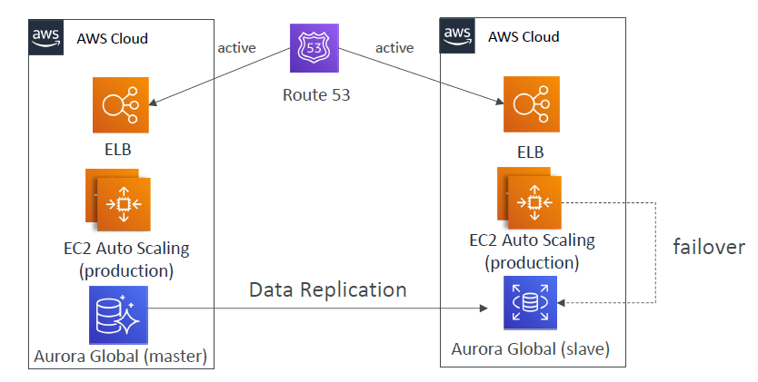
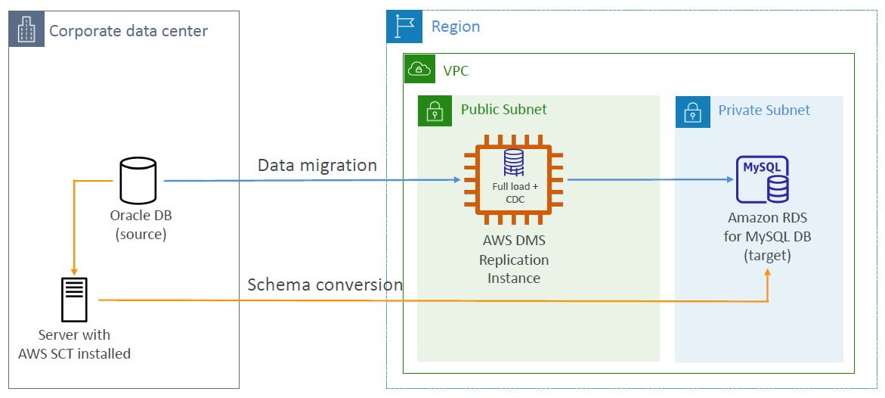
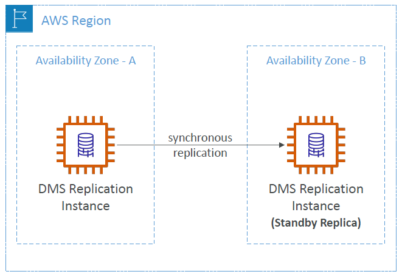
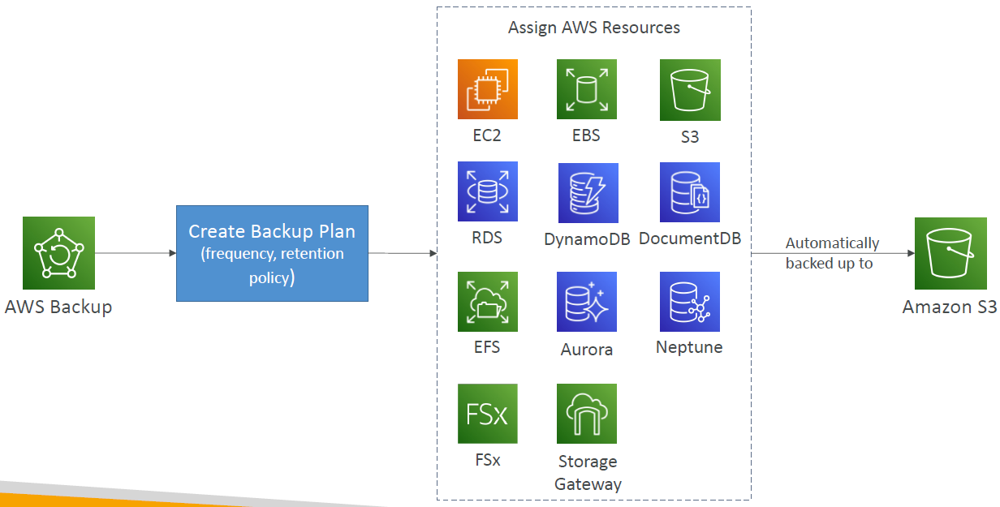

# Disaster Recovery

## Overview

- Any event that has a negative impact on a company’s business continuity or finances is a disaster
- Disaster recovery (DR) is about preparing for and recovering from a disaster
- What kind of disaster recovery?
  - On-premise => On-premise: traditional DR, and very expensive
  - On-premise => AWS Cloud: hybrid recovery
  - AWS Cloud Region A => AWS Cloud Region B
- Need to define two terms:
  - RPO: Recovery Point Objective
  - RTO: Recovery Time Objective

## RPO and RTO

## Disaster Recovery Strategies

- Backup and Restore
- Pilot Light
- Warm Standby
- Hot Site / Multi Site Approach

https://docs.aws.amazon.com/whitepapers/latest/disaster-recovery-workloads-on-aws/disaster-recovery-options-in-the-cloud.html

### Backup and Restore (High RPO)

### Pilot Light

- A small version of the app is always running in the cloud
- Useful for the critical core (pilot light)
- Very similar to Backup and Restore
- Faster than Backup and Restore as critical systems are already up

### Warm Standby

- Full system is up and running, but at minimum size
- Upon disaster, we can scale to production load

### Multi Site / Hot Site Approach

- Very low RTO (minutes or seconds) – very expensive
- Full Production Scale is running AWS and On Premise

### All AWS Multi Region

## Disaster Recovery Tips

- Backup
  - EBS Snapshots, RDS automated backups / Snapshots, etc…
  - Regular pushes to S3 / S3 IA / Glacier, Lifecycle Policy, Cross Region Replication
  - From On-Premise: Snowball or Storage Gateway
- High Availability
  - Use Route53 to migrate DNS over from Region to Region
  - RDS Multi-AZ, ElastiCache Multi-AZ, EFS, S3
  - Site to Site VPN as a recovery from Direct Connect
- Replication
  - RDS Replication (Cross Region), AWS Aurora + Global Databases
  - Database replication from on-premises to RDS
  - Storage Gateway
- Automation
  - CloudFormation / Elastic Beanstalk to re-create a whole new environment
  - Recover / Reboot EC2 instances with CloudWatch if alarms fail
  - AWS Lambda functions for customized automations
- Chaos
  - Netflix has a “simian-army” randomly terminating EC2

# DMS – Database Migration Service

- Quickly and securely migrate databases to AWS, resilient, self healing
- The source database remains available during the migration
- Supports:
  - Homogeneous migrations: ex Oracle to Oracle
  - Heterogeneous migrations: ex Microsoft SQL Server to Aurora
- Continuous Data Replication using CDC
- You must create an EC2 instance to perform the replication tasks

## DMS Sources and Targets

### SOURCES:

- On-Premises and EC2 instances databases: Oracle, MS SQL Server, MySQL, MariaDB, PostgreSQL, MongoDB, SAP, DB2
- Azure: Azure SQL Database
- Amazon RDS: all including Aurora
- Amazon S3
- DocumentDB

### TARGETS:

- On-Premises and EC2 instances databases: Oracle, MS SQL Server, MySQL, MariaDB, PostgreSQL, SAP
- Amazon RDS
- Redshift, DynamoDB, S3
- OpenSearch Service
- Kinesis Data Streams
- Apache Kafka
- DocumentDB & Amazon Neptune
- Redis & Babelfish

## AWS Schema Conversion Tool (SCT)

- Convert your Database’s Schema from one engine to another
- Example OLTP: (SQL Server or Oracle) to MySQL, PostgreSQL, Aurora
- Example OLAP: (Teradata or Oracle) to Amazon Redshift
- Prefer compute-intensive instances to optimize data conversions

- You do not need to use SCT if you are migrating the same DB engine
  - Ex: On-Premise PostgreSQL => RDS PostgreSQL
  - The DB engine is still PostgreSQL (RDS is the platform)

## DMS - Continuous Replication

### AWS DMS – Multi-AZ Deployment

- When Multi-AZ Enabled, DMS provisions and maintains a synchronously stand replica in a different AZ
- Advantages:
  - Provides Data Redundancy
  - Eliminates I/O freezes
  - Minimizes latency spikes

# RDS & Aurora MySQL Migrations

- RDS MySQL to Aurora MySQL
  - Option 1: DB Snapshots from RDS MySQL restored as MySQL Aurora DB
  - Option 2: Create an Aurora Read Replica from your RDS MySQL, and when the replication lag is 0, promote it as its own DB cluster (can take time and cost $)
- External MySQL to Aurora MySQL
  - Option 1:
    - Use Percona XtraBackup to create a file backup in Amazon S3
    - Create an Aurora MySQL DB from Amazon S3
  - Option 2:
    - Create an Aurora MySQL DB
    - Use the mysqldump utility to migrate MySQL into Aurora (slower than S3 method)
- Use DMS if both databases are up and running

# RDS & Aurora PostgreSQL Migrations

- RDS PostgreSQL to Aurora PostgreSQL
  - Option 1: DB Snapshots from RDS PostgreSQL restored as PostgreSQL Aurora DB
  - Option 2: Create an Aurora Read Replica from your RDS PostgreSQL, and when the replication lag is 0, promote it as its own DB cluster (can take time and cost $)
- External PostgreSQL to Aurora PostgreSQL
  - Create a backup and put it in Amazon S3
  - Import it using the aws_s3 Aurora extension
- Use DMS if both databases are up and running

# On-Premise strategy with AWS

- Ability to download Amazon Linux 2 AMI as a VM (.iso format)
  - VMWare, KVM, VirtualBox (Oracle VM), Microsoft Hyper-V
- VM Import / Export
  - Migrate existing applications into EC2
  - Create a DR repository strategy for your on-premises VMs
  - Can export back the VMs from EC2 to on-premises
- AWS Application Discovery Service
  - Gather information about your on-premises servers to plan a migration
  - Server utilization and dependency mappings
  - Track with AWS Migration Hub
- AWS Database Migration Service (DMS)
  - replicate On-premise => AWS , AWS => AWS, AWS => On-premise
  - Works with various database technologies (Oracle, MySQL, DynamoDB, etc..)
- AWS Server Migration Service (SMS)
  - Incremental replication of on-premises live servers to AWS

# AWS Backup

- Fully managed service
- Centrally manage and automate backups across AWS services
- No need to create custom scripts and manual processes
- Supported services:
  - Amazon EC2 / Amazon EBS
  - Amazon S3
  - Amazon RDS (all DBs engines) / Amazon Aurora / Amazon DynamoDB
  - Amazon DocumentDB / Amazon Neptune
  - Amazon EFS / Amazon FSx (Lustre & Windows File Server)
  - AWS Storage Gateway (Volume Gateway)
- Supports cross-region backups
- Supports cross-account backups
- Supports PITR for supported services
- On-Demand and Scheduled backups
- Tag-based backup policies
- You create backup policies known as Backup Plans
  - Backup frequency (every 12 hours, daily, weekly, monthly, cron expression)
  - Backup window
  - Transition to Cold Storage (Never, Days, Weeks, Months, Years)
  - Retention Period (Always, Days, Weeks, Months, Years)

## Diagram

## Vault Lock

- Enforce a WORM (Write Once Read Many) state for all the backups that you store in your AWS Backup Vault
- Additional layer of defense to protect your backups against:
  - Inadvertent or malicious delete operations
  - Updates that shorten or alter retention periods
- Even the root user cannot delete backups when enabled

# AWS Application Discovery Service

- Plan migration projects by gathering information about on-premises data centers
- Server utilization data and dependency mapping are important for migrations
- Agentless Discovery (AWS Agentless Discovery Connector)
  - VM inventory, configuration, and performance history such as CPU, memory, and disk usage
- Agent-based Discovery (AWS Application Discovery Agent)
  - System configuration, system performance, running processes, and details of the network connections between systems
- Resulting data can be viewed within AWS Migration Hub

# AWS Application Migration Service (MGN)

- The "AWS evolution" of CloudEndure Migration, replacing AWS Server Migration Service (SMS)
- Lift-and-shift (rehost) solution which simplify migrating applications to AWS
- Converts your physical, virtual, and cloud-based servers to run natively on AWS
- Supports wide range of platforms, Operating Systems, and databases
- Minimal downtime, reduced costs

# Transferring large amount of data into AWS

- Example: transfer 200 TB of data in the cloud. We have a 100 Mbps internet connection.
- Over the internet / Site-to-Site VPN:
  - Immediate to setup
  - Will take 200(TB)\*1000(GB)\*1000(MB)\*8(Mb)/100 Mbps = 16,000,000s = 185d
- Over direct connect 1Gbps:
  - Long for the one-time setup (over a month)
  - Will take 200(TB)\*1000(GB)\*8(Gb)/1 Gbps = 1,600,000s = 18.5d
- Over Snowball:
  - Will take 2 to 3 snowballs in parallel
  - Takes about 1 week for the end-to-end transfer
  - Can be combined with DMS
- For on-going replication / transfers: Site-to-Site VPN or DX with DMS or DataSync

# VMware Cloud on AWS

- Some customers use VMware Cloud to manage their on-premises Data Center
- They want to extend the Data Center capacity to AWS, but keep using the VMware Cloud software
- …Enter VMware Cloud on AWS
- Use cases
  - Migrate your VMware vSphere-based workloads to AWS
  - Run your production workloads across VMware vSphere-based private, public, and hybrid cloud environments
  - Have a disaster recover strategy

