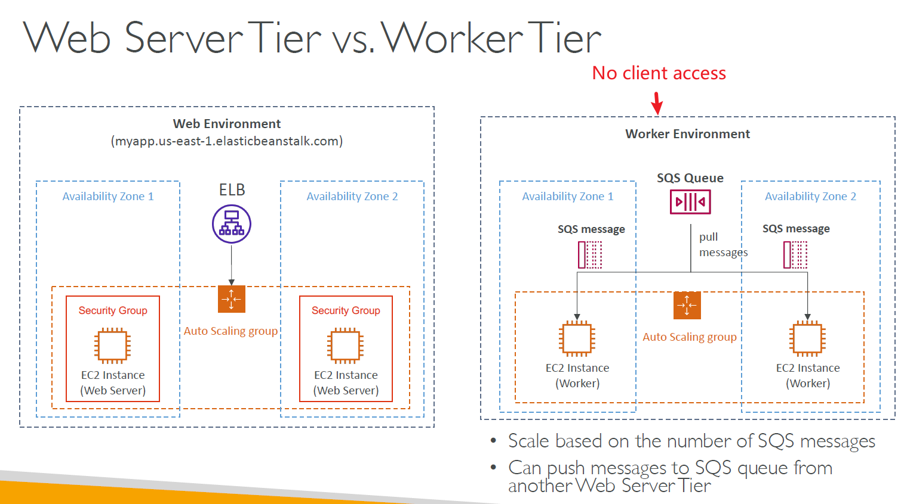
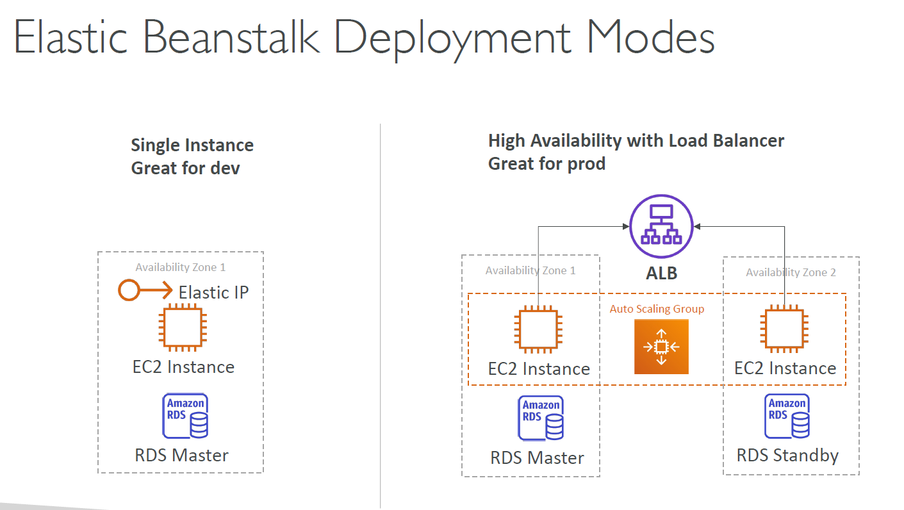
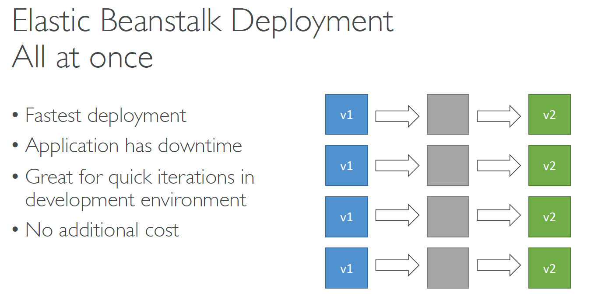
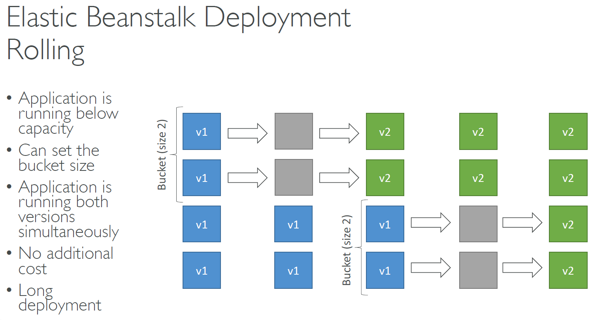
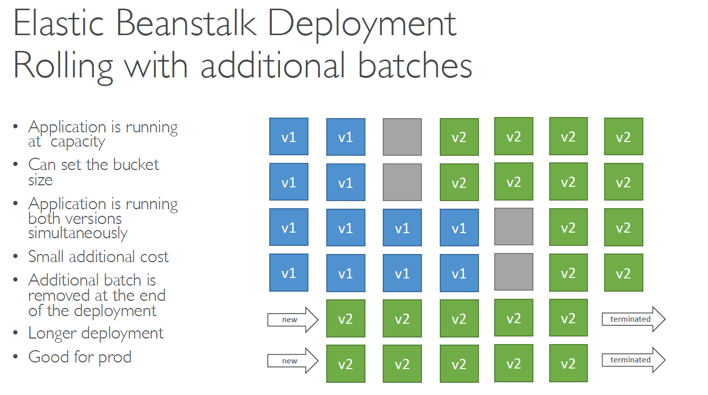
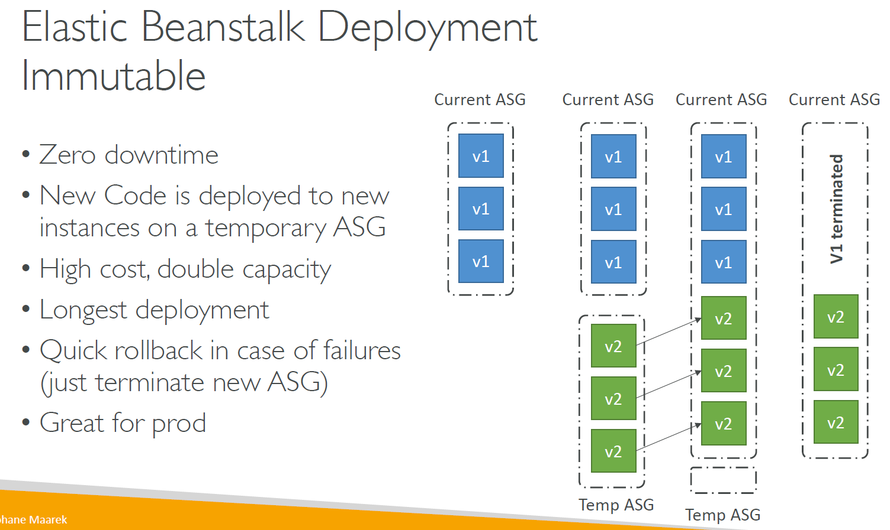
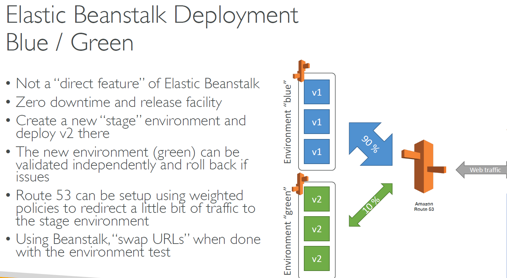
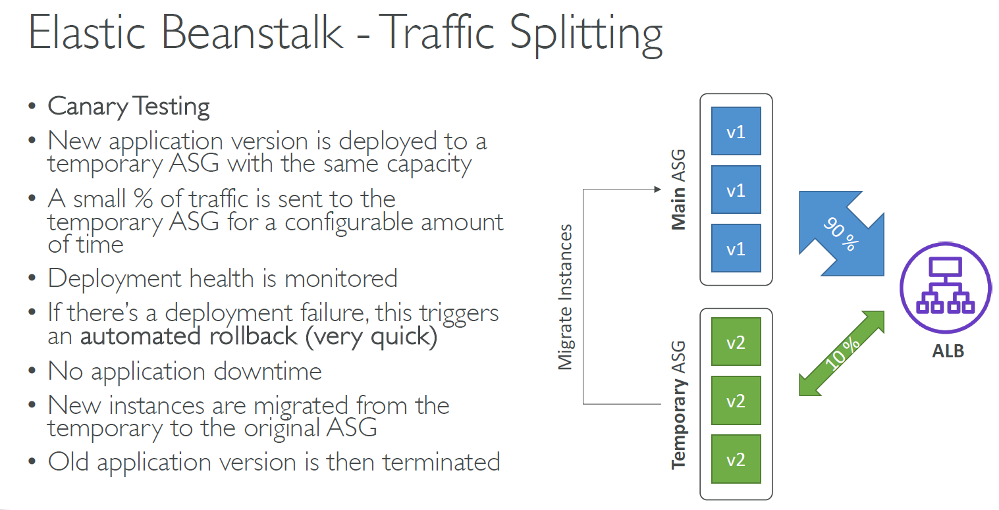
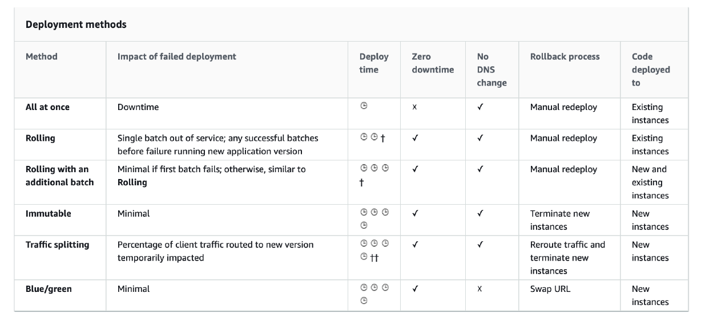

- Each time you upload a new version of your application with the Elastic Beanstalk console or the EB CLI, Elastic Beanstalk creates an application version. If you don’t delete versions that you no longer use, you will eventually reach the application version limit and be unable to create new versions of that application. You can avoid hitting the limit by applying an application version lifecycle policy to your applications. A lifecycle policy tells Elastic Beanstalk to delete application versions that are old, or to delete application versions when the total number of versions for an application exceeds a specified number.

- You can now use an **immutable deployment** policy when updating your application or environment configuration on Elastic Beanstalk. This policy is well suited for updates in production environments where you want to minimize downtime and reduce the risk from failed deployments. It ensures that the impact of a failed deployment is limited to a single instance and allows your application to serve traffic at full capacity throughout the update.

- You can now also use a **rolling with additional batch** policy when updating your application. This policy ensures that the impact of a failed deployment is limited to a single batch of instances and allows your application to serve traffic at full capacity throughout the update.

- When you use the AWS Elastic Beanstalk console to deploy a new application or an application version, you’ll need to upload a source bundle. Your source bundle must meet the following requirements:

  - Consist of a single ZIP file or WAR file (you can include multiple WAR files inside your ZIP file)
  - Not exceed 512 MB
  - Not include a parent folder or top-level directory (subdirectories are fine)
  - If you want to deploy a worker application that processes periodic background tasks, your application source bundle must also include a cron.yaml file. For more information, see Periodic Tasks.

- Elastic Beanstalk supports two methods of saving configuration option settings. Configuration files in YAML or JSON format can be included in your application’s source code in a directory named .ebextensions and deployed as part of your application source bundle. You create and manage configuration files locally.

# Migrate Env
1. Create a saved configuration from account A
2. Download it to local machine
3. Make the account-specific param changes
4. Upload to S3 in account B
5. Create an application from that configuration

# Overview

- Elastic Beanstalk is a developer centric view of deploying an application on AWS
- It uses all the component's we've seen before: EC2, ASG, ELB, RDS,...
- Managed service
  - Automatically handles capacity provisioning, load balancing, scaling, application health monitoring, instance configuration...
  - Just the application code is the responsibility of the developer
- We still have full control over the configuration
- Beanstalk is **free** but you pay for the underlying instances

# Components

- **Application**: collection of Elastic Beanstalk components (environments, versions, configurations...)
- **Application Version**: an iteration of your application code
- **Environment**
  - _Tiers_:
    - Web Server Environment Tier
    - Worker Environment Tier
  - Collection of AWS resources running an application version (only one application version at a time)
  - You can create multiple environments (dev, test, prod,...)

## Tiers:

# Supported Platforms

- Go
- Java SE
- Java with Tomcat
- .NET core on Linux
- .Net on Windows Server
- Node.js
- PHP
- Python
- Ruby
- Packer Builder
- Single Container Docker
- Multi-container Docker
- Pre-configured Docker

# Deployment Modes

## Deployment options for updates

- _All at once_ (deploy all in one go) - fastest, but instances aren't available to serve traffic for a bit (downtime)
- _Rolling_: Update a few instances at a time (bucket), and then move onto the next bucket once the first bucket is healthy
- _Rolling with additional batches_: like rolling, but spins up new instances to move the batch (so that the old application is still available)
- _Immutable_: spins up new instances in a new ASG, deploys version to these instances, and then swaps all the instances when everything is healthy
- _Blue Green_: create a new environment and switch over when ready
- _Traffic Splitting_: canary testing - send a small % of traffic to new deployment

### All at once

### Rolling

### Rolling with additional batches

### Immutable

### Blue / Green

### Traffic Splitting

- **Canary Testing**

#### Official doc

https://docs.aws.amazon.com/elasticbeanstalk/latest/dg/using-features.deploy-existing-version.html

# CLI

- We can install an additional CLI called the "EB cli" which makes working with Beanstalk from the CLI easier
- Basic commands are
  - eb create
  - eb status
  - eb health
  - eb events
  - eb logs
  - eb open
  - eb deploy
  - eb config
  - eb terminate
- helpful for automated deployment pipelines

# Deployment Process

- Describe dependencies (requirements.txt for Python, package.json for Node.js)
- Package code as zip, and describe dependencies
- _Console_: upload zip file (creates new app version), and then deploy
- _CLI_: create new app version using CLI (uploads zip), and then deploy
- Elastic Beanstalk will deploy the zip on each EC2 instance, resolve dependencies and start the application

# Lifecycle Policy

- Beanstalk can store at most 1000 application versions
- If you don't remove old versions, you won't be able to deploy anymore
- To phase out old application versions, use a lifecycle policy
  - Based on time (old versions are removed)
  - Based on space (when you have too many versions)
- Versions that are currently used won't be deleted
- Option not to delete the source bundle in S3 to prevent data loss

# Beanstalk Extensions

- A zip file containing our code must be deployed to Elastic Beanstalk
- All the parameters set in the UI can be configured with code using files
- Requirements:
  - in the .ebextensions/ directory in the root of source code
  - YAML / JSON format
  - **.config** extensions (example: logging.config)
  - Able to modify some default settings using: option_settings
  - Ability to add resources such as RDS, ElastiCache, DynamoDB, etc...

* Resources managed by .ebextensions get deleted if the environment goes away

# Beanstalk Under the Hood

- Under the hood, Elastic Beanstalk relies on CloudFormation
- CloudFormation is used to provision other AWS services (we'll see later)
- Use case: you can define CloudFormation resources in your .ebextensions to provision ElastiCache, an S3 bucket, anything you want

# Beanstalk Cloning

- Clone an environment with the exact same configuration
- Useful for deploying a test version of your application
- All resources and configuration are preserved:
  - Load Balancer type and configuration
  - RDS database type (but the data is not preserved)
  - Environment variables
- After cloning an environment, you can change settings

# Beanstalk Migration

## Load Balancer

- After creating an Elastic Beanstalk environment, you cannot change the Elastic Load Balancer type (only the configuration)
- To migrate:
  1. Create a new environment with the same configuration except LB
  2. Deploy your application onto the new environment
  3. Perform a CNAME swap or Route 53 update

## RDS

- RDS can be provisioned with Beanstalk, which is great for dev / test
- This is not great for PROD as the database lifecycle is tied to the Beanstalk environment lifecycle
- The best for PROD is to separately create an RDS database and provide our EB application with the connection string

### Decouple RDS

1. Create a snapshot of RDS DB (as a safeguard)
2. Go to the RDS console and protect the RDS database from deletion
3. Create a new Elastic Beanstalk environment, without RDS, point your application to existing RDS
4. Perform a CNAME swap (blue/green) or Route 53 update, confirm working
5. Terminate the old environment (RDS won't be deleted)
6. Delete CloudFormation stack (in DELETE_FAILED state)
