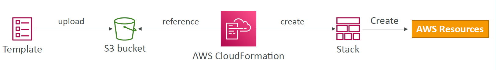
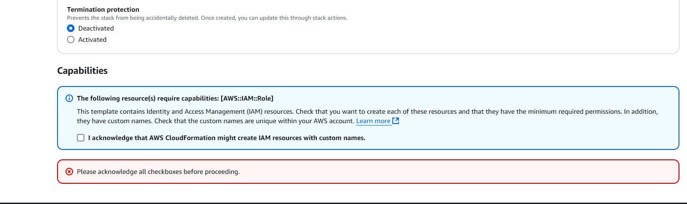
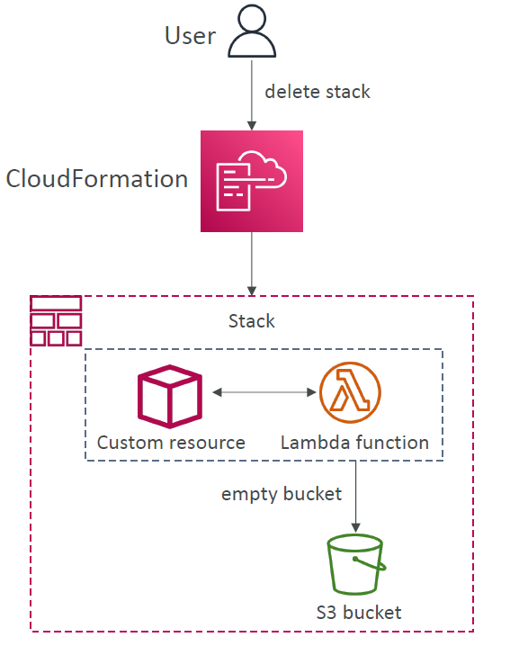
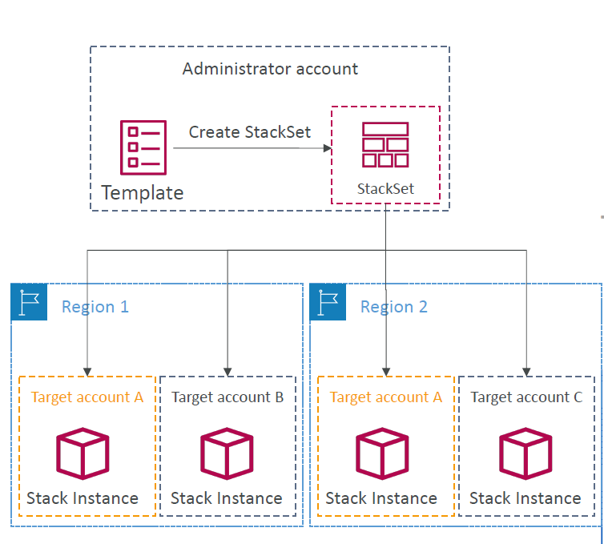

- As your infrastructure grows, common patterns can emerge in which you declare the same components in each of your templates. You can separate out these common components and create dedicated templates for them. That way, you can mix and match different templates but use nested stacks to create a single, unified stack. Nested stacks are stacks that create other stacks. To create nested stacks, use the AWS::CloudFormation::Stack resource in your template to reference other templates.

- The optional Conditions section contains statements that define the circumstances under which entities are created or configured. For example, you can create a condition and then associate it with a resource or output so that AWS CloudFormation only creates the resource or output if the condition is true. Similarly, you can associate the condition with a property so that AWS CloudFormation only sets the property to a specific value if the condition is true. If the condition is false, AWS CloudFormation sets the property to a different value that you specify.

  - You might use conditions when you want to reuse a template that can create resources in different contexts, such as a test environment versus a production environment. In your template, you can add an EnvironmentType input parameter, which accepts either prod or test as inputs.

- When you need to update a stack, understanding how your changes will affect running resources before you implement them can help you update stacks with confidence. Change sets allow you to preview how proposed changes to a stack might impact your running resources

# Overview

- CloudFormation is a declarative way of outlining your AWS infrastructure, for any resources (most of them are supported)
- For example, within a CloudFormation template, you say:
  - I want a security group
  - I want 2 EC2 instances using this security group
  - I want 2 Elastic IPs for these EC2 instances
  - I want an S3 bucket
  - I want a load balancer (ELB) in front of these EC2 instances
- Then CloudFormation creates those for you, in the right order, with the exact configuration that you specify

# Benefits of AWS CloudFormation

- Infrastructure as Code (IaC)
  - No resources are manually created, which is excellent for control
  - The code can be version controlled for example using Git
  - Changes to the infrastructure are reviewed through code
- Cost
  - Each resources within the stack is tagged with an identifier so you can easily see how much a stack costs you
  - You can estimate the costs of your resources using the CloudFormation template
  - Savings strategy: In Dev, you could automate deletion of templates at 5 PM and recreated at 8 AM, safely
- Productivity
  - Ability to destroy and re-create an infrastructure on the cloud on the fly
  - Automated generation of Diagram for your templates
  - Declarative programming (no need to figure out ordering and orchestration)
- Separation of concern: create many stacks for many apps, and many layers. Ex:
  - VPC stacks
  - Network stacks
  - App stacks
- Don't re-invent the wheel
  - Leverage existing templates on the web!
  - Leverage the documentation

# How CloudFormation Works

- Templates must be uploaded in S3 and then referenced in CloudFormation
- To update a template, we **_can't edit previous ones_**. We have to **_re-upload a new version_** of the template to AWS
- Stacks are identified by a **name**
- Deleting a stack deletes every single artifact that was created by CloudFormation



# Deploying CloudFormation Templates

- Manual way
  - Editing templates in Application Composer or code editor
  - Using the console to input parameters, etc...
- Automated way (Recommended)
  - Editing templates in a YAML file
  - Using the AWS CLI (Command Line Interface) to deploy the templates, or using a Continuous Delivery (CD) tool

# CloudFormation - Building Blocks

- Template's Components
  - `AWSTemplateFormatVersion` - identifies the capabilities of the template, eg "2010-09-09"
  - `Description` - comments about the template
  - `Resources` (mandatory) - your AWS resources declared in the template
  - `Parameters` - the dynamic inputs for your template
  - `Mappings` - the static variables for your template
  - `Outputs` - references to what has been created
  - `Conditionals` - list of conditions to perform resource creation
- Template's Helpers
  - References
  - Functions

# CloudFormation - Resources

- Resource types identifiers are of the form:

  - service-provider::service-name::data-type-name

- Resources are listed here: https://docs.aws.amazon.com/AWSCloudFormation/latest/UserGuide/aws-template-resource-type-ref.html

# CloudFormation - Parameters

Parameters can be controlled by all these settings:

- Type:
  - String
  - number
  - CommaDelimitedList
  - List<Number>
  - AWS-Specific Parameter (to help catch invalid values - match against existing values in the AWS account)
  - List<AWS-Specific Parameter>
  - SSM Parameter (get parameter value from SSM Parameter store)
- Description
- ConstraintDescription (String)
- Min/MaxLength
- Min/MaxValue
- Default
- Allowed Values (array)
- AllowedPattern (regex)
- NoEcho (Boolean)

## How to Reference a Parameter?

```yaml
Resources:
  DBSubnet1:
    Type: AWS::EC2::Subnet
    Properties:
      VpcId: !Ref MyVPC
```

- The `Fn::Ref` function can be leveraged to reference parameters
- Parameters can be used anywhere in a template
- The shorthand for this in YAML is `!Ref`
- The function can also reference other elements within the template

## Pseudo Parameters

- AWS offers us Pseudo Parameters in any CloudFormationtemplate
- These can be used at any time and are enabled by default
- Important pseudo parameters:
  - AWS::AccountId
  - AWS::Region
  - AWS::StackId
  - AWS::StackName
  - AWS::NotificationARNs
  - AWS::NoValue

# CloudFormation - Mappings

- Mappings are fixed variables within your CloudFormation template
- They're very handy to differentiate between different environments (dev VS prod), regions (AWS regions), AMI types...
- All the values are hardcoded within the template

```yaml
Mappings:
  Mapping01:
    Key01:
      Name: Value01
    Key02:
      Name: Value02
    Key03:
      Name: Value03
```

```yaml
RegionMap:
  us-east-1:
    HVM64: ami-123
    HVMG2: ami-456
  us-west-1:
    HVM64: ami-789
    HVMG2: ami-012
  eu-west-1:
    HVM64: ami-345
    HVMG2: ami-678
```

## Accessing Mapping Values (Fn::FindInMap)

- We use `Fn::FindInMap` to return a named value from a specific key
- !FindInMap [MapName, TopLevelKey, SecondLevelKey]

```yaml
RegionMap:
  us-east-1:
    HVM64: ami-123
    HVMG2: ami-456
  us-west-1:
    HVM64: ami-789
    HVMG2: ami-012
  eu-west-1:
    HVM64: ami-345
    HVMG2: ami-678

Resources:
  MyEC2Instance:
    Type: AWS::EC2::Instance
    Properties:
      ImageId: !FindInMap [RegionMap, !Ref "AWS::Region", HVM64]
      InstanceType: t2.micro
```

## When would you use Mappings vs. Parameters?

- Use `mapping` when:
  - You know in advance all the values that can be taken and that they can be deduced from variables such as
    - Region
    - AZ
    - AWS Account
    - Environment (dev vs prod)
    - etc..
- Use `parameters` when the values are really user specific

# CloudFormation - Outputs

- The outputs section declares optional outputs values that we can import into other stacks (if you export them first)
- You can also view the outputs in the AWS Console or in using the AWS CLI
- They're very useful for example if you define a network CloudFormation, and output the variables such as VPC ID and your Subnet IDs
- It's the best way to perform some collaboration cross stack, as you let export handle their own part of the stack

```yaml
# Creating a SSH Security Group as part of one template
# Create an output that references that security group
Outputs:
  StackSSHSecurityGroup:
    Description: The SSH Security Group for our Company
    Value: !Ref MyCompanyWideSSHSecurityGroup
    Export:
      Name: SSHSecurityGroup

# Create a second template that leverages that security group
# For this, we use the Fn::ImportValue function
# You can't delete the underlying stack until all the references are deleted
Resources:
  MySecureInstance:
    Type: AWS::EC2::Instance
    Properties:
      ImageId: ami-123
      InstanceType: t2.micro
      AvailabilityZone: us-east-1a
      SecurityGroups:
        - !ImportValue SSHSecurityGroup
```

# CloudFormation - Conditions

- Conditions are used to control the creation of resources or outputs based on a condition
- Conditions can be whatever you want them to be, but common ones are:
  - Environment (dev / test / prod)
  - AWS Region
  - Any parameter value
- Each condition can reference another condition parameter value or mapping

```yaml
Conditions:
  CreateProdResources: !Equals [!Ref EnvType, prod]
```

- The logical ID is for you to choose. It's how you name condition
- The intrinsic function (logical) can be any of the following:
  - Fn::And
  - Fn::Equals
  - Fn::If
  - Fn::Not
  - Fn::Or

```yaml
Resources:
  MountPoint:
    Type: AWS::EC2::VolumeAttachment
    Condition: CreateProdResources
```

# CloudFormation - Intrinsic functions

- Ref
- Fn::GetAtt
- Fn::FindInMap
- Fn::Join
- Fn::Sub
- Fn::ForEach
- Fn::ToJsonString
- Condition Functions
  - Fn::If
  - Fn::Not
  - Fn::Equals
  - etc...
- Fn::Base64
- Fn::Cidr
- Fn::GetAZs
- Fn::Select
- Fn::Split
- Fn::Transform
- Fn::Length

## Fn::Ref

- The Fn::Ref function can be leveraged to reference:
  - Parameters - returns the value of the parameter
  - Resources - returns the physical ID of the underlying resource (e.g. EC2 ID)
- Shorthand: !Ref

```yaml
Resources:
  DBSubnet1:
    Type: AWS::EC2::Subnet
    Properties:
      VpcId: !Ref MyVPC
```

## Fn::GetAtt

- Attributes are attached to any resources you create
- To know the attributes of your resources, the best place to look at is the documentation
- Example: the AZ of an EC2 instance

```yaml
Resources:
  EC2Instance:
    Type: AWS::EC2::Instance
    Properties:
      ImageId: ami-123
      InstanceType: t2.micro
  EBSVolume:
    Type: AWS::EC2::Volume
    Condition: CreateProdResources
    Properties:
      Size: 100
      AvailabilityZone: !GetAtt EC2Instance.AvaialbilityZone
```

## Fn:FindInMap

- See [example](#accessing-mapping-values-fnfindinmap) above

## Fn::ImportValue

- See [example](#cloudformation---outputs) above

## Fn::Base64

- Convert String to it's Base64 representation
- Example: pass encoded data to EC2 Instance's UserData property

```yaml
Resources:
  WebServer:
    Type: AWS::EC2::Instance
    Properties:
    ...
    UserData:
      Fn::Base64: |
      #!/bin/bash
      dnf update -y
      dnf install -y httpd
```

# Cloudformation - Rollbacks

- Stack Creation Fails:
  - Default: everything rolls back (gets deleted). We can look at the log
  - Option to disable rollback and troubleshoot what happened
- Stack Update Fails:
  - The stack automatically rolls back to the previous known working state
  - Ability to see in the log what happened and error messages
- Rollback Failure? Fix resources manually then issue `ContinueUpdateRollback` API from Console
  - Or from the CLI using `continue-update-rollback` API call

# CloudFormation - Service Role

- IAM role that allows CloudFormation to create/update/delete stack resources on your behalf
- Give ability to users to create/update/delete the stack resources even if they don't have permissions to work with the resources in the stack
- Use cases:
  - You want to achieve the least privilege principle
  - But you don't want to give the user all the required permissions to create the stack resources
- User must have `iam:PassRole` permissions

# CloudFormation Capabilities

- `CAPABILITY_NAMED_IAM` and `CAPABILITY_IAM`
  - Necessary to enable when you CloudFormation template is creating or updating IAM resources (IAM User, ROle, Group, Policy, Access keys, Instance Profile...)
  - Specify `CAPABILITY_NAMED_IAM` if the resources are named
- `CAPABILITY_AUTO_EXPAND`
  - Necessary when your CloudFormation template includes Macros or Nested Stacks (stacks within stacks) to perform dynamic transformations
  - You're acknowledging that your template may change before deploying
- `InsufficientCapabilitiesException`
  - Exception that will be thrown by CloudFormation if the capabilities haven't been acknowledged when deploying a template (security measure)

## Example:

If you are creating something like IAM roles in the template, you will see the following on the console


Without ticking the acknowledge, you won't be able to proceed

# CloudFormation - DeletionPolicy

- Control what happens when the CloudFormation template is deleted or when a resource is removed from a CloudFormation template
- Extra safety measure to preserve and backup resources

## DeletionPolicy - Delte

- Default DeletionPolicy = Delete
- There is no need to specify DeletionPolicy if it is `Delete`, but you still can include it in the template:

```yaml
Resources:
  MyEC2Instance:
    Type: AWS::EC2::Instance
    Properties:
      ImageId: ami-123
      InstanceType: t2.micro
      KeyName: my-key-pair
      SecurityGroupIds:
        - sg-123
    DeletionPolicy: Delete
```

- **NOTE:** Delete **won't work** on an S3 bucket if the bucket **is not empty**
  - 2 Solutions to this:
    1. Manually empty the S3
    2. Create custom resource to empty S3 in the template

## DeletionPolicy - Retain

- Specify on resources to preserve in case of CloudFormation deletes
- Works with any resources

## DeletionPolicy - Snapshot

- Create one final snapshot before deleting the resource
- Examples of supported resources:
  - EBS Volume
  - ElastiCache Cluster
  - ElastiCache ReplicationGroup
  - RDS DBInstance
  - RDS DBCluster
  - Redshift Cluster
  - Neptune DBCluster
  - DocumentDB DBCluster

# CloudFormation Stack Policies

- During a CloudFormation Stack update, all update actions are allowed on all resources (default)
- A Stack Policy is a JSON document that defines the update actions that are allowed on specific resources during Stack updates
- Protect resources from unintentional updates
- When you set a Stack Policy, all resources in the Stack are protected by default
- Specify an explicit ALLOW for the resources you want to be allowed to be updated

# CloudFormation Termination Protection

- To prevent accidental deletes of CloudFormation Stacks, use TerminationProtection

# CloudFormation Custom Resources

- Used to
  - define resources not yet supported by CloudFormation
  - define custom provisioning logic for resources that can be outside of CLoudFormation (on-premises resources, 3rd party resources...)
  - have custom scripts run during create / update / delete through Lambda functions (running a Lambda function to empty an S3 bucket before being deleted)
- Defined in the template using
  - `AWS::CloudFormation::CustomResource`
  - OR `Custom::MyCustomResourceTypeName` (recommended)
- Backed by a Lambda function (most common) or an SNS topic

## How to define a Custom Resource?

- `ServiceToken` specifies where CloudFormation sends requests to, such as Lambda ARN or SNS ARN (required & must be in the same region)
- Input data parameters (optional)

```yaml
Resources:
  MyCustomResourceUsingLambda:
    Type: Custom::MyLambdaResource
    Properties:
      ServiceToken: arn:aws:lambda:REGION:ACCOUNT_ID:function:FUNCTION_NAME
      # Input values (optional)
      ExampleProperty: "ExampleValue"
```

### Use Case - Delete content from an S3 bucket

- You can't delete a non-empty S3 bucket
- To delete a non-empty S3 bucket, you must first delete all the objects inside it
- We can use a custom resource to empty an S3 bucket before it gets deleted by CloudFormation



# CloudFormation - StackSets

- Create, update, or delete stacks across multiple accounts and regions with a single operation / template
- Target accounts to create, update, delete stack instances from StackSets
- When you update a stack set, all associated stack instances are updated throughout all accounts and regions
- Can be applied into all accounts of an AWS Organization
- Only Administrator account (or Delegated Administrator) can create StackSets



# Dynamic References

- Reference external values stored in Systems Manager Parameter Store and Secrets Manager within CloudFormation templates
- CloudFormation retrieves the value of the specified reference during create/update/delete operations
- Supports
  - ssm - for plaintext values stored in SSM Parameter Store
  - ssm-secure - for secure strings stored in SSM Parameter Store
  - secretsmanager - for secret values stored in Secrets Manager

`{{resolve:service-name:reference-key:version}}`

## SSM

```yaml
Resources:
  S3Bucket:
    Type: AWS::S3::Bucket
    Properties:
      AccessControl: "{{resolve:ssm:S3AccessControl:2}}"
```

## SSM Secure

```yaml
Resources:
  IAMUser:
    Type: AWS::IAM::User
    Properties:
      UserName: john
      LoginProfile:
        Password: "{{resolve:ssm-secure:IAMUserPassword:10}}"
```

## Secrets Manager

```yaml
Resources:
  DBInstance:
    Type: AWS::IAM::DBInstance
    Properties:
      DBName: MyRDSInstance
      MasterUsername: "{{resolve:secretsmanager:MyRDSSecret:SecretString:username}}"
      MasterUserPassword: "{{resolve:secretsmanager:MyRDSSecret:SecretString:password}}"
```

# CloudFormation, Secrets Manager & RDS

## Option 1 - ManageMasterUserPassword

- ManageMasterUserPassword - creates admin secret implicitly
- RDS, Aurora will manage the secret in Secrets manager and its rotation

```yaml
Resources:
  MyCluster:
    Type: AWS::RDS::DBCluster
    Properties:
      Engine: aurora-mysql
      MasterUserName: masteruser
      ManageMasterUserPassword: true
Outputs:
  Secret:
    Value: !GetAtt MyCluster.MasterUserSecret.SecretArn
```

## Option2 - Dynamic Reference

1. Secret is generated

```yaml
Resources:
  MyDatabaseSecret:
    Type: AWS::SecretsManager::Secret
    Properties:
      Name: MyDatabaseSecret
      GenerateSecretString:
        SecretStringTemplate: '{"username": "admin"}'
        GenerateStringKey: "password"
        PasswordLength: 16
        ExcludeCharacters: '"@/\'
```

2. Reference secret in RDS DB instance

```yaml
MyDBInstance:
  Type: AWS::RDS::DBInstance
  Properties:
    DBName: mydatabase
    AllocatedStorage: 20
    DBInstanceClass: db.t2.micro
    Engine: mysql
    MasterUsername: "{{resolve:secretsmanager:MyDatabaseSecret:SecretString:username}}"
    MasterUserPassword: "{{resolve:secretsmanager:MyDatabaseSecret:SecretString:password}}"
```

3. link the secret to RDS DB instance (for rotation)

```yaml
SecretRDSAttachment:
  Type: AWS::SecretsManager::SecretTargetAttachment
  Properties:
    SecretId: !Ref MyDatabaseSecret
    TargetId: !Ref MyDBInstance
    TargetType: AWS::RDS::DBInstance
```
