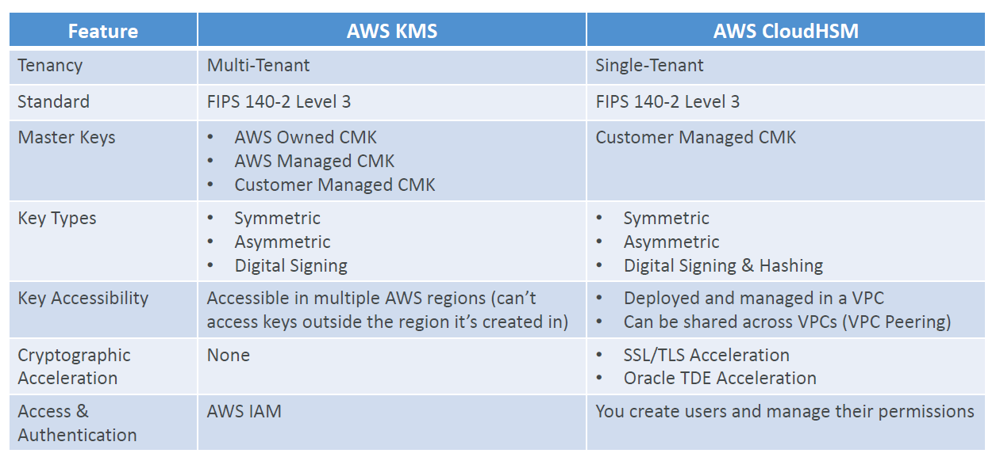
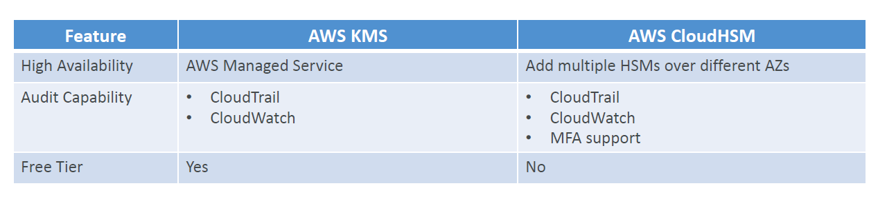

# Overview

- KMS => AWS manages the software for encryption
- CloudHSM => AWS provisions encryption hardware
- Dedicated hardware (HSM = Hardware Security Module)
- You manage your own encryption keys entirely (not AWS)
- HSM device is tamper resistant, FIPS 140-2 Level 3 compliance
- Supports both symmetric and asymmetric encryption (SSL/TLS keys)
- No free tier available
- Must use the CloudHSM Client Software
- **Redshift** supports CloudHSM for database encryption and key management
- **Good option to use with SSE-C encryption**

# CloudHSM vs. KMS

