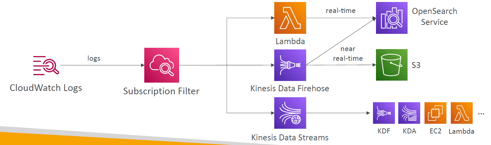
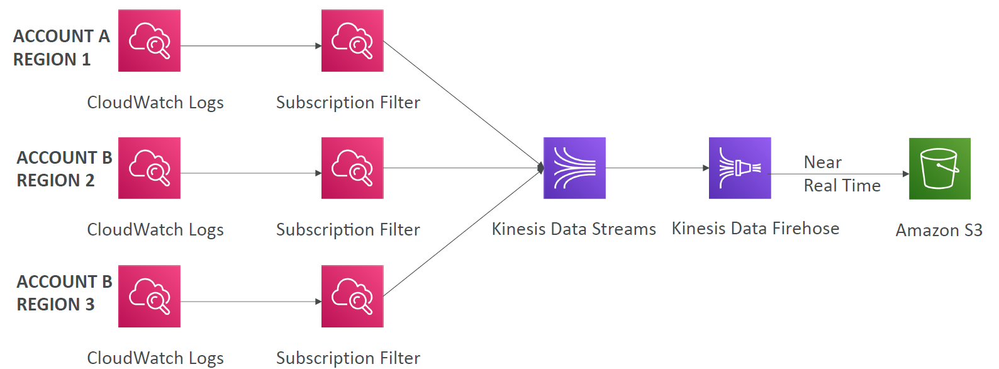
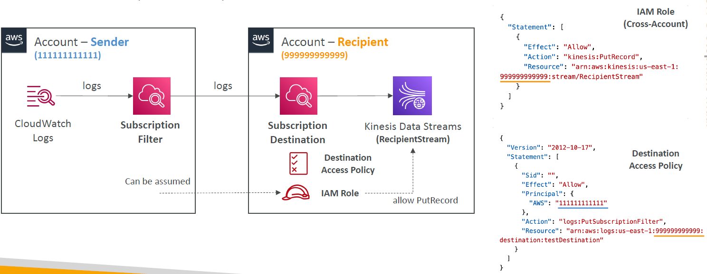
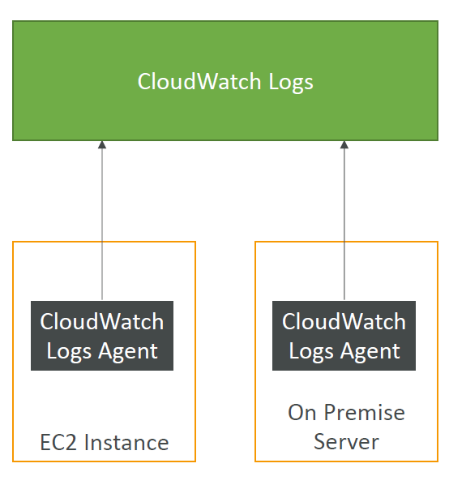
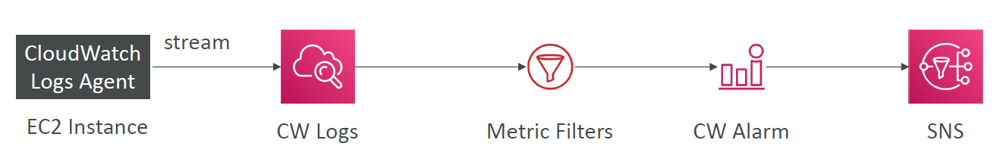
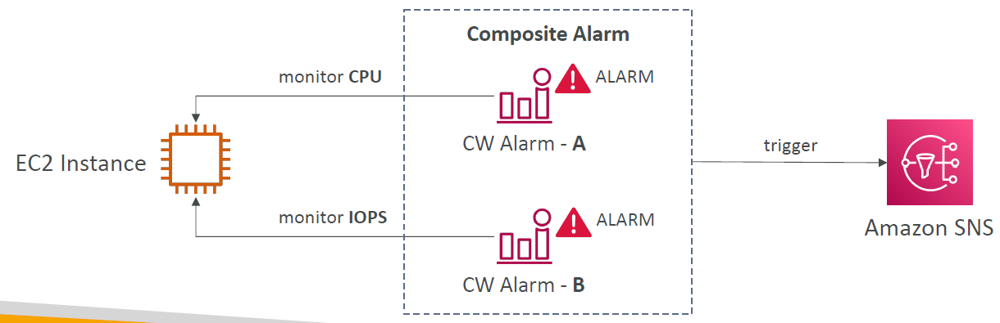
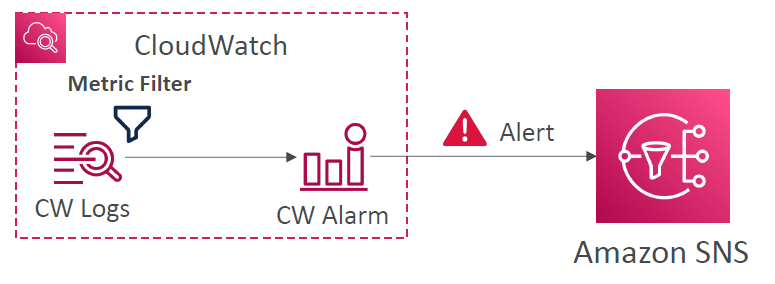

- Using CloudWatch Events, you can monitor the progress of jobs, build AWS Batch custom workflows with complex dependencies, generate usage reports or metrics around job execution, or build your own custom dashboards. With AWS Batch and CloudWatch Events, you can eliminate scheduling and monitoring code that continuously polls AWS Batch for job status changes. Instead, handle AWS Batch job state changes asynchronously using any CloudWatch Events target, such as AWS Lambda, Amazon Simple Queue Service, Amazon Simple Notification Service, or Amazon Kinesis Data Streams.
- How to create custom metric for the number of concurrent users

# Overview

- CloudWatch provides metrics for every services in AWS
- Metric is a variable to monitor (CPUUtilization, NetworkIn...)
- Metrics belong to namespaces
- Dimension is an attribute of a metric (instance id, environment, etc...)
- Up to 30 dimensions per metric
- Metrics have timestamps
- Can create CloudWatch dashboards of metrics

## EC2 Detailed monitoring

- EC2 instance metrics have metrics "every 5 minutes"
- With detailed monitoring (for a cost), you get data "every 1 minute"
- Use detailed monitoring if you want to scale faster for you ASG
- Free Tier allows us to have 10 detailed monitoring metrics
- NOTE: EC2 **memory usage** is by default **not pushed** (must be pushed from inside the instance as a custom metric)

# Custom Metrics

- Possibility to define and send your own custom metrics to CloudWatch
- Example: memory (RAM) usage, disk space, number of logged in users...
- Use API call **PutMetricData**
- Ability to use dimensions (attributes) to segment metrics
  - Instance.id
  - Environment.name
- Metric resolution (**StorageResolution** API parameter - 2 possible values):
  - Standard: 1 minute (60 seconds)
  - High Resolution: 1/5/10/30 second(s) - high cost
- Important: Accepts metric data points 2 weeks in the past and 2 hours in the future (make sure to configure your EC2 instance time correctly)

# CloudWatch Logs

- Log groups: arbitrary name, usually representing an application
- Log stream: instances within application / log files / containers
- Can define log expiration policies (never expire, 1 day to 10 years...)
- CloudWatch Logs can send logs to:
  - S3 (exports)
  - Kinesis Data Streams
  - Kinesis Data Firehose
  - AWS Lambda
  - OpenSearch
- Logs are encrypted by default
- Can setup KMS-based encryption with your own keys

## CloudWatch Logs - Sources

- SDK, CloudWatch Logs Agent, CloudWatch Unified Agent
- Elastic Beanstalk: collection of logs from application
- ECS: collection from containers
- AWS Lambda: collection from function logs
- VPC Flow Logs: VPC specific logs
- API Gateway
- CloudTrail based on filter
- Route53: Log DNS queries

## CloudWatch Logs Insights

- Search and analyze log data stored in CloudWatch Logs
- Provides a purpose-built query language
  - Automatically discovers fields from AWS services and JSON log events
  - Fetch desired event fields, filter based on conditions, calculate aggregate statistics, sort event, limit number of events...
  - Can save queries and add them to CloudWatch Dashboards
- Can query multiple Log Groups in different AWS accounts
- It's a query engine, nota real-time engine

## CloudWatch Logs - S3 Export

- Log data can take up to 12 hours to become available for export
- The API call is CreateExportTask
- Not near-real time or real-time...use logs Subscriptions instead

## CloudWatch Logs Subscriptions

- Get a real-time log events from CloudWatch Logs for processing and analysis
- Send to
  - Kinesis Data Streams
  - Kinesis Data Firehose
  - Lambda
- Subscription Filter - filter which logs events are delivered to your destination



## CloudWatch Logs Aggregation Multi-Account & Multi Region





## CloudWatch LiveTail

- 1 hour free per day

# CloudWatch Logs for EC2

- By default, **no logs** from your EC2 machine will to to CloudWatch
- You need to run a **CloudWatch agent** on EC2 to push the log files you want
- Make sure IAM permissions are correct
- The CloudWatch log agent can be setup **on-premises** too
- Out of the box high level metrics for EC2
  - disk
  - CPU
  - network



# CloudWatch Logs Agent & Unified Agent

- For virtual servers (EC2 instances, on-premise servers...)
- CloudWatch Logs Agent
  - Old version of the agent
  - Can only send to CloudWatch Logs
- CloudWatch Unified Agent
  - Both metrics and logs
  - Collect additional system-level metrics such as RAM, processes, etc...
  - Collect logs to send to CloudWatch Logs
  - Centralized configuration using SSM Parameter Store

## Unified Agent - Metrics

- Collected directly on your Linux server / EC2 instance
  - CPU (active, guest, idle, system, user, steal) - a way more granular level
  - Disk Metrics (free, used, total), Disk IO (writes, reads, bytes, iops)
  - RAM (free, inactive, used, total, cached)
  - Netstat (number of TCP and UDP connections, net packets, bytes)
  - Processes (total, dead, bloqued, idle, running, sleep)
  - Swap Space (free, used, used %)

# CloudWatch Logs Metric Filter

- CloudWatch Logs can use filter expressions
  - For example, find a specific IP inside of a log
  - Or count occurrences of "ERROR" in your logs
  - Metric filters can be used to trigger alarms
- Filters do not retroactively filter data. Filters only publish the metric data points for events that happen after the filter was created
- Ability to specify up to 3 Dimensions for the Metric Filter (optional)



## Metric filter pattern

- [Official Doc](https://docs.aws.amazon.com/AmazonCloudWatch/latest/logs/FilterAndPatternSyntax.html)

# CloudWatch Alarms

- Alarms are used to trigger notifications for any metric
- Various options (sampling, %, max, min, etc...)
- Alarm States:
  - OK
  - INSUFFICIENT_DATA
  - ALARM
- Period:
  - Length of time in seconds to evaluate the metric
  - High resolution custom metrics: 10 sec, 30 sec or multiples of 60 sec

## CloudWatch Alarm Targets

- Stop, Terminate, Reboot, or Recover an **EC2** Instance
- Trigger **Auto Scaling Action**
- Send notification to **SNS** (from which you can do pretty much anything)

## CloudWatch Alarms - Composite Alarms

- CloudWatch Alarms are on a single metric
- Composite Alarms are monitoring the states of multiple other alarms
- **AND** and **OR** conditions
- Helpful to reduce "alarm noise" by creating complex composite alarms



## EC2 Instance Recovery

- Status Check:
  - Instance status = check the EC2 VM
  - System status = check the underlying hardware
  - Attached EBS status = check attached EBS volumes
- Recovery: **Same Private, Public, Elastic IP, metadata, placement group**

## CloudWatch Alarm: good to know

- Alarms can be created based on CloudWatch Logs Metrics Filters



- To test alarms and notifications, set the alarm state to Alarm using CLI

```bash
aws cloudwatch set-alarm-state --alarm-name "myalarm" --state-value ALARM --state-reason "testing"
```

# CloudWatch Synthetics Canary

- Configurable script that monitor your APIs, URLs, Websites,...
- Reproduce what your customers do programmatically to find issues before customers are impacted
- Checks the availability and latency of your endpoints and can store load time data and screenshots of the UI
- Integration with CloudWatch Alarms
- Scripts written in Node.js or Python
- Programmatic access to a headless Google Chrome browser
- Can run once or on a regular schedule

## CloudWatch Synthetics Canary Blueprints

- **Heartbeat Monitor** - load URL, store screenshot and an HTTP archive file
- **API Canary** - test basic read and write functions of REST APIs
- **Broken Link Checker** - check all links inside the URL that you are testing
- **Visual Monitoring** - compare a screenshot taken during a canary run with a baseline screenshot
- **Canary Recorder** - used with CloudWatch Synthetics Recorder (record your actions on a website and automatically generates a script for that)
- **GUI Workflow Builder** - verifies that actions can be taken on your webpage (e.g. test a webpage with a login form)

# Encryption

- You can encrypt CloudWatch logs with KMS keys
- Encryption is enabled at the log group level, by associating a CMK with a log group, either when you create the log group or after it exists
- You **cannot** associate a CMK with a log group using the CloudWatch console.
- You must use the CloudWatch Logs API:
  - associate-kms-key: if the log group already exists
  - create-log-group: if the log group doesn't exist yet

# CloudWatch Evidently

- Safely validate new features by serving them to a specified % of your users
  - Reduce risk and identify unintended consequences
  - Collect experiment data, analyze using stats, monitor performance
- Launches (=feature flags): enable and disable features for a subset of users
- Experiments (= A/B testing): compare multiple versions of the same feature
- Overrides: pre-define a variation for a specific user
- Store evaluation events in CloudWatch Logs or S3
