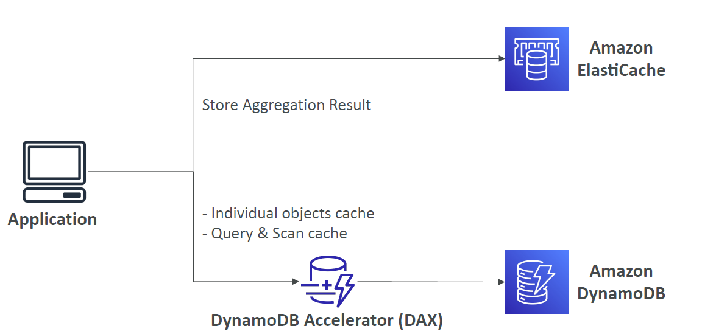
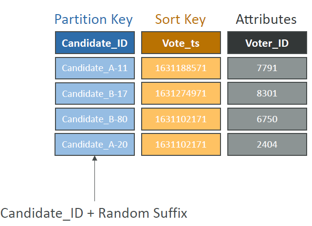

- You can use Global secondary indexes and use only those attributes which will be queried. This can help reduce the amount of read throughput used on the table.

- If possible, you should a**void using a Scan operation** on a large table or index with a filter that removes many results. Also, as a table or index grows, the Scan operation slows. The Scan operation examines every item for the requested values and can use up the provisioned throughput for a large table or index in a single operation. For faster response times, design your tables and indexes so that your applications can use Query instead of Scan. (For tables, you can also consider using the GetItem and BatchGetItem APIs.)
  - [doc](https://docs.aws.amazon.com/amazondynamodb/latest/developerguide/bp-query-scan.html)

- Keep the number of indexes to a **minimum**. Don't create secondary indexes on attributes that you don't query often. Indexes that are seldom used contribute to increased storage and I/O costs without improving application performance.

  - **Avoid indexing tables that experience heavy write activity**. In a data capture application, for example, the cost of I/O operations required to maintain an index on a table with a very high write load can be significant. If you need to index data in such a table, it may be more effective to copy the data to another table that has the necessary indexes and query it there.

- Query Operation: This operation is more efficient than a Scan operation because it allows you to specify a specific query condition based on a partition key and sort key. This reduces the amount of data that DynamoDB needs to process.

- Eventually-Consistent Reads: This read consistency model offers lower latency and higher throughput compared to strongly consistent reads. While it might not guarantee the absolute latest data, it's often sufficient for many applications.

- [Overview](#overview)
- [Basics](#basics)
- [Primary Keys](#primary-keys)
- [DynamoDB - Read/Write Capacity Modes](#dynamodb---readwrite-capacity-modes)
  - [Provisioned Mode](#provisioned-mode)
    - [Write Capacity Units (WCU)](#write-capacity-units-wcu)
    - [Read Capacity Units (RCU)](#read-capacity-units-rcu)
      - [Strongly Consistent Read vs. Eventually Consistent Read](#strongly-consistent-read-vs-eventually-consistent-read)
  - [On-Demand Mode](#on-demand-mode)
- [DynamoDB - Partitions Internal](#dynamodb---partitions-internal)
- [DynamoDB - Throttling](#dynamodb---throttling)
- [DynamoDB - Writing Data](#dynamodb---writing-data)
- [DynamoDB - Reading Data](#dynamodb---reading-data)
  - [Query](#query)
  - [Scan](#scan)
- [DynamoDB - Deleting Data](#dynamodb---deleting-data)
- [DynamoDB - Batch Operations](#dynamodb---batch-operations)
- [DynamoDB - PartiQL](#dynamodb---partiql)
- [DynamoDB - Conditional Writes](#dynamodb---conditional-writes)
  - [Example on Update Item](#example-on-update-item)
  - [Example on Delete Item](#example-on-delete-item)
- [Conditional Writes - Do Not Overwrite Elements](#conditional-writes---do-not-overwrite-elements)
- [DynamoDB - Local Secondary Index (LSI)](#dynamodb---local-secondary-index-lsi)
- [DynamoDB - Global Secondary Index (GSI)](#dynamodb---global-secondary-index-gsi)
- [DynamoDB - Indexes and Throttling](#dynamodb---indexes-and-throttling)
- [DynamoDB - PartiQL](#dynamodb---partiql-1)
- [DynamoDB - Optimistic Locking](#dynamodb---optimistic-locking)
- [DynamoDB Accelerator (DAX)](#dynamodb-accelerator-dax)
- [DynamoDB Accelerator (DAX) vs. ElastiCache](#dynamodb-accelerator-dax-vs-elasticache)
- [DynamoDB Streams](#dynamodb-streams)
- [DynamoDB Streams \& AWS Lambda](#dynamodb-streams--aws-lambda)
- [DynamoDB - Time To Live (TTL)](#dynamodb---time-to-live-ttl)
- [DynamoDB CLI - Good to Know](#dynamodb-cli---good-to-know)
- [DynamoDB Transactions](#dynamodb-transactions)
  - [DynamoDB Transactions - Capacity Computations](#dynamodb-transactions---capacity-computations)
- [DynamoDB as Session State Cache](#dynamodb-as-session-state-cache)
- [DynamoDB Write Sharding](#dynamodb-write-sharding)
- [DynamoDB - Write Types](#dynamodb---write-types)
- [DynamoDB - Large Objects Pattern](#dynamodb---large-objects-pattern)
- [DynamoDB - Indexing S3 Objects Metadata](#dynamodb---indexing-s3-objects-metadata)
- [DynamoDB Operations](#dynamodb-operations)
- [DynamoDB - Security \& Other Features](#dynamodb---security--other-features)
- [DynamoDB - Users Interact with DynamoDB Directly](#dynamodb---users-interact-with-dynamodb-directly)
- [DynamoDB - Fine-Grained Access Control](#dynamodb---fine-grained-access-control)


# Overview
- Fully managed, highly available with replication across multiple AZs
- NoSQL database - not a relational database
- Scales to massive workloads, distributed database
- Millions of requests per seconds, trillions of row, 100s of TB of storage
- Fast and consistent in performance (low latency on retrieval)
- Integrated with IAM for security, authorization and administration
- Enables event driven programming with DynamoDB streams
- Low cost and auto-scaling capabilities
- Standard && Infrequent Access (IA) table class

# Basics
- DynamoDB is made of Tables
- Each table has a Primary Key (must be decided at creation time)
- Each table can have an infinite number of items (=rows)
- Each item has attributes (can be added over time - can be null)
- Maximum size of an item is **400KB**
- Data types supported are
  - Scalar Types - string, number, binary, boolean, null
  - Document Types - List, Map
  - Set Types - string set, number set, binary set

# Primary Keys
- Option 1: Partition Key (HASH)
  - Partition key must be unique for each item
  - Partition key must be "diverse" so that the data is distributed
- Option 2: Partition Key + Sort Key (HASH + RANGE)
  - The combination must be unique for each item
  - Data is grouped by partition key

# DynamoDB - Read/Write Capacity Modes
- Control how you manage your table's capacity (read / write throughput)
- Provisioned Mode (default)
  - You specify the number of reads/writes per second
  - You need to plan capacity beforehand
  - Pay for provisioned read & write capacity units
  - Pay for provisioned read & write capacity units
- On-Demand Mode
  - Read/writes automatically scale up/down with your workloads
  - No capacity planning needed
  - Pay for what you use, more expensive ($$$)
- You can switch between different modes once every 24 hours

## Provisioned Mode
- Table must have provisioned read and write capacity units
- **Read Capacity Units (RCU)** : throughput for reads
- **Write Capacity Units (WCU)** : throughput for writes
- Option to setup *auto-scaling* of throughput to meet demand
- Throughput can be exceeded temporarily using "Burst Capacity"
- If Burst Capacity has been consumed, you will get a `ProvisionedThroughputExceededException`
- It's then advised to do an exponential backoff retry

### Write Capacity Units (WCU)
- One **Write Capacity Unit (WCU)** represents one write per second for an item up to 1 KB in size
- If the items are larger than 1 KB, more WCUs are consumed
- Example 1: We write 10 items per second, with item size 2 KB
  - We need 10 * (2 KB / 1 KB) = 20 WCUs
- Example 2: we write 6 items per second, with item size 4.5 KB
  - We need 6 * (5 KB / 1 KB) = 30 WCUs (4.5 gets rounded to the upper KB)
- Example 3: we write 120 items per minute, with item size 2 KB
  - We need (120 / 60) * (2 KB / 1 KB) = 4 WCUs

### Read Capacity Units (RCU)
- 1 RCU represents 1 Strongly Consistent Read per second OR 2 Eventually Consistent Reads per second, for an item up to 4 KB in size
- If the items are larger than 4 KB, more RCUs are consumed
- Example 1: 10 Strongly Consistent Reads per second, with item size 4 KB
  - 10 * (4 KB / 4 KB) = 10 RCUs
- Example 2: 10 Eventually Consistent Reads per second, with item size 4 KB
  - (10 / 2) * (4 KB / 4 KB) = 5 RCUs
- Example 3: 16 Eventually Consistent Reads per second, with item size 12 KB
  - (16 / 2) * (12 KB / 4 KB) = 24 RCUs
- Example 4: 10 Strongly Consistent Reads per second, with item size 6 KB
  - 10 * (8 KB / 4 KB) = 20 RCUs (**must round up 6 KB to 8 KB**)

#### Strongly Consistent Read vs. Eventually Consistent Read
- Eventually Consistent Read (default)
  - If we read just after a write, it's possible we'll get some stale data because of replication
- Strongly Consistent Read
  - If we read just after a write, we will get the correct data
  - Set `ConsistentRead` parameter to True in API calls (GetItem, BatchGetItem, Query, Scan)
  - Consumes **twice** the RCU

## On-Demand Mode
- Read/writes automatically scale up/down with your workloads
- No capacity planning needed (WCU / RCU)
- Unlimited WCU & RCU, no throttle, more expensive
- You're charged for reads/writes that you use in terms of RRU and WRU
- Read Request Units (RRU) - throughput for reads (same as RCU)
- Write Request Unit (WRU) - throughput for writes (same as WCU)
- 2.5x more expensive than provisioned capacity (use with care)
- Use cases: unknown workloads, unpredictable application traffic

# DynamoDB - Partitions Internal
- Data is stored in partitions
- Partition Keys go through a hashing algorithm to know to which partition they go to
- To compute the number of partitions
  - \# of partitions by capacity = (RCUs Total / 3000) + (WCUs Total / 1000)
  - \# of partitions by size = Total Size / 10 GB
  - \# of partitions = ceil(max(\# of partitions by capacity, \# of partitions by size))
- WCUs and RCUs are spread evenly across partitions

# DynamoDB - Throttling
- If we exceed provisioned RCUs or WCUs, we get `ProvisionedThroughputExceededException`
- Reasons
  - Hot Keys - one partition key is being read too many times (e.g. popular item)
  - Hot Partitions
  - Very large items, remember RCU and WCU depends on size of items
- Solutions
  - Exponential backoff when exception encountered (already in SDK)
  - Distribute partition keys as much as possible
  - If RCU issue, we can use DynamoDB Accelerator (DAX)

# DynamoDB - Writing Data
- PutItem
  - Creates a new item or fully replace an old item (same Primary Key)
  - Consumes WCUs
- UpdateItem
  - Edits an existing item's attributes or **adds a new item if it doesn't exist**
  - Can be used to implement Atomic Counters - a numeric attribute that's unconditionally incremented
- Conditional Writes
  - Accept a write/update/delete only if conditions are met, otherwise returns an error
  - Helps with concurrent access to items
# DynamoDB - Reading Data
- GetItem
  - Read based on Primary key
  - Primary Key can be HASH or HASH + RANGE
  - Eventually Consistent Read (default)
  - Option to use Strongly Consistent Reads (more RCU - might take longer)
  - ProjectionExpression can be specified to retrieve only certain attributes

## Query
- Query returns items based on:
  - KeyConditionExpression
    - Partition Key value (must be = operator) - required
    - Sort Key value (=, <, <=, >, >=, between, Begins with) - optional
  - FilterExpression
    - Additional filtering after the Query operation (before data returned to you)
    - Use only with non-key attributes (does not allow HASH or RANGE attributes)
- Returns
  - The number of items specified in Limit
  - Or up to 1 MB of data
- Ability to do pagination on the results
- Can query table, a Local Secondary Index, or a Global Secondary Index

## Scan
- Scan the entire table and then filter out data (inefficient)
- Returns up to **1 MB** of data - use pagination to keep on reading
- **Consumes a lot of RCU**
- Limit impact using Limit or reduce the size of the result and pause
- For faster performance use Parallel Scan
  - Multiple workers scan multiple data segments at the same time
  - Increases the throughput and RCU consumed
  - Limit the impact of parallel scans just like you would for Scans
- Can use `ProjectionExpression` & `FilterExpression` (**no** changes to RCU)

# DynamoDB - Deleting Data
- DeleteItem
  - Delete an individual item
  - Ability to perform a conditional delete
- DeleteTable
  - Delete a whole table and all its items
  - Much quicker deletion than calling DeleteItem on all items

# DynamoDB - Batch Operations
- Allows you to save in latency by reducing the number of API calls
- Operations are done in parallel for better efficiency
- Part of a batch can fail, in which case we need to try again for the failed items
- **BatchWriteItem**
  - Up to 25 PutItem and/or DeleteItem in one call
  - Up to 16 MB of data written, up to 400 KB of data per item
  - Can't update items, only can do `PutItem` or `DeleteItem`
  - `UnprocessedItems` for failed write operations (exponential backoff or add WCU)
- **BatchGetItem**
  - Return items from one or more tables
  - Up to 100 items, up to 16 MB of data
  - Items are retrieved in parallel to minimize latency
  - `UnprocessedKeys` for failed read operations (exponential backoff or add RCU)
# DynamoDB - PartiQL
- SQL-compatible query language for DynamoDB
- Allows you to select, insert, update, and delete data in DynamoDB using SQL
- Run queries across multiple DynamoDB tables
- Run PartiQL queries from
  - AWS Management Console
  - NoSQL Workbench for DynamoDB
  - DynamoDB APIs
  - AWS CLI
  - AWS SDK
# DynamoDB - Conditional Writes
- For **PutItem**, **UpdateItem**, **DeleteItem** and **BatchWriteItem**
- You can specify a Condition expression to determine which items should be modified:
  - attribute_exists
  - attribute_not_exists
  - attribute_type
  - contains (for string)
  - begins_with (for string)
  - ProductCategory IN (:cat1, :cat2) and Price between :low and :high
  - size (string length)
- Note: Filter Expression filters the results of read queries, while Condition Expressions are for write operations

## Example on Update Item

```json
// values.json
{
  ":discount": {
    "N": "150"
  },
  ":limit": {
    "N": "500"
  }
}
```

```bash
aws dynamodb update-item \
  --table-name ProductCatalog \
  --key '{"Id": {"N": "456"}}' \
  --update-expression "SET Price = Price - :discount" \
  --condition-expression "Price > :limit" \
  --expression-attribute-values file://values.json
```

## Example on Delete Item
- attribute_not_exists
  - Only succeeds if the attribute doesn't exist yet (no value)
```bash
aws dynamodb delete-item \
  --table-name ProductCatalog \
  --key '{"Id": {"N": "456"}}' \
  --condition-expression "attribute_not_exists(Price)"
```

- attribute_exists
  - Opposite of attribute_not_exists
```bash
aws dynamodb delete-item \
  --table-name ProductCatalog \
  --key '{"Id": {"N": "456"}}' \
  --condition-expression"attribute_exists(ProductReviews.OneStar)"
```

# Conditional Writes - Do Not Overwrite Elements
- attribute_not_exists(partition_key)
  - Make sure the item isn't overwritten
- attribute_not_exists(partition_key) and attribute_not_exists(sort_key)
  - Make sure the partition / sort key combination is not overwritten

# DynamoDB - Local Secondary Index (LSI)
- Alternative Sort Key for your table (same Partition Key as that of base table)
- The Sort Key consists of one scalar attribute (String, Number, or Binary)
- **Up to 5** Local Secondary Indexes per table
- **Must** be defined at **table creation time**
- Attribute Projections - can contain some or all the attributes of the base table (KEYS_ONLY, INCLUDE, ALL)


# DynamoDB - Global Secondary Index (GSI)
- Alternative Primary Key (HASH or HASH + RANGE) from the base table
- Speed up queries on non-key attributes
- The index Key consists of scalar attributes (String, Number, or Binary)
- Attribute Projections - some or all the attributes of the base table (KEYS_ONLY, INCLUDE, ALL)
- Must provision RCUs & WCUs for the index
- Can be added / modified after table creation


# DynamoDB - Indexes and Throttling
- Global Secondary Index (GSI):
  - If the writes are throttled on the GSI, then the main table will be throttled
  - Even if the WCU on the main tables are fine
  - Choose your GSI partition key carefully
  - Assign your WCU capacity carefully
- Local Secondary Index (LSI):
  - Uses the WCUs and RCUs of the main table
  - No special throttling considerations

# DynamoDB - PartiQL
- Use a SQL-like syntax to manipulate DynamoDB tables
- Supports some (but not all) statements:
  - INSERT
  - UPDATE
  - SELECT
  - DELETE
- It supports Batch operations

# DynamoDB - Optimistic Locking
- DynamoDB has a feature called "Conditional Writes"
- A strategy to ensure an item hasn't changed before you update/delete it
- Each item has an attribute that acts as a version number

# DynamoDB Accelerator (DAX)
- Fully-managed, highly available, seamless in-memory cache for DynamoDB
- Microseconds latency for cached reads & queries
- Doesn't require application logic modification (compatible with existing DynamoDB APIs)
- Solves the "Hot Key" problem (too many reads)
- **5 minutes TTL** for cache (**default**)
- **Up to 10 nodes** in the cluster
- Multi-AZ (3 nodes minimum recommended for production)
- Secure (Encryption at rest with KMS, VPC, IAM, CloudTrail, …)

# DynamoDB Accelerator (DAX) vs. ElastiCache



# DynamoDB Streams
- Ordered stream of item-level modifications (create/update/delete) in a table
- Stream records can be:
  - Sent to **Kinesis Data Streams**
  - Read by **AWS Lambda**
  - Read by **Kinesis Client Library applications**
- Data Retention for **up to 24 hours**
- Use cases:
  - react to changes in real-time (welcome email to users)
  - Analytics
  - Insert into derivative tables
  - Insert into OpenSearch Service
  - Implement cross-region replication


- Ability to choose the information that will be written to the stream:
  - **KEYS_ONLY** - only the key attributes of the modified item
  - **NEW_IMAGE** - the entire item, as it appears after it was modified
  - **OLD_IMAGE** - the entire item, as it appeared before it was modified
  - **NEW_AND_OLD_IMAGES** - both the new and the old images of the item
- DynamoDB Streams are made of shards, just like Kinesis Data Streams
- You don't provision shards, this is automated by AWS
- Records are not retroactively populated in a stream after enabling it

# DynamoDB Streams & AWS Lambda
- You need to define an Event Source Mapping to read from a DynamoDB Streams
- You need to ensure the Lambda
function has the appropriate permissions
- Your Lambda function is invoked synchronously


# DynamoDB - Time To Live (TTL)
- Automatically delete items after an expiry timestamp
- Doesn't consume any WCUs (i.e., no extra cost)
- The TTL attribute must be a "Number" data type with "Unix Epoch timestamp" value
- Expired items deleted within 48 hours of expiration
- Expired items, that haven't been deleted, appears in reads/queries/scans (if you don't want them, filter them out)
- Expired items are deleted from both LSIs and GSIs
- A delete operation for each expired item enters the DynamoDB Streams (can help recover expired items)
- Use cases: reduce stored data by keeping only current items, adhere to regulatory obligations, …

# DynamoDB CLI - Good to Know
- **--projection-expression**: one or more attributes to retrieve
- **--filter-expression**: filter items before returned to you
- General AWS CLI Pagination options (e.g., DynamoDB, S3, …)
  - **--page-size**: specify that AWS CLI retrieves the full list of items but with a larger
  number of API calls instead of one API call (default: 1000 items)
  - **--max-items**: max. number of items to show in the CLI (returns NextToken)
  - **--starting-token**: specify the last NextToken to retrieve the next set of items

# DynamoDB Transactions
- Coordinated, all-or-nothing operations (add/update/delete) to multiple items across one or more tables
- Provides Atomicity, Consistency, Isolation, and Durability (**ACID**)
- **Read Modes** - Eventual Consistency, Strong Consistency, Transactional
- **Write Modes** - Standard, Transactional
- Consumes **2x WCUs & RCUs**
  - DynamoDB performs **2 operations** for every item (prepare & commit)
- Two operations:
  - **TransactGetItems** - one or more GetItem operations
  - **TransactWriteItems** - one or more PutItem, UpdateItem, and DeleteItem operations
- Use cases: financial transactions, managing orders, multiplayer games, …

## DynamoDB Transactions - Capacity Computations
- Important for the exam!
- Example1: 3 Transactional writes per second, with item size 5 KB
  - We need 3 ∗ (8 KB / 4 KB) ∗ 2 transactional cost = 30 WCUs
- Example 2: 5 Transaction reads per second , with item size 5 KB
  - We need 5 ∗ (8 KB / 4 KB) ∗ 2 transactional cost = 20 RCUs
  - (5 gets rounded to the upper 4 KB)

# DynamoDB as Session State Cache
- It’s common to use DynamoDB to store session states
- vs. ElastiCache
  - ElastiCache is **in-memory**, but DynamoDB is **serverless**
  - Both are key/value stores
- vs. EFS
  - EFS **must be attached to EC2** instances as a network drive
- vs. EBS & Instance Store
  - EBS & Instance Store can only be used for local caching, not shared caching
- vs. S3
  - S3 is higher latency, and not meant for small objects

# DynamoDB Write Sharding
- Imagine we have a voting application with two candidates, candidate A and candidate B
- If Partition Key is “Candidate_ID”, this results into two partitions, which will generate issues (e.g., Hot Partition)
- A strategy that allows better distribution of items evenly across partitions
- Add a suffix to Partition Key value
- Two methods:
  - Sharding Using Random Suffix
  - Sharding Using Calculated Suffix



# DynamoDB - Write Types


# DynamoDB - Large Objects Pattern


# DynamoDB - Indexing S3 Objects Metadata


# DynamoDB Operations
- Table Cleanup
  - Option 1: Scan + DeleteItem
    - Very slow, consumes RCU & WCU, expensive
  - Option 2: Drop Table + Recreate table
    - Fast, efficient, cheap
- Copying a DynamoDB Table
  - Option 1: Using AWS Data Pipeline
  - Option 2: Backup and restore into a new table
    - Takes some time
  - Option 3: Scan + PutItem or BatchWriteItem
    - Write your own code

# DynamoDB - Security & Other Features
- Security
  - VPC Endpoints available to access DynamoDB without using the Internet
  - Access fully controlled by IAM
  - Encryption at rest using AWS KMS and in-transit using SSL/TLS
- Backup and Restore feature available
  - Point-in-time Recovery (PITR) like RDS
  - No performance impact
- Global Tables
  - Multi-region, multi-active, fully replicated, high performance
- DynamoDB Local
  - Develop and test apps locally without accessing the DynamoDB web service (without Internet)
- AWS Database Migration Service (AWS DMS) can be used to migrate to DynamoDB (from MongoDB, Oracle, MySQL, S3, …)

# DynamoDB - Users Interact with DynamoDB Directly


# DynamoDB - Fine-Grained Access Control
- Using **Web Identity Federation** or **Cognito Identity Pools**, each user gets AWS credentials
- You can assign an IAM Role to these users with a **Condition** to limit their API access to DynamoDB
- **LeadingKeys** – limit row-level access for users on the Primary Key
- **Attributes** – limit specific attributes the user can see

