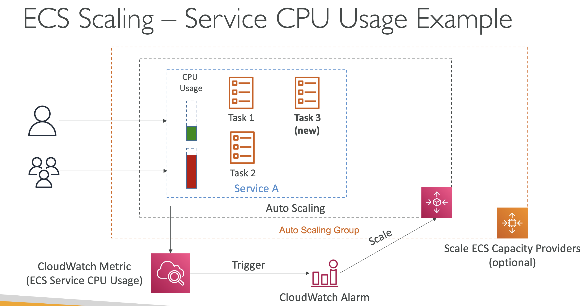
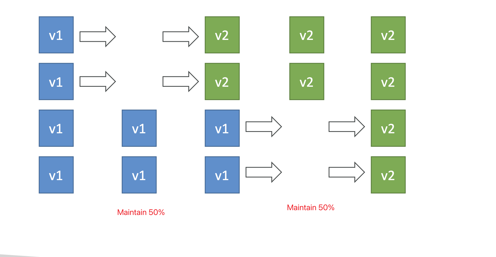
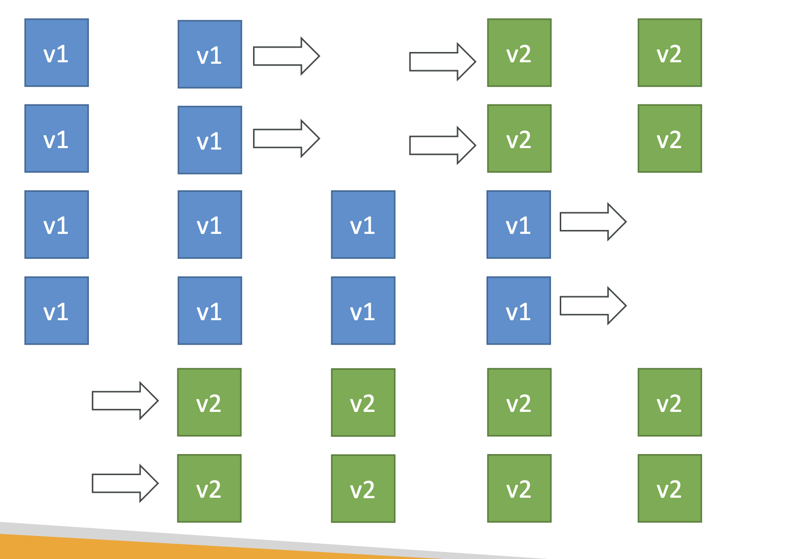
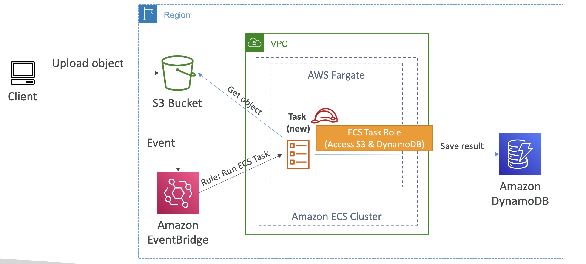
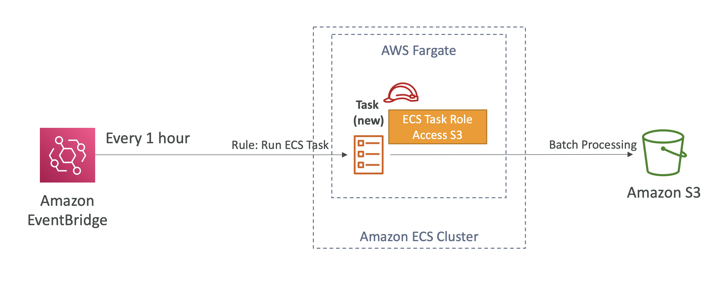
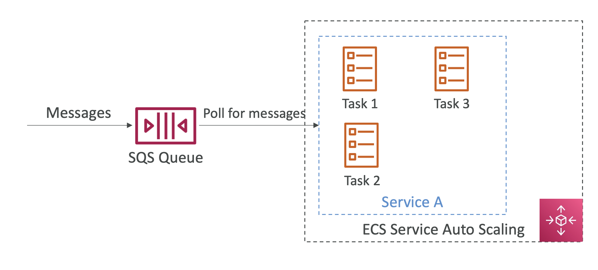
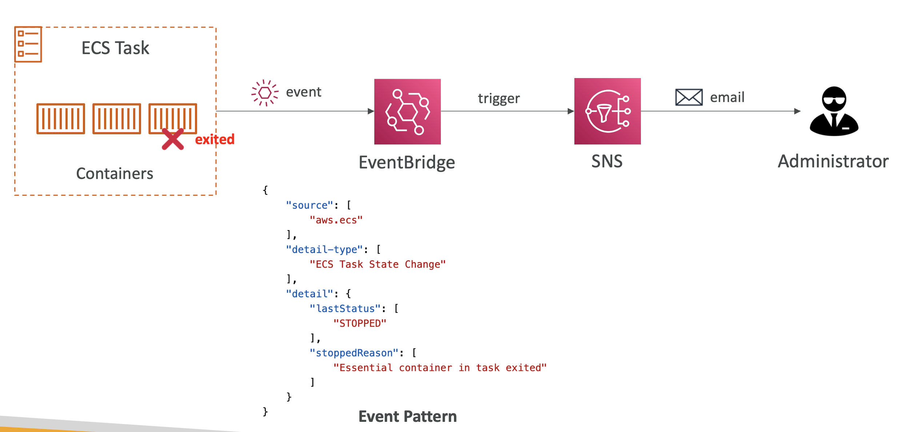
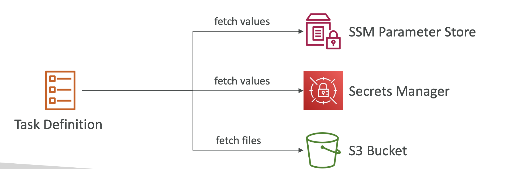

# ECS Service Auto Scaling
* Automatically increase/decrease the desired number of ECS tasks
* Amazon ECS Auto Scaling uses AWS Application Auto Scaling
  * ECS Service **Average CPU Utilization**
  * ECS Service **Average Memory Utilization** - Scale on **RAM**
  * ALB **Request Count Per target** - metric coming from the **ALB**
* **Target Tracking** - Scale based on target value for a specific CloudWatch metric
* **Step Scaling** - scale based on a specified CloudWatch Alarm
* **Scheduled Scaling** - scale based on a specified date/time (predictable changes)

* ECS Service Auto Scaling (task level) != EC2 Auto Scaling (EC2 instance level)
* Fargate Auto Scaling is much easier to setup (because Serverless)

# EC2 Launch Type - Auto Scaling EC2 Instances
* Accommodate ECS Service Scaling by adding underlying EC2 Instances

## Auto Scaling Group Scaling
* Scale your ASG based on CPU Utilization
* Add EC2 instances over time

## ECS Cluster Capacity Provider (Recommended)
* Used to automatically provision and scale the infrastructure for your ECS Tasks
* Capacity Provider paired with an Auto Scaling Group
* Add EC2 Instances when you're missing capacity (CPU, RAM...)

# ECS Scaling - Service CPU USage Example

# ECS Rolling Updates
* When updating from v1 to v2, we can control how many tasks can be started and stopped, and in which order

## Example
Starting number of tasks: 4
### Min 50%, Max 100%

### Min 100%, Max 150%

# ECS tasks invoked by Event Bridge

# ECS tasks invoked by Event Bridge Schedule

# ECS - SQS Queue Example

# ECS - Intercept Stopped Tasks using EventBridge

# Task Definitions
* Task definitions are metadata in JSON form to tell ECS how to run a or multiple docker containers
* It contains crucial information, such as:
  * Image Name
  * Port Binding for container and host
  * Memory and CPU required
  * Environment variables
  * Networking information
  * IAM Role
  * Logging configuration (ex CloudWatch)
* Can define up to 10 containers in a Task Definition
* One IAM Role per task definition

## ECS - Load Balancing (EC2 Launch Type)
* We get a Dynamic Host Port Mapping if you define only the container port in the task definition
* The ALB finds the right port on your EC2 Instances
* You must allow on the EC2 instance's SecurityGroup any port from the ALB's Security Group

## ECS - Load Balancing (Fargate)
* Each task has a unique private IP
* Only define the container port (host port is not applicable)
* Example
  * ECS ENI Security Group
    * Allow port 80 from the ALB
  * ALB Security Group
    * Allow port 80/443 from web

## Environment Variables
* Env Var
  * Hardcoded - e.g. URLs
  * SSM Parameter Store
  * Secrets Manager
* Environment Files (bulk) - Amazon S3

## ECS - Data Volumes (Bind Mounts)
* Share data between multiple containers in the same Task Definition
* Works for both EC2 and Fargate Tasks
* EC2 Tasks - Using EC2 instance storage
  * Data are tied to the lifecycle of the EC2 instance
* Fargate Tasks - Using ephemeral storage
  * Data are tied to the container(s) using them
  * 20 GiB - 200 GiB (default 20 GiB)
* Use cases:
  * Share ephemeral data between multiple containers
  * "Sidecar" container pattern, where the "sidecar" container used to send metrics/logs to other destinations (separation of concerns)