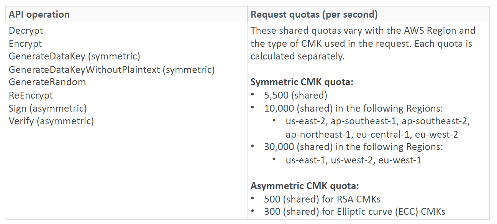

# AWS KMS Types

- AWS Owned Keys (free): SSE-S3,SSE-SQS, SSE-DDB (default key)
- AWS Managed Key: free (aws/service-name, example: aws/rds or aws/ebs)
- Customer managed keys created in KMS: $1/month
- Customer managed keys imported: $1/month
- \+ pay for API call to KMS ($0.03 / 10000 calls)

## Automatic key rotation:

- AWS-managed KMS key: automatic every 1 year
- Customer-managed KMS key: (must be enabled) automatic & on-demand
- Imported KMS key: only manual rotation possible using alias

# KMS Keys Types

- KMS Keys is the new name of KMS Customer Master Key
- Symmetric (AES-256 keys)
  - Single encryption key that is used to Encrypt and Decrypt
  - AWS services that are integrated with KMS use Symmetric CMKs
  - You never get access to the KMS Key unencrypted (must call KMS API to use)
- Asymmetric (RSA & ECC key pairs)
  - Public (Encrypt) and Private Key (Decrypt) pair
  - Used for Encrypt / Decrypt, or Sign/Verify operations
  - The public key is downloadable,but you can't access the Private Key unencrypted
  - Use case: encryption outside of AWS by users who can't call the KMS API

# KMS Key policies

- Control access to KMS keys, "similar" to S3 bucket policies
- Difference: you cannot control access without them

## Default KMS key policy:

- Created if you don't provide a specific KMS Key Policy
- Complete access to the key to the root user = entire AWS account

## Custom KMS Key policy:

- Define users, roles that can access the KMS key
- Define who can administer the key
- Useful for cross-account access of your KMS key

# Copying Snapshots across account

1. Create a Snapshot, encrypted with your own KMS key (customer managed key)
2. Attach a KMS key policy to authorize cross-account access
3. Share the encrypted snapshot
4. (in target) Create a copy of the Snapshot, encrypt it with a CMK in your account
5. Create a volume from the snapshot

# GenerateDataKey: generates a unique symmetric data key (DEK)

- returns a plaintext copy of the data key
- AND a copy that is encrypted under the CMK that you specify

# GenerateDataKeyWithoutPlaintext:

- Generate a DEK to use at some point (not immediately)
- DEK that is encrypted under the CMK that you specify (must use Decrypt later)

# GenerateRandom: Returns a random byte string

# Envelope Encryption

- KMS Encrypt API call has a limit of 4 KB
- If you want to encrypt > 4 KB, we need to use Envelope Encryption
- The main API that will help us is the GenerateDataKey API
- **For the exam**: anything over 4 KB of data that needs to be encrypted **must** use the Envelope Encryption == GenerateDataKey API

# Encryption SDK CLI Hands on

https://docs.aws.amazon.com/encryption-sdk/latest/developer-guide/crypto-cli-install.html#crypto-cli-prerequisites

# KMS Request Quotas

- When you exceed a request quota, you get a ThrottlingException
- To respond, use exponential backoff (backoff and retry)
- For cryptographic operations, they share a quota
- This includes requests made by AWS on your behalf (ex: SSE-KMS)



# S3 Bucket Key for SSE-KMS encryption

- New setting to decrease...
  - Number of API calls made to KMS from S3 by 99%
  - Costs of overall KMS encryption with Amazon S3 by 99%
- This leverages data keys
  - A "S3 bucket key" is generated
  - That key is used to encrypt KMS objects with new data keys
- You will see less KMS CloudTrail events in CloudTrail

# Key Policy - Examples

## Default KMS Key Policy

```json
{
  "Effect": "Allow",
  "Action": "kms:*",
  "Principal": {
    "AWS": "arn:aws:iam::123456789012:root"
  },
  "Resource": "*"
}
```

## Allow Federated User

```json
{
  "Effect": "Allow",
  "Action": [
    "kms:Encrypt",
    "kms:Decrypt",
    "kms:ReEncrypt*",
    "kms:GenerateDataKey*",
    "kms:DescribeKey"
  ],
  "Principal": {
    "AWS": "arn:aws:sts::123456789012:federated-user/user-name"
  },
  "Resource": "*"
}
```
