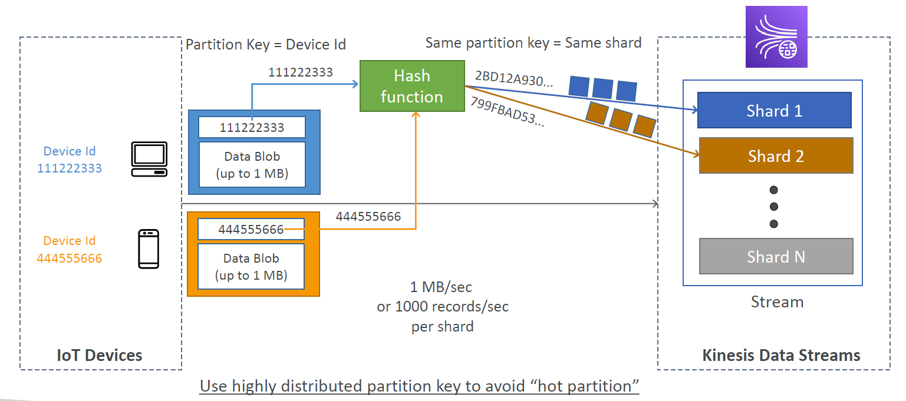
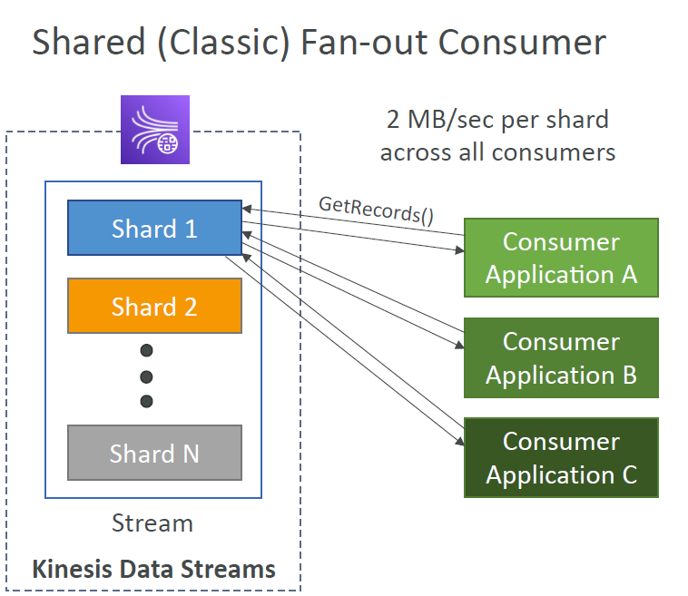
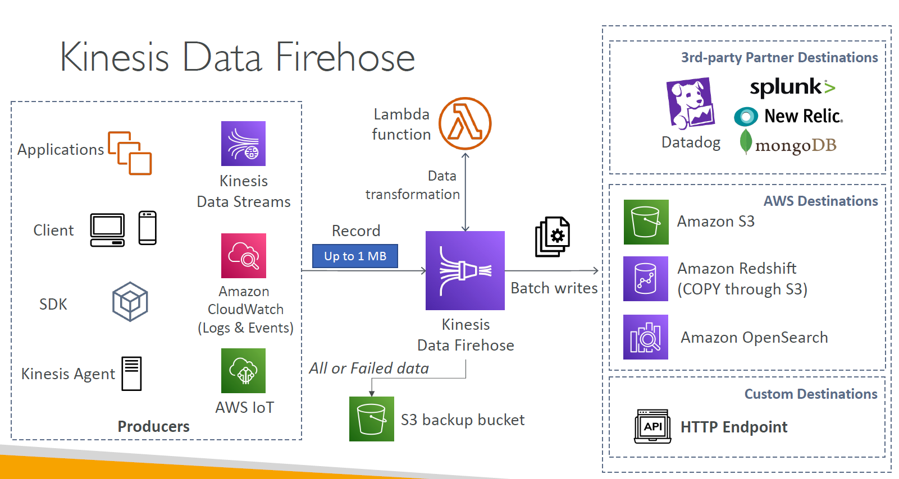
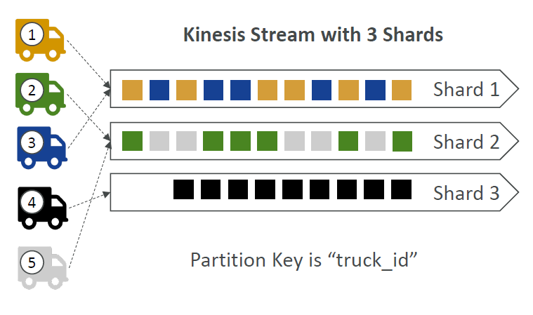

- Kinesis Data Firehose can invoke your Lambda function to transform incoming source data and deliver the transformed data to destinations. You can enable Kinesis Data Firehose data transformation when you create your delivery stream.

# Overview

- Makes it easy to collect, process, and analyze streaming data in real-time
- Ingest real-time data such as: Application logs, Metrics, Website clickstreams, IoT telemetry data...
- 4 Types:
  - Kinesis Data Streams: capture, process, and store data streams
  - Kinesis Data Firehose: load data streams into AWS data stores
  - Kinesis Data Analytics: analyze data streams with SQL or Apache Flink
  - Kinesis Video Streams: capture, process and store video streams

# Kinesis Data Streams

- Retention between 1 day to 365 days
- Ability to reprocess (replay) data
- Once data is inserted in Kinesis, it can't be deleted (immutability)
- Data that shares the same partition goes to the same shard (ordering)
- Producers:
  - AWS SDK
  - Kinesis Producer Library (KPL)
  - Kinesis Agent
- Consumers:
  - Write your own:
    - Kinesis Client Library (KCL)
    - AWS SDK
  - Managed:
    - AWS Lambda
    - Kinesis Data Firehose
    - Kinesis Data Analytics


## Kinesis Data Streams - Capacity Modes

- Provisioned Mode:
  - You choose the number of shards provisioned, scale manually or using API
  - Each shard gets 1 MB/s in (or 1000 records per second)
  - Each shard gets 2 MB/s out (classic or enhanced fan-out consumer)
  - You pay per shard provisioned per hour
- On-demand mode:
  - No need to provision or manage the capacity
  - Default capacity provisioned (4 MB/s in or 4000 records per second)
  - Scales automatically based on observed throughput peak during the last 30 days
  - Pay per stream per hour & data in/out per GB

## Kinesis Data Streams - Security

- Control access / authorization using IAM policies
- Encryption in flight using HTTPS endpoints
- Encryption at rest using KMS
- You can implement encryption / decryption of data on client side (harder)
- VPC Endpoints available for Kinesis to access within VPC
- Monitor API calls using CloudTrail


## Kinesis Data Streams - Producers

- Puts data records into data streams
- Data record consists of:
  - Sequence number (unique per partition-key within shard)
  - Partition key (must specify while put records into stream)
  - Data blob (up to 1 MB)
- Producers:
  - AWS SDK: simple producer
  - Kinesis Producer Library (KPL): C++, Java, Batch, compression, retries
  - Kinesis Agent: monitor log files
- Write throughput: 1 MB/sec or 1000 records/sec per shard
- PutRecord API
- Use batching with PutRecords API to reduce costs & increase throughput



### ProvisionedThroughputExceeded


## Kinesis Data Streams - Consumers

- Get data records from data streams and process them
- The consumers can be:
  - AWS Lambda
  - Kinesis Data Analytics
  - Kinesis Data Firehose
  - Custom Consumer (AWS SDK) - Classic or Enhanced Fan-Out
  - Kinesis Client Library (KCL): library to simplify reading from data stream

### Custom Consumers

#### Shared (Classic) Fan-out Consumer

- Pull model
- Low number of consuming applications
- Read throughput: 2 MB/sec per shard across all consumers
- Max. 5 GetRecords API calls/sec
- Latency ~200 ms
- Low cost ($)
- Consumers poll data from Kinesis using GetRecords API call
- Returns up to 10 MB (then throttle for 5 seconds) or up to 10000 records



#### Enhanced Fan-out Consumer

- Push model
- Multiple consuming applications for the same stream
- 2 MB/sec per consumer per shard
- Latency ~70 ms
- Higher costs ($$$)
- Kinesis pushes data to consumers over HTTP/2 (SubscribeToShard API)
- Soft limit of 5 consumer applications (KCL) per data stream (default)
  - Can be increased by submitting service request


### Lambda

- Supports **Classic & Enhanced** fan-out consumers
- Read records in batches
- Can configure **batch size** and **batch window**
- If error occurs, Lambda retries until succeeds or data expired
- Can process **up to 10 batches per shard** simultaneously


## Some commands

```bash
#!/bin/bash

# get the AWS CLI version
aws --version

# PRODUCER

# CLI v2
aws kinesis put-record --stream-name test --partition-key user1 --data "user signup" --cli-binary-format raw-in-base64-out --region <region>

# CLI v1
aws kinesis put-record --stream-name test --partition-key user1 --data "user signup"


# CONSUMER

# describe the stream
aws kinesis describe-stream --stream-name test

# Consume some data
aws kinesis get-shard-iterator --stream-name test --shard-id shardId-000000000000 --shard-iterator-type TRIM_HORIZON

aws kinesis get-records --shard-iterator <>
```

### Kinesis Client Library (KCL)

- A Java library that helps read record from a Kinesis Data Stream with distributed applications sharing the read workload
- Each shard is to be read by only one KCL instance
- 4 shards = max. 4 KCL instances
- 6 shards = max. 6 KCL instances
- Progress is checkpointed into DynamoDB (needs IAM access)
- Track other workers and share the work amongst shards using DynamoDB
- KCL can run on EC2, Elastic Beanstalk, and on-premises
- Records are read in order at the shard level
- Versions:
  - KCL 1.x (supports shared consumer)
  - KCL 2.x (supports shared & enhanced fan-out consumer)

#### Example: 4 shards


#### Example: 4 shards, Scaling KCL App


#### Example: 6 shards, Scaling


## Kinesis Operation

### Shard Splitting

- Used to increase the Stream capacity (1 MB/s data in per shard)
- Used to divide a "hot shard"
- The old shard is closed and will be deleted once the data is expired
- No Automatic scaling (manually increase/decrease capacity)
- Can't split into more than 2 shards in a single operation


### Merging Shards

- Decrease the Stream capacity and save costs
- Can be used to group 2 shards with low traffic (cold shards)
- Old shards are closed and will be deleted once the data is expired
- Can't merge more than 2 shards in a single operation


# Kinesis Data Firehose

- Fully managed service, no administration, automatic scaling, serverless
- Destinations:
  - AWS
    - Redshift
    - S3
    - OpenSearch
  - 3rd party partner
    - Splunk
    - MongoDB
    - DataDog
    - NewRelic
    - ...
  - Custom: Send to any HTTP endpoint
- Pay for data going through Firehose
- Near Real Time
  - Buffer interval: 0 seconds (no buffering) to 900 seconds
  - Buffer size: minimum 1 MB
- Supports many data formats, conversions, transformations, compression
- Support custom data transformations using AWS Lambda
- Can send failed or all data to a backup S3 bucket



# Kinesis Data Streams vs Firehose


# Kinesis Data Analytics for SQL applications

- Real-time analytics on Kinesis Data Streams & Firehose using SQL
- Add reference data from Amazon S3 to enrich streaming data
- Fully managed, no servers to provision
- Automatic scaling
- Pay for actual consumption rate
- Output:
  - Kinesis Data Streams: create streams out of the real-time analytics queries
  - Kinesis Data Firehose: send analytics query results to destinations
- use cases:
  - Time-series analytics
  - Real-time dashboards
  - Real-time metrics


# Kinesis Data Analytics for Apache Flink (renamed to Amazon managed Service for Apache Flink)

- Use Flink (Java, Scala or SQL) to process and analyze streaming data
- Run any Apache Flink Application on a manged cluster on AWS
  - Provisioning compute resources, parallel computation, automatic scaling
  - Application backups (implemented as checkpoints and snapshots)
  - Use any Apache Flink programming features
  - Flink **does not** read from Firehose (use Kinesis Analytics for SQL instead)


# Ordering data into Kinesis

- Imaging you have 100 trucks (truck_1, truck_2, ..., truck_100) on the road sending their GPS positions regularly into AWS
- You want to consume the data in order for each truck, so that you can track their movement accurately
- How should you send that data into Kinesis?

- Answer: send using a "Partition Key" value of the "truck_id"
- The same key will always go to the same shard



# Ordering data into SQS

- For SQS standard, there is no ordering
- For SQS FIFO, if you don't use a Group ID, messages are consumed in the order they are sent, with only one consumer


- You want to scale the number of consumers, but yo want messages to be "grouped" when they are related to each other, then you use a Group ID (similar to Partition Key in Kinesis)


# Kinesis vs SQS ordering

- Example: 100 trucks, 5 Kinesis shards, 1 SQS FIFO
- Kinesis Data Streams:
  - On average you'll have 20 trucks per shard
  - Trucks will have their data ordered within each shard
  - The maximum amount of consumers in parallel we can have is 5
  - Can receive up to 5 MB/s of data
- SQS FIFO
  - You only have one 1 SQS FIFO queue
  - You will have 100 Group ID
  - You can have up to 100 consumers (due to the 100 Group ID)
  - You have up to 300 messages per second (or 3000 if using batching)

# SQS vs SNS vs Kinesis


