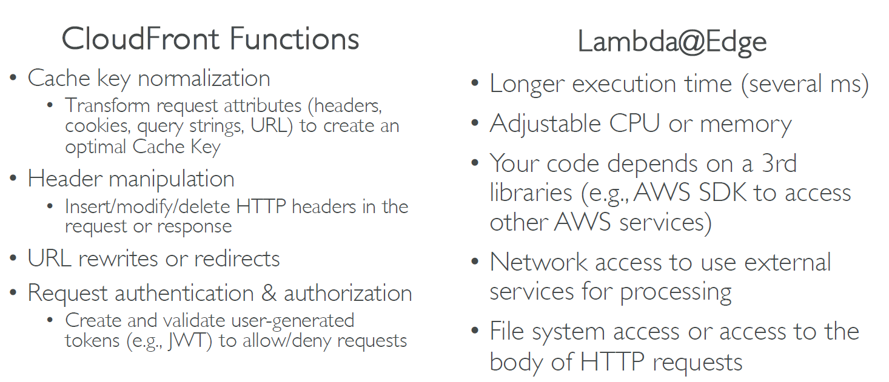
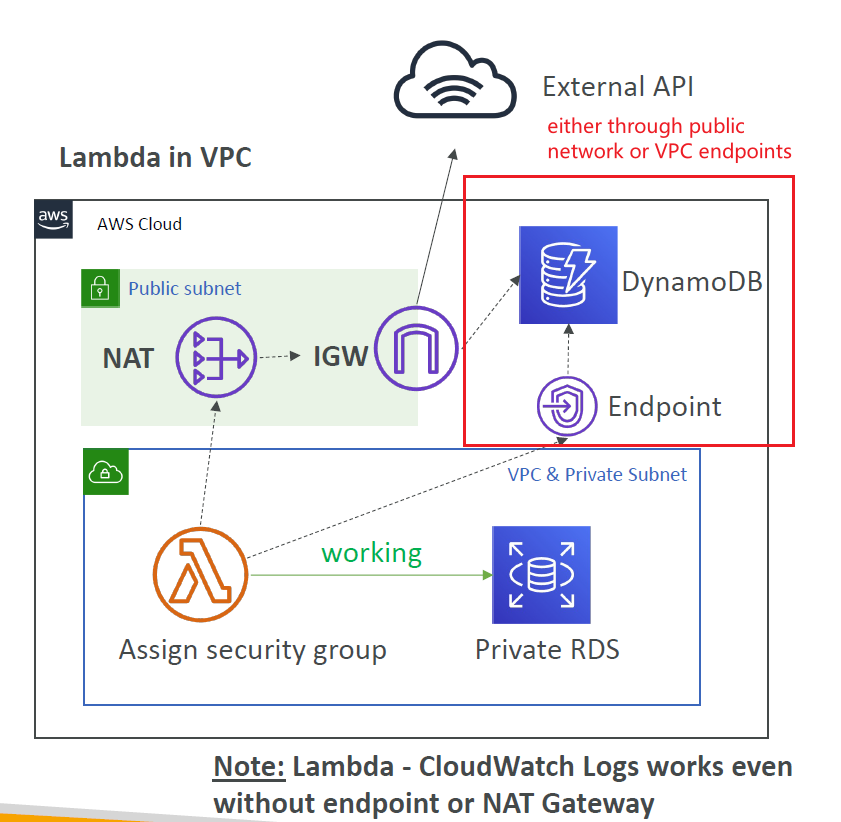
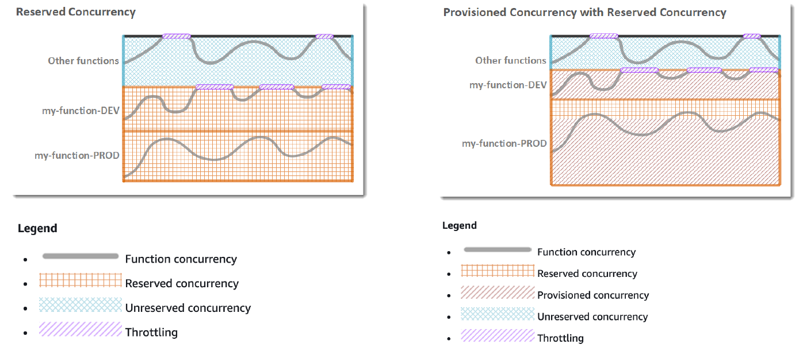

- By default, an alias points to a single Lambda function version. When the alias is updated to point to a different function version, incoming request traffic in turn instantly points to the updated version. This exposes that alias to any potential instabilities introduced by the new version. To minimize this impact, you can implement the routing-config parameter of the Lambda alias that allows you to point to two different versions of the Lambda function and dictate what percentage of incoming traffic is sent to each version.

- Avoid using recursive code in your Lambda function, wherein the function automatically calls itself until some arbitrary criteria is met. This could lead to unintended volume of function invocations and escalated costs. If you do accidentally do so, set the function concurrent execution limit to 0 immediately to throttle all invocations to the function, while you update the code..

- Environment variables for Lambda functions enable you to dynamically pass settings to your function code and libraries, without making changes to your code. Environment variables are key-value pairs that you create and modify as part of your function configuration, using either the AWS Lambda Console, the AWS Lambda CLI or the AWS Lambda SDK. AWS Lambda then makes these key value pairs available to your Lambda function code using standard APIs supported by the language, like process.env for Node.js functions.

- If your Lambda function code is executing, but you don’t see any log data being generated after several minutes, this could mean your execution role for the Lambda function did not grant permissions to write log data to CloudWatch Logs. For information about how to make sure that you have set up the execution role correctly to grant these permissions, see Manage Permissions: Using an IAM Role (Execution Role)

- Any Lambda function invoked asynchronously is retried twice before the event is discarded. If the retries fail and you’re unsure why, use Dead Letter Queues (DLQ) to direct unprocessed events to an Amazon SQS queue or an Amazon SNS topic to analyze the failure.

- Minimize your deployment package size to its runtime necessities. This will reduce the amount of time that it takes for your deployment package to be downloaded and unpacked ahead of invocation. For functions authored in Java or .NET Core, avoid uploading the entire AWS SDK library as part of your deployment package. Instead, selectively depend on the modules which pick up components of the SDK you need

- You can insert logging statements into your code to help you validate that your code is working as expected. Lambda automatically integrates with Amazon CloudWatch Logs and pushes all logs from your code to a CloudWatch Logs group associated with a Lambda function (/aws/lambda/).

- To resolve “LambdaThrottledException” error while using Amazon Cognito Events, you need to perform retry on sync operations while writing Lambda function.

- If the lambda function was created with the default settings , it would have the default timeout of 3 seconds

- For errors such as `ServiceException`, best practice is to Retry invoking Lambda function. Within a Retry Code `ErrorEquals` field is required string which matches error names & all other fields are optional.

- Lambda Catch code is only used after a number of retries are performed by State function.

- `BackoffRate` field is optional in Lambda Retry code & if not specified Default value of 2.0 is considered.

- Lambda Catch code is **only used after a number of retries** are performed by State function. ResultPath is an optional field in a Catch Code, ErrorEquals & Next are required strings.

- If you are writing code that uses other resources, such as a graphics library for image processing, or you want to use the AWS CLI instead of the console, you need to first create the Lambda function deployment package, and then use the console or the CLI to upload the package.

- Take advantage of Execution Context reuse to improve the performance of your function. Make sure any externalized configuration or dependencies that your code retrieves are stored and referenced locally after initial execution. Limit the re-initialization of variables/objects on every invocation. Instead use static initialization/constructor, global/static variables and singletons. Keep alive and reuse connections (HTTP, database, etc.) that were established during a previous invocation.

- AWS Lambda uses environment variables to facilitate communication with the X-Ray daemon and configure the X-Ray SDK.

  - \_X_AMZN_TRACE_ID: Contains the tracing header, which includes the sampling decision, trace ID, and parent segment ID. If Lambda receives a tracing header when your function is invoked, that header will be used to populate the \_X_AMZN_TRACE_ID environment variable. If a tracing header was not received, Lambda will generate one for you.
  - AWS_XRAY_CONTEXT_MISSING: The X-Ray SDK uses this variable to determine its behavior in the event that your function tries to record X-Ray data, but a tracing header is not available. Lambda sets this value to LOG_ERROR by default.
  - AWS_XRAY_DAEMON_ADDRESS: This environment variable exposes the X-Ray daemon’s address in the following format: IP_ADDRESS:PORT. You can use the X-Ray daemon’s address to send trace data to the X-Ray daemon directly, without using the X-Ray SDK.

- With the Lambda proxy integration, Lambda is required to return an output of the following format … In this output, statusCode is typically 4XX for a client error and 5XX for a server error. API Gateway handles these errors by mapping the Lambda error to an HTTP error response, according to the specified statusCode. For API Gateway to pass the error type (for example, InvalidParameterException), as part of the response to the client, the Lambda function must include a header (for example, “X-Amzn-ErrorType“:“InvalidParameterException“) in the headers property.

- You can assign an alias to a specific version and link the S3 trigger to that alias. If you want to change the version of the Lambda triggered by S3, you just need to edit the alias

- Lambda@Edge functions can only be created and deployed in the us-east-1 (N. Virginia) Region

- [Benefits of Lambda](#benefits-of-lambda)
- [Language support](#language-support)
- [Main Integrations](#main-integrations)
  - [Example: Serverless Thumbnail creation](#example-serverless-thumbnail-creation)
- [Pricing Example](#pricing-example)
- [Synchronous Invocations](#synchronous-invocations)
  - [Services](#services)
- [Lambda Integration with ALB](#lambda-integration-with-alb)
  - [Docs](#docs)
  - [ALB to Lambda: HTTP to JSON](#alb-to-lambda-http-to-json)
  - [Lambda to ALB conversions: JSON to HTTP](#lambda-to-alb-conversions-json-to-http)
  - [ALB Multi-Header Values](#alb-multi-header-values)
- [Lambda - Asynchronous Invocations](#lambda---asynchronous-invocations)
  - [Lambda - Asynchronous Invocations - Services](#lambda---asynchronous-invocations---services)
  - [Lambda - Asynchronous Invocations - Commands](#lambda---asynchronous-invocations---commands)
- [Lambda - CloudWatch Events / EventBridge](#lambda---cloudwatch-events--eventbridge)
- [Lambda - S3 Events Notifications](#lambda---s3-events-notifications)
  - [Simple S3 Event Pattern - Metadata Sync](#simple-s3-event-pattern---metadata-sync)
- [Lambda - Event Source Mapping](#lambda---event-source-mapping)
  - [Streams \&\& Lambda (Kinesis \& DynamoDB)](#streams--lambda-kinesis--dynamodb)
    - [Error Handling](#error-handling)
  - [SQS \&\& SQS FIFO](#sqs--sqs-fifo)
    - [Queues \& Lambda](#queues--lambda)
  - [Lambda Event Mapper Scaling](#lambda-event-mapper-scaling)
- [Lambda - Event and Context Objects](#lambda---event-and-context-objects)
- [Lambda - Destinations](#lambda---destinations)
- [Lambda Execution Role (IAM Role)](#lambda-execution-role-iam-role)
- [Lambda Resource Based Policies](#lambda-resource-based-policies)
- [Lambda Environment Variables](#lambda-environment-variables)
- [Lambda Logging \& Monitoring](#lambda-logging--monitoring)
- [Lambda Tracing with X-Ray](#lambda-tracing-with-x-ray)
- [Customization At The Edge](#customization-at-the-edge)
  - [CloudFront Functions \& Lambda@Edge Use Cases](#cloudfront-functions--lambdaedge-use-cases)
    - [CloudFront Functions](#cloudfront-functions)
    - [Lambda@Edge](#lambdaedge)
    - [CloudFront Functions vs Lambda@Edge](#cloudfront-functions-vs-lambdaedge)
    - [CloudFront Functions vs. Lambda@Edge - Use Cases](#cloudfront-functions-vs-lambdaedge---use-cases)
- [Lambda Networking](#lambda-networking)
  - [Lambda in VPC](#lambda-in-vpc)
    - [Lambda in VPC - Internet Access](#lambda-in-vpc---internet-access)
- [Lambda Function Configuration](#lambda-function-configuration)
  - [Lambda Execution Context](#lambda-execution-context)
    - [initialize outside the handler](#initialize-outside-the-handler)
  - [Lambda functions /tmp spaces](#lambda-functions-tmp-spaces)
- [Lambda Performance Improvements](#lambda-performance-improvements)
- [Lambda Layers](#lambda-layers)
  - [Hands on doc](#hands-on-doc)
- [Lambda - File Systems Mounting](#lambda---file-systems-mounting)
  - [Storage Options](#storage-options)
- [Lambda Concurrency and Throttling](#lambda-concurrency-and-throttling)
  - [Concurrency Issue](#concurrency-issue)
  - [Concurrency and Asynchronous Invocations](#concurrency-and-asynchronous-invocations)
  - [Cold Starts \& Provisioned Concurrency](#cold-starts--provisioned-concurrency)
- [Reserved and Provisioned Concurrency](#reserved-and-provisioned-concurrency)
- [Lambda Function Dependencies](#lambda-function-dependencies)
- [Lambda and CloudFormation](#lambda-and-cloudformation)
  - [Inline](#inline)
  - [Through S3](#through-s3)
  - [Lambda and CloudFormation - through S3 multiple accounts](#lambda-and-cloudformation---through-s3-multiple-accounts)
- [Lambda Container Images](#lambda-container-images)
  - [Lambda Container Images - Best Practices](#lambda-container-images---best-practices)
- [Lambda Versions](#lambda-versions)
- [AWS Lambda Aliases](#aws-lambda-aliases)
- [Lambda \& CodeDeploy](#lambda--codedeploy)
  - [Lambda \& CodeDeploy - AppSepc.yml](#lambda--codedeploy---appsepcyml)
- [Lambda - Function URL](#lambda---function-url)
  - [Security](#security)
- [Lambda and CodeGuru Profiling](#lambda-and-codeguru-profiling)
- [Lambda Limits - per region](#lambda-limits---per-region)
- [Lambda Best Practices](#lambda-best-practices)


# Benefits of Lambda

- Easy Pricing:
  - Pay per request and compute time
  - Free tier of 1,000,000 AWS Lambda requests and 400,000 GBs of compute time
  - Integrated with the whole AWS suite of services
  - Integrated with many programming languages
  - Easy monitoring through AWS CloudWatch
  - Easy to get more resources per functions (up to 10GB of RAM)
  - **Increasing RAM will also improve CPU and network**

# Language support

- Node.js
- Python
- Java
- C#
- Ruby
- Custom Runtime API (community supported, example Rust or Golang)
- Lambda Container Image
  - The container image must implement the Lambda Runtime API
  - ECS / Fargate is preferred for running arbitrary Docker images

# Main Integrations


## Example: Serverless Thumbnail creation


# Pricing Example

- You can find overall pricing information here: https://aws.amazon.com/lambda/pricing/
- Pay per calls:
  - First 1,000,000 requests are free
  - $0.20 per 1 million requests thereafter ($0.0000002 per request)
- Pay per duration: (in increment of 1 ms)
  - 400,000 GB-seconds of compute time per month for FREE
  - == 400,000 seconds if function is 1GB RAM
  - == 3,200,000 seconds if function is 128 MB RAM
  - After that $1.00 for 600,000 GB-seconds
- It is usually very cheap to run AWS Lambda so it’s very popular

# Synchronous Invocations

- Synchronous: CLI, SKD, API Gateway, ALB
  - Results is returned right away
  - Error handling must happen client side (retries, exponential backoff, etc...)

## Services

- User Invoked:
  - ELB (ALB)
  - API Gateway
  - CloudFront (Lambda@Edge)
  - S3 Batch
- Service Invoked:
  - Cognito
  - Step Functions
- Other
  - Lex
  - Alexa
  - Kinesis Data Firehose


```bash
aws lambda list-functions --region eu-west-1


# LINUX / MAC
aws lambda invoke --function-name demo-lambda --cli-binary-format raw-in-base64-out --payload '{"key1": "value1", "key2": "value2", "key3": "value3" }' --region eu-west-1 response.json

# WINDOWS POWERSHELL
aws lambda invoke --function-name demo-lambda --cli-binary-format raw-in-base64-out --payload '{\"key1\": \"value1\", \"key2\": \"value2\", \"key3\": \"value3\" }' --region eu-west-1 response.json

# WINDOWS CMD
aws lambda invoke --function-name demo-lambda --cli-binary-format raw-in-base64-out --payload "{""key1"":""value1"",""key2"":""value2"",""key3"":""value3""}" --region eu-west-1 response.json
```

# Lambda Integration with ALB

- To expose a Lambda function as an HTTP(s) endpoint...
- You can use the ALB (or an API Gateway)
- The Lambda function must be registered in a target group


## Docs

- https://docs.aws.amazon.com/lambda/latest/dg/services-alb.html
- https://docs.aws.amazon.com/elasticloadbalancing/latest/application/lambda-functions.html

## ALB to Lambda: HTTP to JSON


## Lambda to ALB conversions: JSON to HTTP


## ALB Multi-Header Values

- ALB can support multi header values (ALB settings)
- When you enable multi-value headers, HTTP headers and query string parameters that are sent with multiple values are shown as arrays within the AWS Lambda event and response objects


# Lambda - Asynchronous Invocations

- S3, SNS, CloudWatch Events...
- The events are placed in an **Event Queue**
- Lambda attempts to retry on errors
  - 3 tries total
  - 1 minute wait after 1st, then 2 minutes wait
- Make sure the processing is idempotent (in case of retries)
- If the function is retried, you will see duplicate logs entries in CloudWatch Logs
- Can define a DLQ (dead-letter queue) - SNS or SQS - for failed processing (need correct IAM permissions)
- Asynchronous invocations allow you to speed up the processing if you don't need to wait for the result (ex: you need 1000 files processed)


## Lambda - Asynchronous Invocations - Services

- S3
- SNS
- CloudWatch Events / EventBridge
- CodeCommit (CodeCommit Trigger: new branch, new tag, new push)
- CodePipeline (invoke a Lambda function during the pipeline, Lambda must callback)

- Other services:
  - CloudWatch Logs (log processing)
  - Simple Email Service
  - CloudFormation
  - AWS Config
  - AWS IoT
  - AWS IoT Events

## Lambda - Asynchronous Invocations - Commands

```bash
# LINUX / MAC
aws lambda invoke --function-name demo-lambda --cli-binary-format raw-in-base64-out --payload '{"key1": "value1", "key2": "value2", "key3": "value3" }' --invocation-type Event --region eu-west-1 response.json

# WINDOWS POWERSHELL
aws lambda invoke --function-name demo-lambda --cli-binary-format raw-in-base64-out --payload '{\"key1\": \"value1\", \"key2\": \"value2\", \"key3\": \"value3\" }' --invocation-type Event --region eu-west-1 response.json

# WINDOWS CMD
aws lambda invoke --function-name demo-lambda --cli-binary-format raw-in-base64-out --payload "{""key1"":""value1"",""key2"":""value2"",""key3"":""value3""}" --invocation-type Event --region eu-west-1 response.json
```

# Lambda - CloudWatch Events / EventBridge


# Lambda - S3 Events Notifications

- Events
  - S3:ObjectCreated
  - S3:ObjectRemoved
  - S3:ObjectRestore
  - S3:Replication
  - ...
- Object name filtering possible (\*.jpg)
- Use case: generate thumbnails of images uploaded to S3
- S3 event notifications typically deliver events in seconds but can sometimes take a minute or longer
- If 2 writes are made to a single non-versioned object at the same time, it is possible that **only a single** event notification will be sent
- If you want to ensure that an event notification is sent for every successful write, you can enable versioning on your bucket

## Simple S3 Event Pattern - Metadata Sync


# Lambda - Event Source Mapping

- Common denominator: records need to be polled from the source
- Your lambda function is invoked synchronously


## Streams && Lambda (Kinesis & DynamoDB)

- An event source mapping creates an iterator for each shard, processes items in order
- Start with new items, from the beginning or from timestamp
- Processed items aren't removed from the stream (other consumers can read them)
- Low traffic: use batch window to accumulate records before processing
- You can process multiple batches in parallel
  - up to 10 batches per shard
  - in-order processing is still guaranteed for each partition key

https://aws.amazon.com/blogs/compute/new-aws-lambda-scaling-controls-for-kinesis-and-dynamodb-event-sources/

### Error Handling

- By default, if your function returns an error, the entire batch is reprocessed until the function succeeds, or the items in the batch expire
- To ensure in-order processing, processing for the affected shard is paused until the error is resolved
- You can configure the event source mapping to
  - discard old events
  - OR restrict the number of retries
  - OR split the batch on error (to work around Lambda timeout issues)
- Discarded events can go to a Destination

## SQS && SQS FIFO

- Event Source Mapping will poll SQS (Long Polling)
- Specify batch size (1 - 10 messages)
- Recommended: Set the queue visibility timeout to 6 times of the timeout of your Lambda function
- To use a DLQ
  - set-up on the SQS queue, not Lambda (DLQ for Lambda is only for async invocations)
  - Or use a Lambda destination for failures


### Queues & Lambda

- Lambda also supports in-order processing for FIFO queues, **scaling up to the number of active message groups**
- For standard queues, items aren't necessarily processed in order
- Lambda scales up to process a standard queue as quickly as possible
- When an error occurs, batches are returned to the queue as individual items and might be processed in a different grouping than the original batch
- Occasionally, the event source mapping might receive the same item from the queue twice, even if no function error occurred
- Lambda deletes items from the queue after they're processed successfully
- You can configure the source queue to send items to a dead-letter queue if they can't be processed

## Lambda Event Mapper Scaling

- Kinesis Data Streams & DynamoDB streams:
  - 1 Lambda invocation per stream shard
  - If you use parallelization, up to 10 batches processed per shard simultaneously
- SQS Standard
  - Lambda adds 60 more instances per minute to scale up
  - Up to 1000 batches of messages processed simultaneously
- SQS FIFO
  - Messages with the same GroupID will be processed in order
  - The Lambda function scales to the number of active message groups

# Lambda - Event and Context Objects


- Event object
  - JSON-formatted document contains data for the function to process
  - Contains information from the invoking service (e.g. EventBridge, custom...)
  - Lambda runtime converts the event to an object (e.g. dict type in Python)
  - Example: input arguments, invoking service arguments, ...
- Context Object
  - Provides methods and properties that provide information about the invocation, function, and runtime environment
  - Passed to your function by Lambda at runtime
  - Example: aws_request_id, function_name, memory_limit_in_mb,...

# Lambda - Destinations

- Asynchronous invocations - can define destinations for successful and failed event:
  - Amazon SQS
  - Amazon SNS
  - AWS Lambda
  - Amazon EventBridge bus
  - NOTE: AWS recommends you use destinations instead of DLQ now (but both can be used at the same time)
  - [doc](https://docs.aws.amazon.com/lambda/latest/dg/invocation-async.html)
- Event Source mapping: for discarded event batches
  - Amazon SQS
  - Amazon SNS
  - NOTE: you can send events to a DLQ directly from SQS
  - [doc](https://docs.aws.amazon.com/lambda/latest/dg/invocation-eventsourcemapping.html)

# Lambda Execution Role (IAM Role)

- Grants the Lambda function permissions to AWS services / resources
- Sample managed policies for Lambda:
  - `AWSLambdaBasicExecutionRole` - Upload logs to CloudWatch
  - `AWSLambdaKinesisExecutionRole` - Read from Kinesis
  - `AWSLambdaDynamoDBExecutionRole` - Read from DynamoDB Streams
  - `AWSLambdaSQSQueueExecutionRole` - Read from SQS
  - `AWSLambdaVPCAccessExecutionRole` - Deploy Lambda function in VPC
  - `AWSXRayDaemonWriteAccess` - Upload trace data to X-Ray
- When you use an event source mapping to invoke your function, Lambda uses the execution role to read event data
- Best practice: create one Lambda Execution Role per function

# Lambda Resource Based Policies

- Use resource-based policies to give other accounts and AWS services permission to use your Lambda resources
- Similar to S3 bucket policies for S3 bucket
- An IAM principal can access Lambda:
  - if the IAM policy attached to the principal authorizes it (e.g. user access)
  - OR if the resource-based policy authorizes (eg.g service access)
- When an AWS service like Amazon S3 calls your Lambda function, the resource-based policy gives it access

# Lambda Environment Variables

- key value pair in "String" form
- Adjust the function behavior without updating code
- The environment variables are available to your code
- Lambda service adds its own system environment variables as well
- Helpful to store secrets (encrypted by KMS)
- Secrets can be encrypted by the Lambda service key, or your own CMK

# Lambda Logging & Monitoring

- CloudWatch Logs
  - AWS Lambda execution logs are stored in AWS CloudWatch Logs
  - Make sure your AWS Lambda function has an **execution role** with an IAM policy that authorizes writes to CloudWatch Logs
- CloudWatch Metrics:
  - AWS Lambda metrics are displayed in AWS CloudWatch Metrics
  - Invocations, Durations, Concurrent Executions
  - Error count, Success Rates, Throttles
  - Async Delivery Failures
  - Iterator Age (Kinesis & DynamoDB Streams)

# Lambda Tracing with X-Ray

- Enable in Lambda configuration (Active Tracing)
- Runs the X-Ray daemon for you
- Use AWS X-Ray SDK in Code
- Ensure Lambda Function has correct IAM Execution Role
  - The managed policy is called `AWSXRayDaemonWriteAccess`
- Environment variables to communicate with X-Ray
  - `_X_AMZN_TRACE_ID`: contains the tracing header
  - `AWS_XRAY_CONTEXT_MISSING`: by default, `LOG_ERROR`
  - `AWS_XRAY_DAEMON_ADDRESS`: the X-Ray Daemon IP_ADDRESS:PORT

# Customization At The Edge

- Many modern applications execute some form of the logic at the edge
- Edge Function:
  - A code that you write and attache to CloudFront Distributions
  - Runs close to your users to minimize latency
- CloudFront provides 2 types
  - CloudFront Functions
  - Lambda@Edge
- Use case: customize the CDN content
- Pay only for what you use
- Fully serverless

## CloudFront Functions & Lambda@Edge Use Cases
- Website Security and Privacy
- Dynamic Web Application at the Edge
- Search Engine Optimization (SEO)
- Intelligently Route Across Origins and Data Centers
- Bot Mitigation at the Edge
- Real-time Image Transformation
- A/B Testing
- User Authentication and Authorization
- User Prioritization
- User Tracking and Analytics

### CloudFront Functions
- Lightweight functions written in JS
- For high-scale, latency-sensitive CDN customizations
- Sub-ms startup times, millions of requests/second
- Used to change Viewer requests and responses
  - Viewer request: after CloudFront receives a request from a viewer
  - Viewer Response: before CloudFront forwards the response to the viewer
- Native feature of CloudFront (manage code entirely within CloudFront)

### Lambda@Edge
- Lambda functions written in NodeJS or Python
- Scales to 1000s of requests/second
- Used to change CloudFront requests and responses
  - Viewer Request - after CloudFront receives a request from a viewer
  - Origin Request - before CloudFront forwards the request to the origin
  - Origin Response - after CloudFront receives the response from the origin
  - Viewer Response - before CloudFront forwards the response to the viewer
- Author your functions in one AWS Region (us-east-1), then CloudFront replicates to its locations

### CloudFront Functions vs Lambda@Edge


### CloudFront Functions vs. Lambda@Edge - Use Cases


# Lambda Networking
- By default, your Lambda function is launched outside your own VPC (in an AWS-owned VPC)
- Therefore it **cannot** access resources in your VPC (RDS, ElastiCache, internal ELB...)


## Lambda in VPC
- You must define the VPC ID, the Subnets and the Security Groups
- Lambda will create an ENI (Elastic Network Interface) in your subnets
- Required role `AWSLambdaVPCAccessExecutionRole`

### Lambda in VPC - Internet Access
- By default, a Lambda function in your VPC does not have internet access
  - Deploying a Lambda function in a public subnet does not give it internet access or a public IP
- Deploying a Lambda function in a private subnet gives it internet access if you have a NAT Gateway / Instance
- You can use VPC endpoints to privately access AWS services without a NAT



# Lambda Function Configuration
- RAM
  - From 128 MB to 10 GB in 1 MB increments
  - The more RAM you add, the more vCPU credits you get
  - At 1,792 MB, a function has the equivalent of one full vCUP
  - After 1,792 MB, you get more than one CPU, and need to use multi-threading in your code to benefit from it
  - If you application is CUP-bound (computation heavy), **increase RAM**
- Timeout
  - default 3 seconds
  - Max: 900 seconds (15 minutes)

## Lambda Execution Context
- The execution context is a temporary runtime environment that initializes any external dependencies of your lambda code
- Great for database connections, HTTP clients, SDK clients...
- The execution context is maintained for some time in anticipation of another Lambda function invocation
- The next function invocation can "re-use" the context to execution time and save time in initializing connections objects
- The execution context includes the */tmp* directory

### initialize outside the handler


## Lambda functions /tmp spaces
- If your Lambda function needs to download a big file to work...
- If your Lambda function needs disk space to perform operations...
- You can use the /tmp directory
- Max size is 10 GB
- The directory content remains when the execution context is frozen, providing transient cache that can be used for multiple invocations (helpful to checkpoint your work)
- For permanent persistence of object (non temporary), use S3
- To encrypt content on /tmp, you must generate KMS Data Keys

# Lambda Performance Improvements


# Lambda Layers
- Custom Runtimes
  - Ex: C++ https://github.com/awslabs/aws-lambda-cpp
  - Ex: Rust https://github.com/awslabs/aws-lambda-rust-runtime
- Externalize Dependencies to re-use them


## Hands on doc
https://aws.amazon.com/blogs/aws/new-for-aws-lambda-use-any-programming-language-and-share-common-components/

# Lambda - File Systems Mounting
- Lambda functions can access EFS file systems if they are running in a VPC
- Configure Lambda to mount EFS file systems to local directory during initialization
- Must leverage EFS Access Points
- Limitations: watch out for the EFS connection limits (1 function instance = 1 connection) and connection burst limits


## Storage Options


# Lambda Concurrency and Throttling
- Concurrency limit: up to 1000 concurrent executions
- Can set a "reserved concurrency at the function level (=limit)
- Each invocation over the concurrency limit will trigger a "Throttle"
- Throttle behavior:
  - If synchronous invocation => return ThrottleError - 429
  - If asynchronous invocation => retry automatically and then go to DLQ
- If you need a higher limit, open a support ticket

## Concurrency Issue
- If you don't reserve concurrency, the following can happen:


## Concurrency and Asynchronous Invocations

- If the function doesn't have enough concurrency available to process all events, additional requests are throttled
- For throttling errors (429) and system errors (500-series), Lambda returns the event to the queue and attempts to run the function again for up to 6 hours
- The retry interval increases exponentially from 1 second after the first attempt to a maximum of 5 minutes

## Cold Starts & Provisioned Concurrency
- Cold Start
  - New instance => code is loaded and code outside the handler run (init)
  - If the init is large (code, dependencies, SDK...) this process can take some time
  - First request served by new instances has higher latency than the rest
- Provisioned Concurrency
  - Concurrency is allocated before the function is invoked (in advance)
  - So the cold start never happens and all invocations have low latency
  - Application Auto Scaling can manage concurrency (schedule or target utilization)
- NOTE:
  - Cold starts in VPC have been dramatically reduced in Oct && Nov 2019
  - https://aws.amazon.com/blogs/compute/announcing-improved-vpc-networking-for-aws-lambda-functions/

# Reserved and Provisioned Concurrency



https://docs.aws.amazon.com/lambda/latest/dg/configuration-concurrency.html

# Lambda Function Dependencies
- If your Lambda function depends on external libraries, for example:
  - AWS X-Ray
  - SDK
  - Database Clients
  - ...
  - You need to install the packages alongside your code and zip it **together**
    - For node js, use npm & "node_modules" directory
    - For python, use pip --target options
    - For Java, include the relevant .jar files
- Upload the zip straight to Lambda if less than 50 MB, else to S3 first
- Native libraries work, they need to be compiled on Amazon Linux
- AWS SDK comes by default with every Lambda function

# Lambda and CloudFormation

## Inline
- Inline functions are very simple
- Use the Code.ZipFile property
- You cannot include function dependencies with inline functions


## Through S3
- You must store the Lambda zip in S3
- You must refer the S3 zip location in the CloudFormation code
  - S3Bucket
  - S3Key: full path to zip
  - S3ObjectVersion: if versioned bucket
- If you update the code in S3, but don't update S3Bucket, S3Key or S3ObjectVersion, CloudFormation won't update your function


## Lambda and CloudFormation - through S3 multiple accounts


# Lambda Container Images
- Deploy Lambda function as container images of up to 10 GB from ECR
- Pack complex dependencies, large dependencies in a container
- Base images are available for Python, Node.js, Java, .NET, Go, Ruby
- Can create your own image as long as it implements the Lambda Runtime API
- Test the containers locally using the Lambda Runtime Interface Emulator
- Unified workflow to build apps


- Build from the base images provided by AWS
```dockerfile
# Use an image that implements the Lambda Runtime API
FROM amazon/aws-lambda-nodejs:12
# Copy your application code and files
COPY app.js package*.json ./
# Install the dependencies in the container
RUN npm install
# Function to run when the Lambda function is invoked
CMD [ "app.lambdaHandler" ]
```

## Lambda Container Images - Best Practices
- Strategies for optimizing container images:
  - Use AWS-provided base images
    - Stable, Built on Amazon Linux 2, cached by Lambda service
  - Use Multi-Stage Builds
    - Build your code in larger preliminary images, copy only the artifacts you need in your final container image, discard the preliminarysteps
  - Build from Stable to Frequently Changing
    - Make your most frequently occurring changes as late in your Dockerfile as possible
  - Use a Single Repository for Functions with Large Layers
    - ECR compares each layer of a container image when it is pushed to avoid uploading and storing duplicates
- Use them to upload large Lambda Functions (up to 10 GB)

# Lambda Versions
- When you work on a Lambda function, we work on $LATEST
- When we're ready to publish a Lambda function, we create a version
- Versions are immutable
- Versions get their own ARN (Amazon Resource Name)
- Version = code + configuration (nothing can be changed - immutable)
- Each version of the Lambda function can be accessed

# AWS Lambda Aliases
- Aliases are "pointers" to Lambda function versions
- We can define a "dev", "test", "prod" aliases and have them point at different lambda versions
- Aliases are mutable
- Aliases enable Canary deployment by assigning weights to lambda functions
- Aliases enable stable configuration of our event triggers / detinations
- Aliases have their own ARNs
- Aliases cannot reference aliases


# Lambda & CodeDeploy
- CodeDeploy can help you automate traffic shift for Lambda aliases
- Feature is integrated within the SAM framework
- Linear: grow traffic every N minutes until 100%
  - Linear10PercentEvery3Minutes
  - Linear10PercentEvery10Minutes
- Canary: try X percent then 100%
  - Canary10Percent5Minutes
  - Canary10Percent30Minutes
- AllAtOnce: immediate
- Can create Pre & Post Traffic hooks to check the health of the Lambda function

## Lambda & CodeDeploy - AppSepc.yml
- Name (required) - the name of the Lambda function to deploy
- Alias (required) - the name of the alias to the Lambda function
- CurrentVersion (required) - the version of the Lambda function traffic currently points to
- TargetVersion (required) - the version of the Lambda function traffic is shifted to

# Lambda - Function URL
- Dedicated HTTP(S) endpoint for your Lambda function
- A unique URL endpoint is generated for you (never changes)
  - https://<url-id>.lambda-url.<region>.on.aws (dual-stack IPv4 & IPv6)
- Invoke via a web browser, curl, Postman, or any HTTP client
- Access your function URL through the public Internet only
  - **Doesn't** support PrivateLink (Lambda functions do support)
- Supports Resource-based Policies & CORS configurations
- Can be applied to any function alias or to %LATEST (can't be applied to other function versions)
- Create and configure using AWS Console or AWS API
- Throttle your function by using Reserved Concurrency

## Security
- Resource-based Policy
  - Authorize other accounts / specific CIDR / IAM principals
- Cross-Origin Resource Sharing (CORS)
  - If you call your Lambda function URL from a different domain
- AuthType NONE - allow public and unauthenticated access
  - Resource-based Policy is always in effect (must grant public access)
- AuthType AWS_IAM - IAM is used to authenticate and authorize requests
  - Both Principal's Identity-based Policy & Resource-based Policy are evaluated
  - Principal must have `lambda:InvokeFunctionUrl` permissions
  - Same account: Identity-based Policy OR Resource-based Policy as ALLOW
  - Cross account - Identity-based Policy AND Resource Based Policy as ALLOW

# Lambda and CodeGuru Profiling
- Gain insights into runtime performance of your Lambda functions using CodeGuru Profiler
- CodeGuru creates a Profiler Group for your Lambda function
- Supported for Java and Python runtimes
- Activate from AWS Lambda Console
- When activated, Lambda adds:
  - CodeGuru Profiler layer to your function
  - Environment variables to your function
  - AmazonCodeGuruProfilerAgentAccess policy to your function

# Lambda Limits - per region
- Execution:
  - Memory allocation: 128 MB - 10 GB (1 MB increments)
  - Max execution time: 900 seconds (15 minutes)
  - Env var (4 KB)
  - Disk capacity in the "function container" (in /tmp): 512 MB to 10 GB
  - Concurrency executions: 1000 (can be increased)
- Deployment
  - Lambda function deployment size (compressed .zip): 50 MB
  - Size of uncompressed deployment (code + dependencies): 250 MB
  - Can use the /tmp directory to load other files at startup
  - Size of environment variables: 4 KB
# Lambda Best Practices
- Perform heavy-duty work outside of your function handler
  - Connect to db outside of your function handler
  - Initialize the AWS SDK outside of your function handler
  - Pull in dependencies or datasets outside of your function hanlder
- Use env var for:
  - db connection strings, S3 bucket, etc...
  - Passwords, sensitive values... they can be encrypted using KMS
- Minimize your deployment package size to its runtime necessities
  - Break down the function if need be
  - Remember the AWS Lambda limits
  - Use Layers where necessary
- Avoid using recursive code, never have a Lambda function call itself
- [doc](https://docs.aws.amazon.com/lambda/latest/dg/best-practices.html)