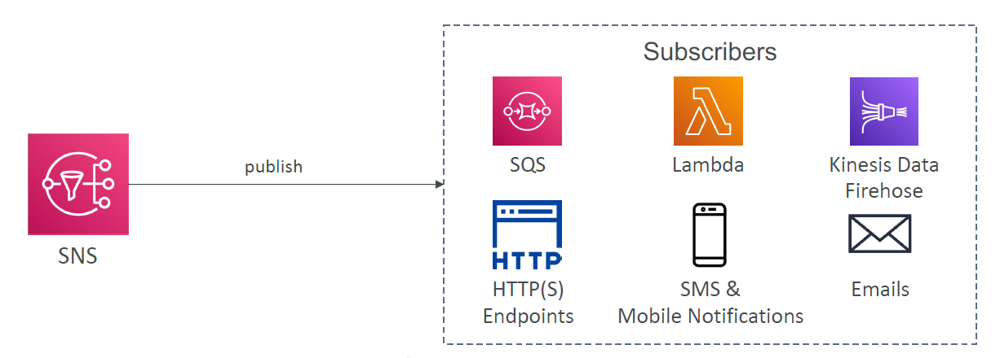
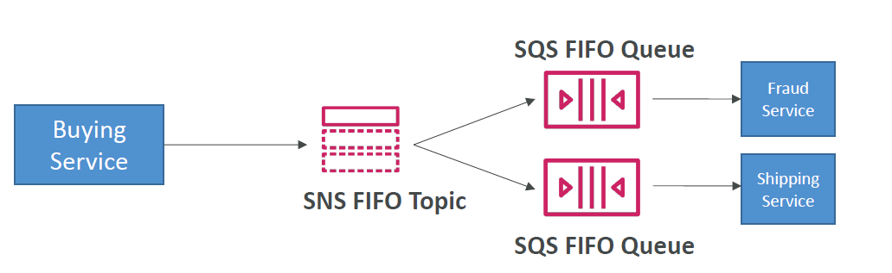

- By default, a subscriber of an Amazon SNS topic receives every message published to the topic. To receive only a subset of the messages, a subscriber assigns a filter policy to the topic subscription.
  - A filter policy is a simple JSON object. The policy contains attributes that define which messages the subscriber receives. When you publish a message to a topic, Amazon SNS compares the message attributes to the attributes in the filter policy for each of the topic’s subscriptions. If there is a match between the attributes, Amazon SNS sends the message to the subscriber. Otherwise, Amazon SNS skips the subscriber without sending the message to it. If a subscription lacks a filter policy, the subscription receives every message published to its topic.

# Overview

- The "event producer" only sends message to one SNS topic
- As many "event receivers" (subscriptions) as we want to listen to the SNS topic notifications
- Each subscriber to the topic will get all the messages (note: new feature to filter messages)
- Up to 12,500,000 subscriptions per topic
- 100,000 topics limit

## SNS integrates with a lot of AWS services

- Many AWS services can send data directly to SNS for notifications

# SNS - How to publish

- Topic Publish (using the SDK)
  - Create a topic
  - Create a subscription (or many)
  - Publish to the topic
- Direct Publish (for mobile apps SDK)
  - Create a platform application
  - Create a platform endpoint
  - Publish to the platform endpoint
  - Works with Google GCM, Apple APNS, Amazon ADM...

# SNS - Security

- Encryption
  - In-flight encryption using HTTPS API
  - At-rest encryption using KMS keys
  - Client-side encryption if the client wants to perform encryption/decryption itself
- Access Controls: IAM policies to regulate access to the SNS API
- SNS Access Policies (similar to S3 bucket policies)
  - Useful for cross-account access to SNS topics
  - Useful for allowing other services (S3...) to write to an SNS topics

# SNS + SQS: Fan Out

- Push once in SNS, receive in all SQS queues that are subscribers
- Fully decoupled, no data loss
- SQS allows for: data persistence, delayed processing and retries of work
- Ability to add more SQS subscribers over time
- Make sure yourSQS queue access policy allows for SNS to write
- Cross-Region Delivery: works with SQS Queues in other regions

## Application: S3 Events to multiple queues

- For the same combination of: event type (e.g. object create) and prefix (e.g. images/) you can only have **one S3 Event rule**
- If you want to send the same S3 event to many SQS queues, use fan-out

## Application: SNS to S3 through Kinesis Data Firehose

- SNS can send to Kinesis and therefore we can have the following solutions architecture:

# SNS - FIFO Topic

- Similar features as SQS FIFO:
  - Ordering by Message Group ID (all messages in the same group are ordered)
  - Deduplication using a **Deduplication ID** or **Content Based Deduplication**
- Can have SQS Standard and FIFO queues as subscribers
- Limited throughput (same throughput as SQS FIFO)

## SNS FIFO + SQS FIFO: Fan out

- In case you need fan out + ordering + deduplication

# SNS - Message Filtering

- JSON policy used to filter messages sent to SNS topic's subscriptions
- If a subscription doesn't have a filter policy, it receives every message

