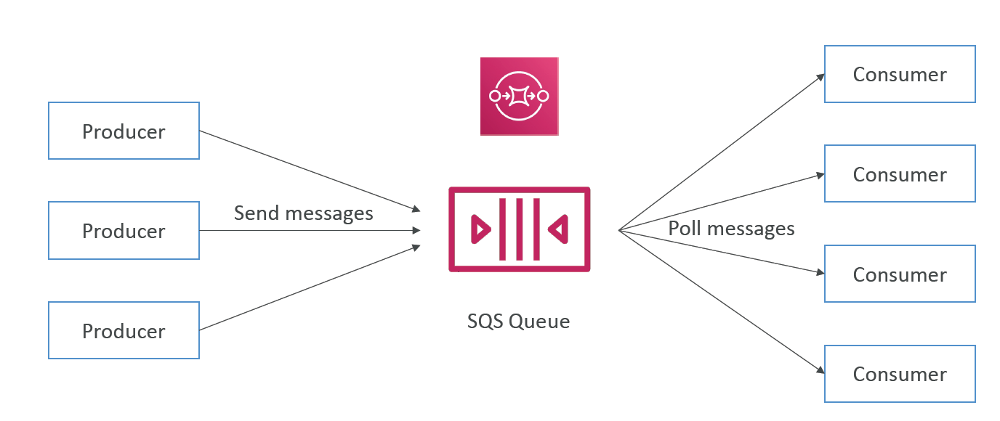
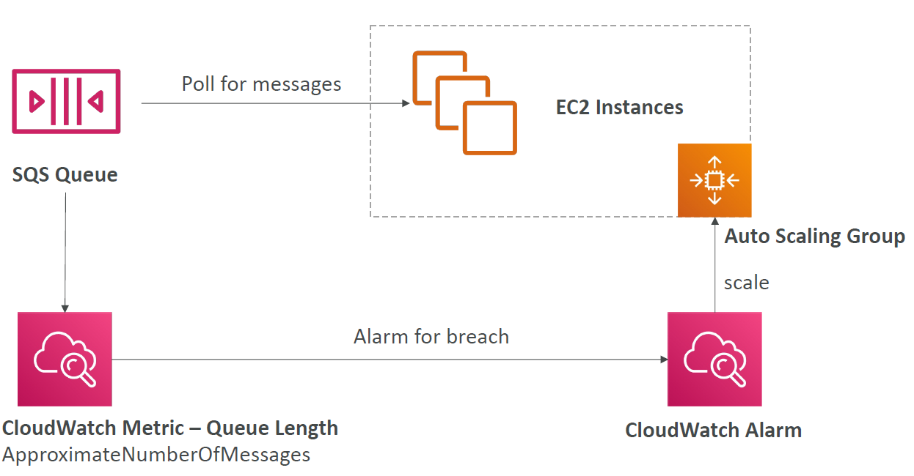
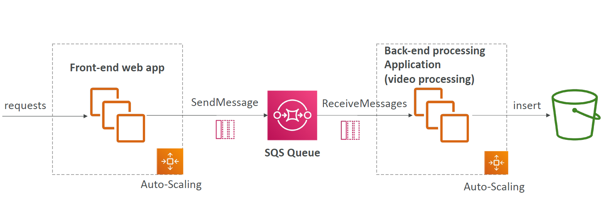
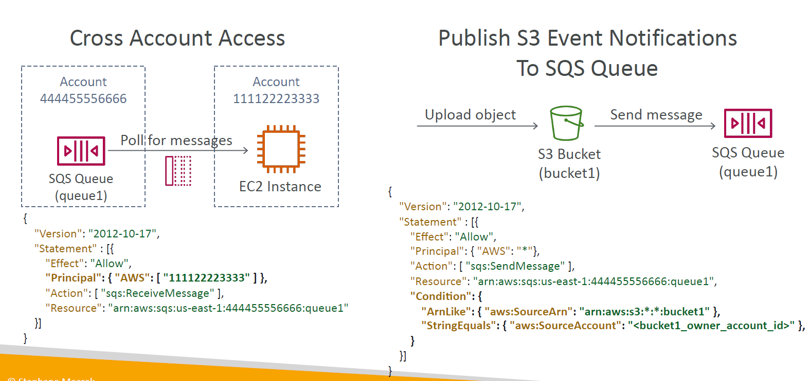
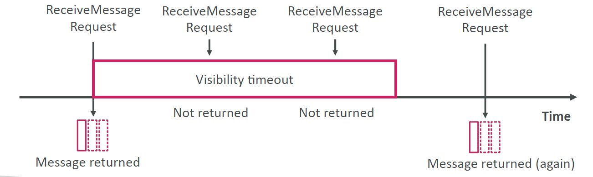
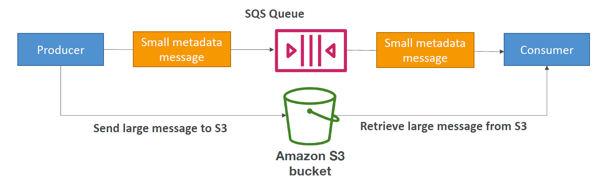

# Overview

## SQS - Standard Queue

- Fully managed service, used to decouple applications
- Attributes:
  - **Unlimited throughput**, **unlimited number of messages** in queue
  - Default retention of messages: **4 days**, maximum of **14 days**
  - Low latency (< 10 ms on publish and receive>)
  - Limitation of **256KB** per message sent
- Can have duplicate messages (at least once delivery, occasionally)
- Can have out of order messages (best effort ordering)

## SQS - Producing Messages

- Produced to SQS using the SDK (SendMessage API)
- The message is persisted in SQS until a consumer deletes it
- Example: send an order to be processed
  - Order id
  - Customer id
  - Any attributes you want

## SQS - Consuming messages

- Consumers (running on EC2 instances, servers (on-prem), or AWS Lambda)...
- Poll SQS for messages (receive **up to 10 messages** at a time)
- Delete the messages using the DeleteMessage API

## SQS - Multiple EC2 Instances Consumers

- Consumers receive and process messages in parallel
- At least once delivery
- Best-effort message ordering
- Consumers delete messages after processing them
- We can scale consumers horizontally to improve throughput of processing

## SQS with Auto Scaling Group (ASG)

## SQS to decouple between application tiers

## SQS - Security

- Encryption
  - In-flight encryption using HTTPS API
  - At-rest encryption using KMS keys
  - Client-side encryption if the client wants to perform encryption/decryption itself
- Access Controls: IAM policies to regulate access to the SQS API
- SQS Access Policies (similar to S3 bucket policies)
  - Useful for cross-account access to SQS queues
  - Useful for allowing other services (SNS, S3...) to write to an SQS queue

# SQS Queue Access Policy

## Granting permissions to publish event notification messages to a destination

[walk through](https://docs.aws.amazon.com/AmazonS3/latest/userguide/ways-to-add-notification-config-to-bucket.html)

# SQS - message Visibility Timeout

- After a message is polled by a consumer, it becomes invisible to other consumers
- By default, the "message visibility timeout" is **30 seconds**
- That means the message has 30 seconds to e processed
- After the message visibility timeout is over, the message is "visible" in SQS

- If a message is not processed within the visibility timeout, it will be processed twice
- A consumer could call the ChangeMessageVisibility API to get more time
- If visibility timeout is high (hours), and consumer crashes, re-processing will take time
- If visibility timeout is too low (seconds), we may get duplicates

# SQS - Dead Letter Queue (DLQ)

- If a consumer fails to process a message within the visibility timeout, the message goes back to the queue
- We can set a threshold of how many times a message can go back to the queue
- After the **MaximumReceives** threshold is exceeded, the message goes into a dead letter queue (DLQ)
- Useful for debugging
- DLQ of a FIFO queue must also be a FIFO queue
- DLQ of a standard queue must also be a Standard queue
- Make sure to process the messages in the DLQ before they expire:
  - Good to set a retention of 14 days in the DLQ

## SQS DLQ - Redrive to Source

- Feature to help consume messages in the DLQ to understand what is wrong with them
- When our code is fixed, we can redrive the messages from the DLQ back into the source queue (or any other queue) in batches without writing custom code

# SQS - Delay Queue

- Delay a message (consumers don't see it immediately) up to 15 minutes
- Default is 0 seconds (message is available right away)
- Can set a default at queue level
- Can override the default on send using the DelaySeconds parameter

# SQS - Long Polling

- When a consumer requests messages from the queue, it can optionally "wait" for message to arrive if there are none in the queue
  - This is called **Long Polling**
- Long Polling **decreases** the number of API calls made to SQS while increasing the efficiency and decreasing the latency of your application
- The wait time can be between **1 sec to 20 sec** (20 sec preferable)
- **Long Polling is preferable to Shot Polling**
- Long Polling can be enabled at the queue level or at the API level using **ReceiveMessageWaitTimeSeconds**

# SQS Extended Client

- Message size limit is 256 KB, how to send large messages, e.g. 1 GB?
- Using the SQS Extended Client (Java Library)

# SQS - Must Know API

- CreateQueue(MessageRetentionPeriod)
- DeleteQueue
- PurgeQueue - delete all the messages in queue
- SendMessage(DelaySeconds)
- MaxNumberOfMessages: default 1, max 10 (for ReceiveMessage API)
- ReceiveMessageWaitTimeSeconds: long polling
- ChangeMessageVisibility: change the message timeout
- Batch APIs for SendMessage, DeleteMessage, ChangeMessageVisibility helps decrease your costs

# SQS - FIFO Queue

- FIFO = First In First Out (ordering of messages in the queue)
- Limited throughput
  - Without batching: 300 msg/s
  - With batching: up to 3000 msg/s
- Exactly-once send capability (by removing duplicates)
- Messages are processed in order by the consumer

## Deduplication

- De-duplication interval is 5 minutes
- Two de-duplication methods:
  - **Content-based deduplication**: will do a SHA-256 hash of the message body
  - Explicitly provide a Message Deduplication ID

## Message Grouping

- If you specify the same value of **MessageGroupID** in an SQS FIFO queue, you can only have one consumer, and all the messages are in order
- To get ordering at the level of a subset of messages, specify different values for **MessageGroupID**
  - Messages that share a common Message Group ID will be in order within the group
  - Each Group ID can have a different consumer (parallel processing!)
  - Ordering across groups is not guaranteed
