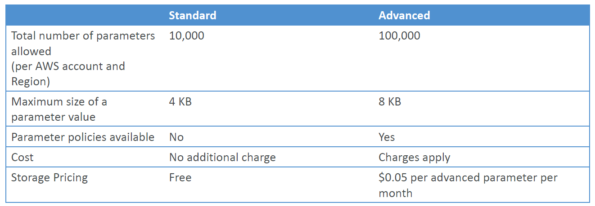

# Overview

- Secure storage for configuration and secrets

* Optional Seamless Encryption using KMS
* Serverless, scalable, durable, easy SDK
* Version tracking of configurations / secrets
* Security through IAM
* Notifications with Amazon EventBridge
* Integration with CloudFormation

# SSM Parameter Store Hierarchy

- /my-department/
  - my-app/
    - dev/
      - db-url
      - db-password
    - prod/
      - db-url
      - db-password
  - other-app/
- /other-department/
- /aws/reference/secretsmanager/secret_ID_in_Secrets_Manager
- /aws/service/ami-amazon-linux-latest/amzn2-ami-hvm-x86_64-gp2 (public)

# Standard and advanced parameter tiers

# Parameters Policies (for advanced parameters)

- Allow to assign to TTL to a parameter (expiration date) to force updating or deleting sensitive data such as passwords
- Can assign multiple policies at a time
