# VPC

## VPC & Subnets Primer

- **VPC**: private network to deploy your resources (regional resource)
- **Subnets** allow you to partition your network inside your VPC (AZ resource)
- A **public subnet** is a subnet that is accessible from the internet
- A **private subnet** is a subnet that is not accessible from the internet
- To define access to the internet and between subnets, we use **Route Tables**

## Internet Gateway & NAT Gateways

- Internet Gateways helps our VPC instances connect with the internet
- Public Subnets have a route to the internet gateway

- NAT Gateways (AWS-managed) & NAT Instances (self-managed) allow your instances in your Private Subnets to access the internet while remaining private

## VPC Components Overview

- **VPC (Virtual Private Cloud)**: A logically isolated virtual network in the AWS cloud
- **Subnet**: A segment of a VPC's IP address range where you can place groups of isolated resources
- **Internet Gateway / Egress-only Internet Gateway**: The Amazon VPC side of a connection to the public internet for IPv4/IPv6
- **Router**: Routers interconnect subnets and direct traffic between Internet gateways, virtual private gateways, NAT gateways, and subnets
- **Peering Connection**: Direct connection between two VPCs
- **VPC Endpoints**: Private connection to public AWS services
- **NAT Instance**: Enables Internet access for EC2 instances in private subnets (managed by you)
- **NAT Gateway**: Enables Internet access for EC2 instances in private subnets (managed by AWS)
- **Virtual Private Gateway**: The Amazon VPC side of a Virtual Private Network (VPN) connection
- **Customer Gateway**: Customer side of a VPN connection
- **AWS Direct Connect**: High speed, high bandwidth, private network connection from customer to AWS
- **Security Group**: Instance-level firewall
- **Network ACL**: Subnet-level firewall

## Rules and Guidelines

- CIDR block size can be between /16 and /28
- The CIDR block **must not overlap** with any existing CIDR block that's associated with the VPC
- You **cannot** increase or decrease the size of an existing CIDR
- The **first 4** and **last IP** address are not available for use
- AWS recommend you use CIDR blocks from the RFC 1918 ranges:
  - 10.0.0.0 - 10.255.255.255 (10/8 prefix): Your VPC must be /16 or smaller, for example, 10.0.0.0/16
  - 172.16.0.0 - 172.31.255.255 (172.16/12 prefix): Your VPC must be /16 or smaller, for example, 172.31.0.0/16
  - 192.168.0.0 - 192.168.255.25 (192.168/16 prefix): Your VPC can be smaller,for example 192.168.0.0/20

## Additional Considerations

- Ensure you have enough networks and hosts
- Bigger CIDR blocks are typically better (more flexibility)
- Smaller subnets are OK for most use cases
- Consider deploying application tiers per subnet
- Split your HA resources across subnets in different AZs
- VPC Peering requires non-overlapping CIDR blocks
  - This is across all VPCs in all Regions / accounts you want to connect
- Avoid overlapping CIDR blocks as much as possible!

## Security Group Best Practice

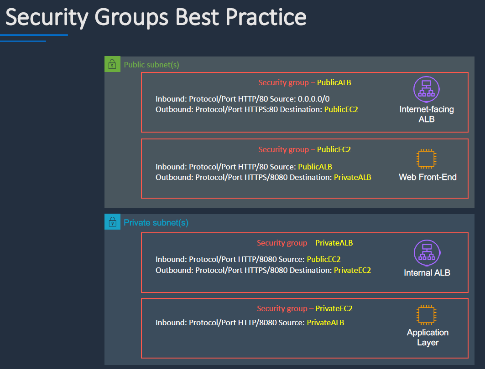

## VPC Peering

## Things needs to be added

### Source

- VPC Peering connection
- Add target VPC CIDR to route table
- Create inbound rules from target in security group

### Target

- Accept VPC Peering request
- Add source VPC CIDR to route table
- Create inbound rules from source in security group

## VPC Endpoints

### VPC Interface Endpoints - other services

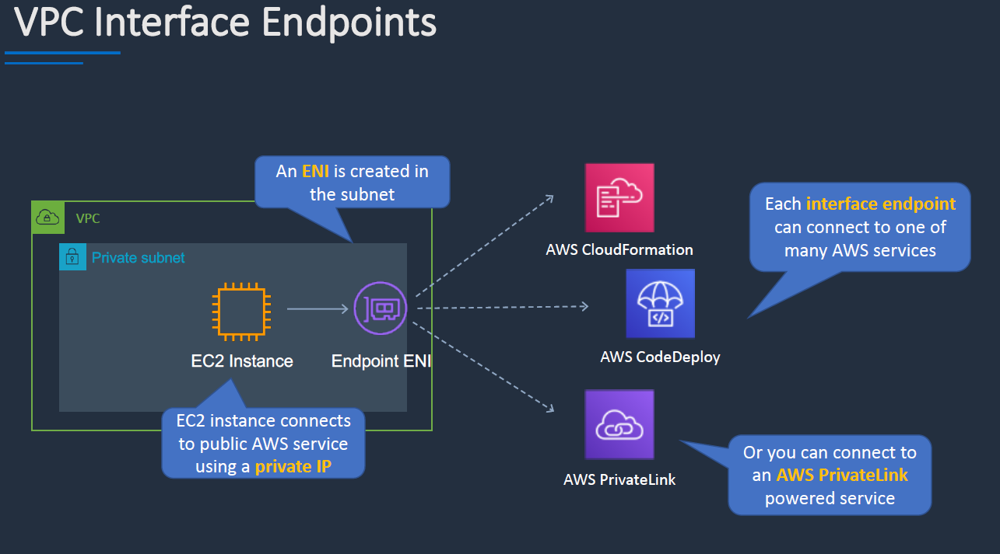

### VPC Gateway Endpoint - S3, DynamoDB

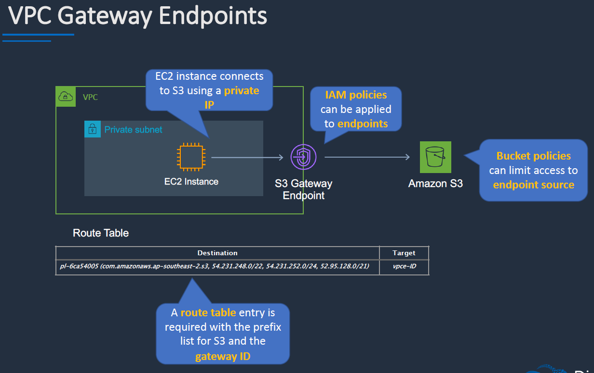

### Interface Endpoint vs Gateway Endpoint

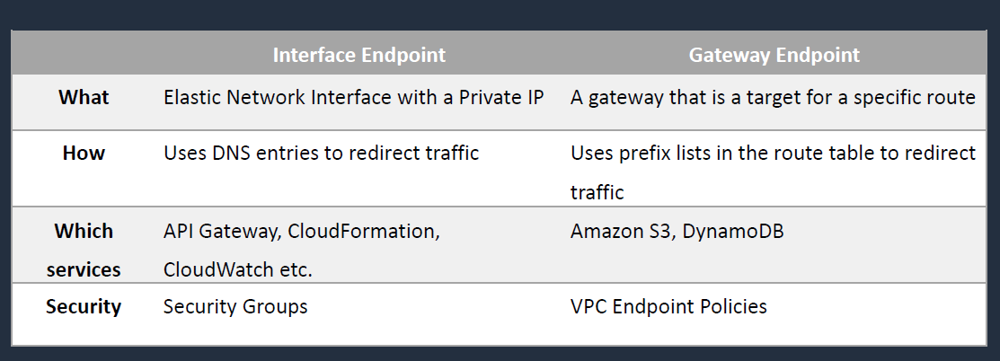

## AWS Client VPN

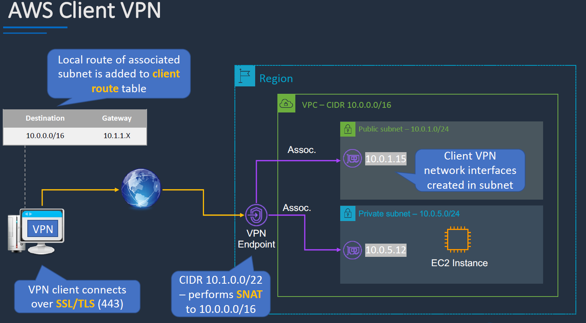

## Site-to-Site VPN

- **Virtual Private Gateway**: Deployed on the AWS side
- **Customer gateway**: Deployed on the customer side
- Establish the VPN connection, the connection supports
  - static routes
  - OR BGP peering/routing

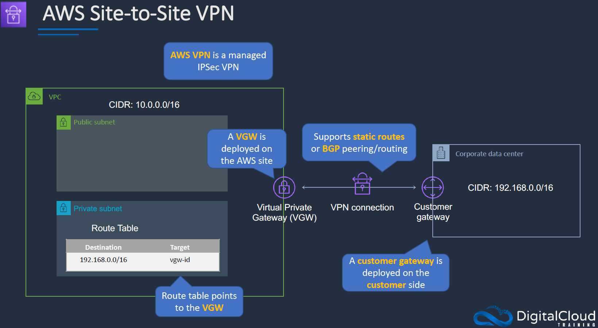

## VPN CloudHub (not accessible from Management Console)

- An architectural Pattern

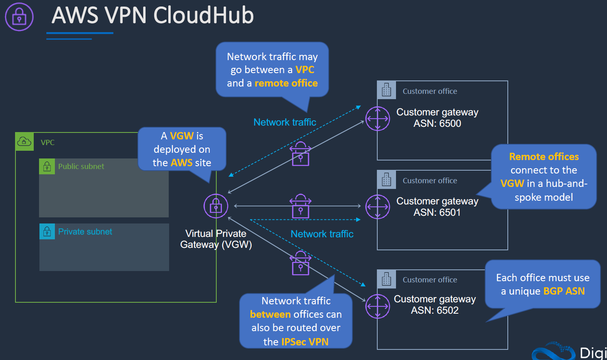

## Direct Connect (DX)

- Private connectivity between AWS and your data center / office
- Consistent network experience - increased speed / latency & bandwidth / throughput
- Lower costs for organizations that transfer large volumes of data

- Speeds from 50 Mbps to 500 Mbps can also be accessed via an APN partner (uses hosted VIFs or hosted connections):
  - A **hosted VIF** is a single VIF that is shared with other customers (shared bandwidth)
  - A **hosted connection** is a DX connection with a single VIF dedicated to you
- DX Connections are **NOT** encrypted
- Use an **IPSec S2S VPN** connection over a VIF to add encryption in transit
- Link aggregation groups (LAGs) can be used to combine multiple physical connections into a single logical connection using **LACP** - provides improved speed

### General Structure

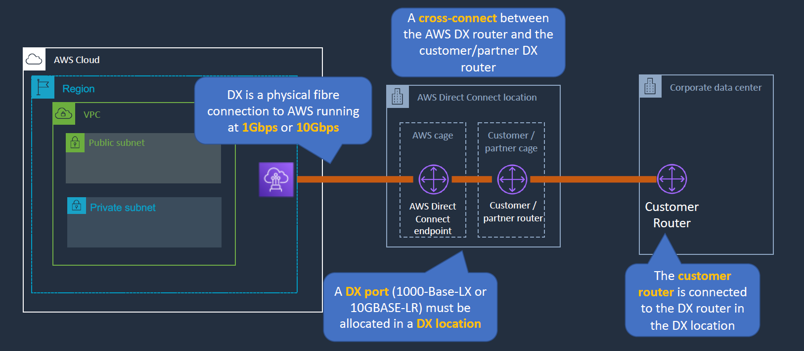

### Connect to AWS service via VIF

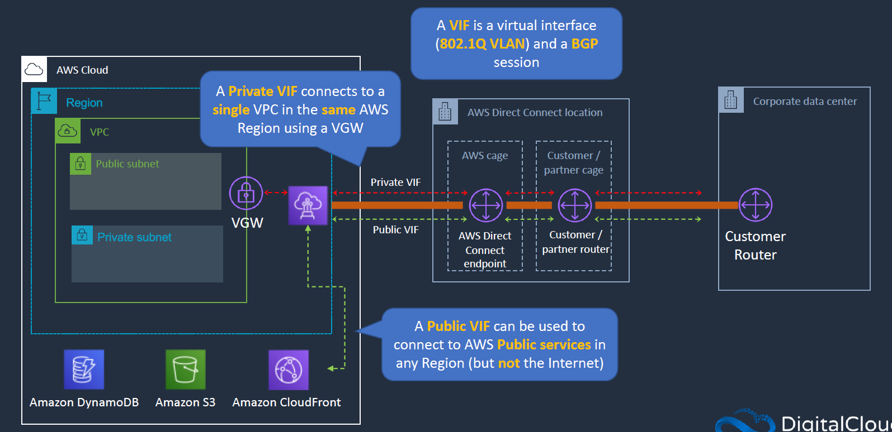

#### VIF to multiple VPCs

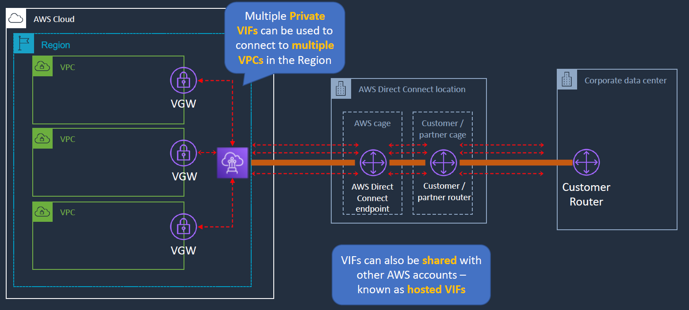

## Direct Connect Gateway

### Without Gateway

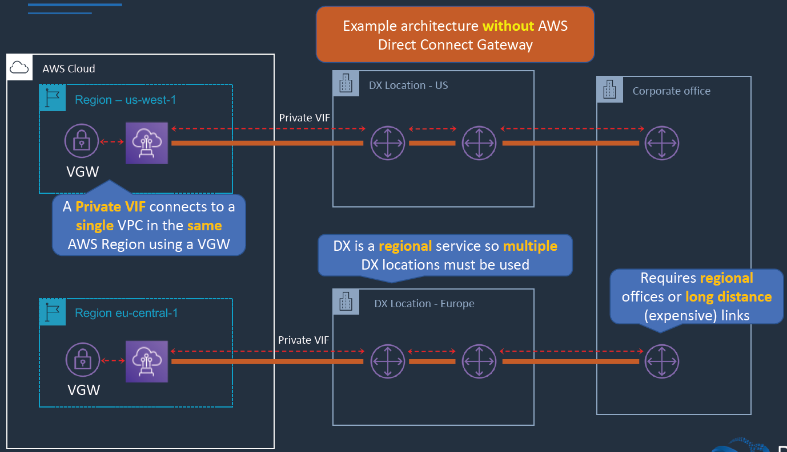

### With Gateway

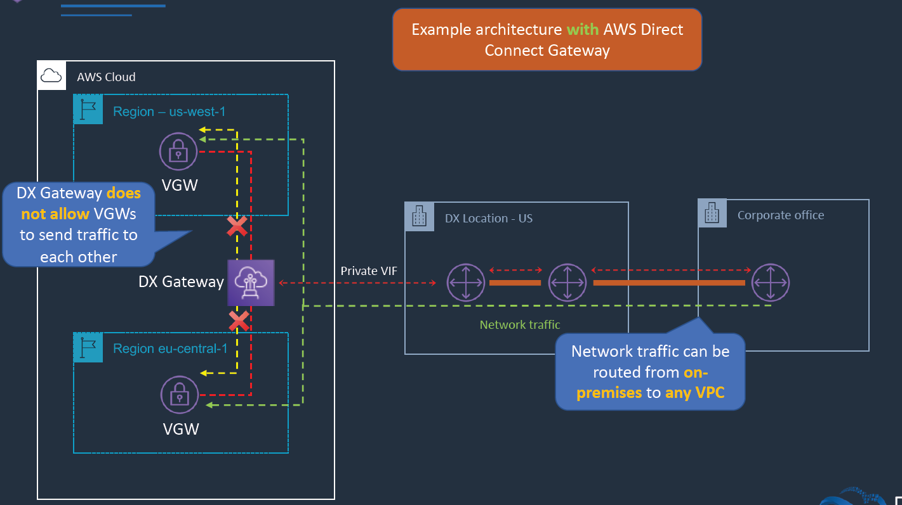

## Transit Gateway

### Without Transit Gateway

- Complex topology, for example: 4 VPCs, it will require
  - 6 peering (A <-> B, B <-> D, D <-> C, A <-> C, A <-> D, B <-> C)
  - 4 Virtual Gateway in each VPC + 1 Customer Gateway
  - 4 Site-to-Site VPNs

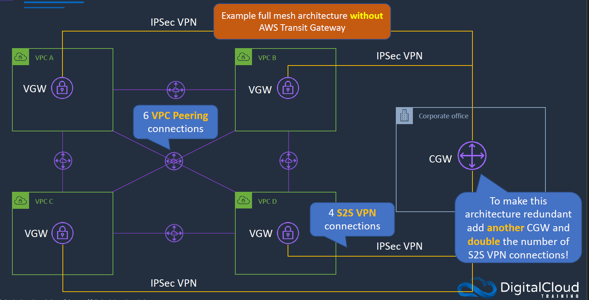

### With Transit Gateway

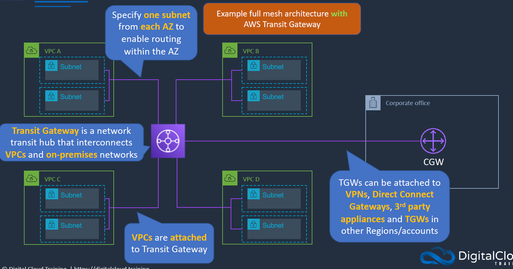

### Transit Gateway + Direct Connect Gateway

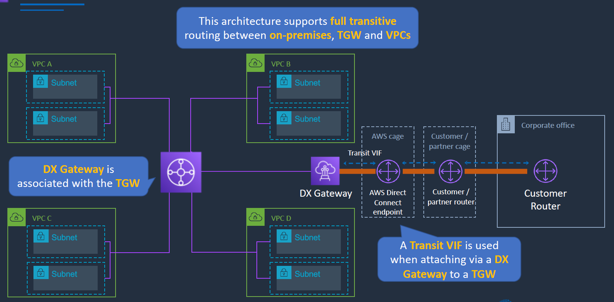

## VPC Flow Logs

- Flow Logs capture information about the IP traffic going to and from network interfaces in a VPC
- Flow log data is stored using Amazon **CloudWatch Logs** or **S3**
- Flow logs can be created at the following levels:
  - VPC
  - Subnet
  - Network interface
