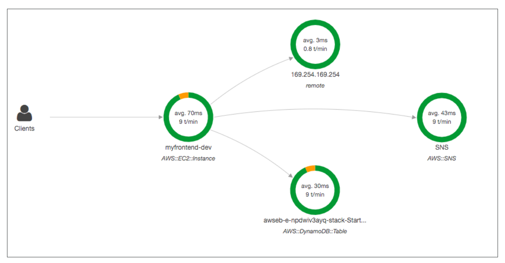
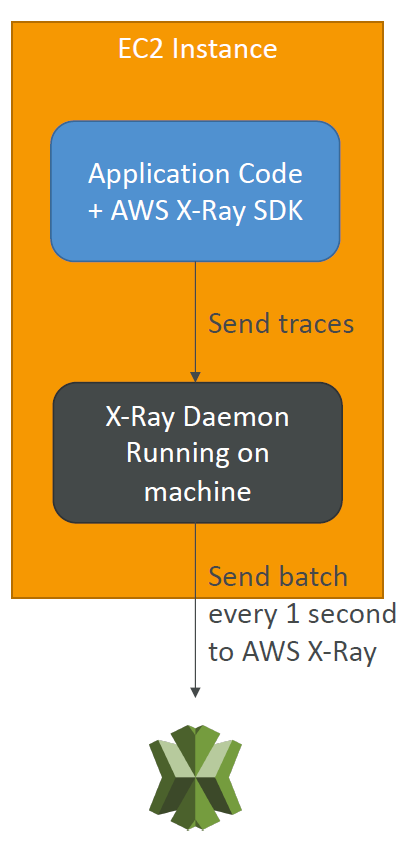
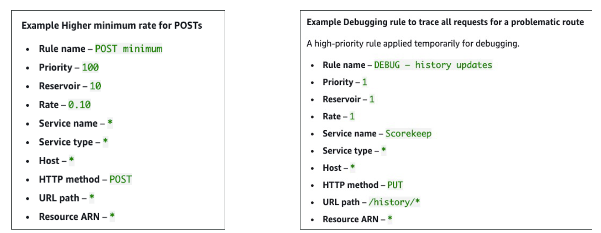
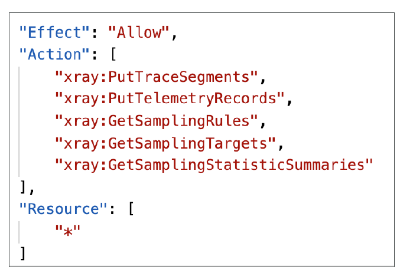
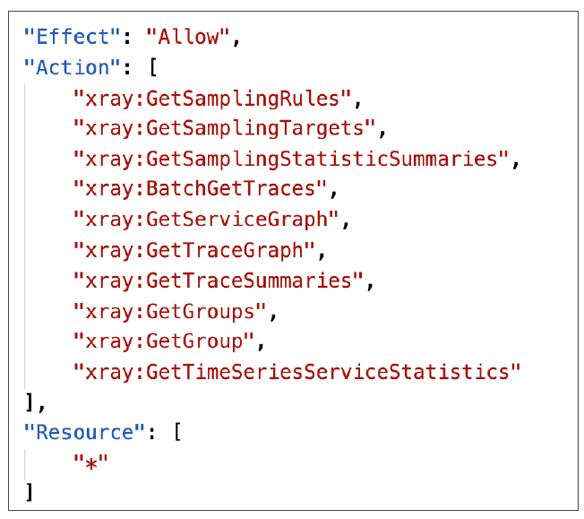
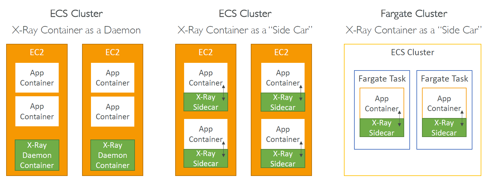

- You need to have the daemon service running on the EC2 Instance. And a role needs to be attached to the EC2 Instance
  Running the X-Ray Daemon on Amazon EC2

- The X-Ray SDK provides:
  - Interceptors to add to your code to trace incoming HTTP requests
  - Client handlers to instrument AWS SDK clients that your application uses to call other AWS services
  - An HTTP client to use to instrument calls to other internal and external HTTP web services

# Overview

## Old way

- Test locally
- Add log statements everywhere
- Re-deploy in production

### Cons

- Log formats differ across applications using CloudWatch and analytics is hard
- Debugging: monolith "easy", distributed services "hard"
- No common views of your entire architecture

# X-Ray Visual analysis of our applications



## Advantages

- Troubleshooting performance (bottlenecks)
- Understand dependencies in a microservice architecture
- Pinpoint service issues
- Review request behavior
- Find errors and exceptions
- Are we meeting time SLA?
- Where am I throttled?
- Identify users that are impacted

## Compatibility

- AWS Lambda
- Elastic Beanstalk
- ECS
- ELB
- API Gateway
- EC2 Instances or any application server (even on premise)

## X-Ray Leverages Tracing

- Tracing is an end to end way to following a "request"
- Each component dealing with the request adds its own "trace"
- Tracing is made of segments (+ sub segments)
- Annotations can be added to traces to provide extra-information
- Ability to trace:
  - Every request
  - Sample request (as a % for example or a rate per minute)
- X-Ray Security:
  - IAM for authorization
  - KMS for encryption at rest

# How to enable X-Ray

1. Your code (Java, Python, Go, Node.js, .NET) must import the AWS X-Ray SDK

   - Very little code modification needed

   - The application SDK will then capture:
     - Calls to AWS services
     - HTTP / HTTPS requests
     - Database Calls (MySQL, PostgreSQL, DynamoDB)
     - Queue calls (SQS)

2. Install the X-Ray daemon or enable X-Ray AWS Integration

   - X-Ray daemon works as a low level UDP packet interceptor (Linux / Windows / Mac...)
   - AWS Lambda / other AWS services already run the X-Ray daemon for you
   - Each application must have the IAM rights to write data to X-Ray



# Troubleshooting

- If X-Ray is not working on EC2
  - Ensure the EC2 IAM Role has the proper permissions
  - Ensure the EC2 instance is running the X-Ray Daemon
- To enable on AWS Lambda:
  - Ensure it has an IAM execution role with proper policy (AWSX-RayWriteOnlyAccess)
  - Ensure that X-Ray is imported in the code
  - Enable Lambda X-Ray Active Tracing

# X-Ray Instrumentation in your code

- Instrumentation means the measure of product's performance, diagnose errors, and to write trace information
- To instrument your application code, you use the X-Ray SDK
- You can modify your application code to customize and annotation the data that the SDK sends to X-Ray, using interceptors, filters, handlers, middleware...

# X-Ray Concepts

- **Segments**: each application / service will send them
- **Subsegments**: if you need more details in your segment
- **Trace**: segments collected together to form an end-to-end trace
- **Sampling**: decrease the amount of requests send to X-Ray, reduce cost
- **Annotations**: Key Value pairs used to index traces and use with filters
- **Metadata**: Key Value pair, not indexed, not used for searching

- The X-Ray daemon / agent has a config to send traces cross account:
  - Make sure the IAM permissions are correct - the agent will assume the role
  - This allows to have a central account for all your application tracing

# X-Ray Sampling Rules

- With sampling rules, you control the amount of data that you record
- You can modify sampling rules without changing your code
- By default, the X-Ray SDK records **the first request each second**, and **5% of any additional requests**
  - 1 request per second is the reservoir, which ensures that at least one trace is recorded each second as long the service is serving requests
  - 5% is the rate at which additional requests beyond the reservoir size are sampled
- You can create your own rules with the reservoir and rate



# X-Ray Write APIs (used by the X-Ray daemon)



- PutTraceSegments: Uploads segment documents to AWS X-Ray
- PutTelemetryRecords: Used by the AWS X-Ray daemon to upload telemetry
  - SegmentsReceivedCount
  - SegmentsRejectedCounts
  - BackendConnectionErrors
  - ...
- GetSamplingRules: Retrieve all sampling rules (to know what/when to send)
- GetSamplingTargets & GetSamplingStatisticSummaries: advanced
- The X-Ray daemon needs to have an IAM policy authorizing the correct API calls to function correctly

# X-Ray Read APIs



- GetServiceGraph: main graph
- BatchGetTraces: Retrieves a list of traces specified by ID. Each trace is a collection of segment documents that originates from a single request
- GetTraceSummaries: Retrieves IDs and annotations for traces available for a specified time frame using an optional filter: To get the full traces, pass the trace IDs to BatchGetTraces
- GetTraceGraph: Retrieves a service graph for one or more specific trace IDs

# X-Ray with Elastic Beanstalk

- AWS Elastic Beanstalk platforms include the X-Ray daemon
- You can run the daemon by setting an option in the Elastic Beanstalk console or with configuration file (in .ebextensions/xray-daemon.config)

```yaml
option_settings:
  aws:elasticbeanstalk:xray:
    XRayEnabled: true
```

- Make sure to give your instance profile the correct IAM permissions so that the X-Ray daemon can function correctly
- Then make sure your application code is instrumented with the X-Ray SDK
- NOte: The X-Ray daemon is **not** provided for Multi-container Docker

# X-Ray + ECS integration options



## Example task definition

[Official Doc](https://docs.aws.amazon.com/xray/latest/devguide/xray-daemon-ecs.html)
