# Encryption

## Why encryption?

### Encryption in flight (TLS / SSL)

- Data is encrypted before sending and decrypted after receiving
- TLS certificates help with encryption (HTTPS)
- Encryption in flight ensures no MITM (man in the middle attack) can happen

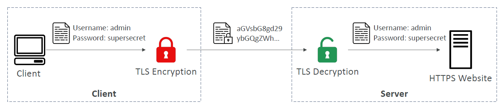

### Server-side encryption at rest

- Data is encrypted after being received by the server
- Data is decrypted before being sent
- It is stored in an encrypted form thanks to a key (usually a data key)
- The encryption / decryption keys must be managed somewhere, and the server must have access to it

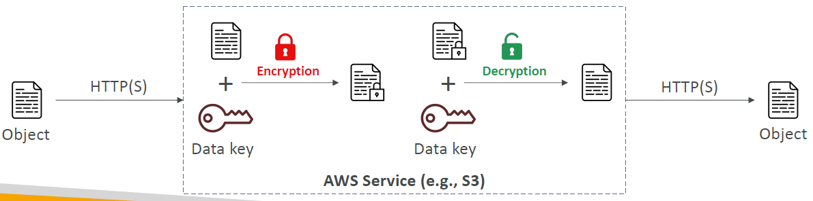

### Client-side encryption

- Data is encrypted by the client and never decrypted by the server
- Data will be decrypted by a receiving client
- The server should not be able to decrypt the data
- Could leverage Envelope Encryption

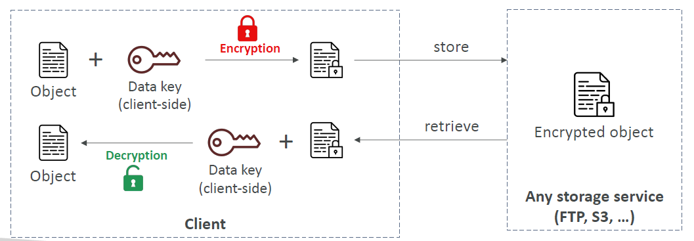

## AWS KMS (Key Management Service)

- Anytime you hear "encryption" for an AWS service, it’s most likely KMS
- AWS manages encryption keys for us
- Fully integrated with IAM for authorization
- Easy way to control access to your data
- Able to audit KMS Key usage using CloudTrail
- Seamlessly integrated into most AWS services (EBS, S3, RDS, SSM…)
- Never ever store your secrets in plaintext, especially in your code!

  - KMS Key Encryption also available through API calls (SDK, CLI)
  - Encrypted secrets can be stored in the code / environment variables

- Types of KMS Keys:
  - AWS Owned Keys (free): SSE-S3, SSE-SQS, SSE-DDB (default key)
  - AWS Managed Key: free (aws/service-name, example: aws/rds or aws/ebs)
  - Customer managed keys created in KMS: $1 / month
  - Customer managed keys imported: $1 / month
  - \+ pay for API call to KMS ($0.03 / 10000 calls)
- Automatic Key rotation:
  - AWS-managed KMS Key: automatic every 1 year
  - Customer-managed KMS Key: (must be enabled) automatic & on-demand
  - Imported KMS Key: only manual rotation possible using alias

### KMS Keys Types

- KMS Keys is the new name of KMS Customer Master Key
- Symmetric (AES-256 keys)
  - Single encryption key that is used to Encrypt and Decrypt
  - AWS services that are integrated with KMS use Symmetric CMKs
  - You never get access to the KMS Key unencrypted (must call KMS API to use)
- Asymmetric (RSA & ECC key pairs)
  - Public (Encrypt) and Private Key (Decrypt) pair
  - Used for Encrypt/Decrypt, or Sign/Verify operations
  - The public key is downloadable, but you can’t access the Private Key unencrypted
  - Use case: encryption outside of AWS by users who can’t call the KMS API

### KMS Key Policies

- Control access to KMS keys, "similar" to S3 bucket policies
- Difference: you cannot control access without them
- Default KMS Key Policy:
  - Created if you don’t provide a specific KMS Key Policy
  - Complete access to the key to the root user = entire AWS account
- Custom KMS Key Policy:
  - Define users, roles that can access the KMS key
  - Define who can administer the key
  - Useful for cross-account access of your KMS key

### Copying Snapshots across regions

#### EBS

1. Take EBS Volume Snapshot from an EBS

   1.1 If the EBS is encrypted, the snapshot will be encrypted with the same KMS key

2. Re-encrypt the snapshot with a different KMS key (something AWS will do for you)

3. Restore from the snapshot that is encrypted with a different KMS key

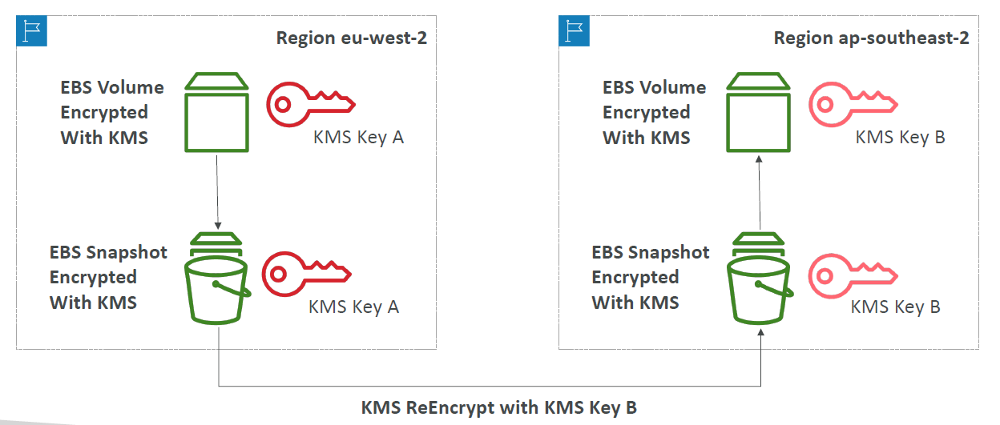

### Copying Snapshots across accounts

1. Create a Snapshot, encrypted with your own KMS Key (Customer Managed Key)
2. Attach a KMS Key Policy to authorize cross-account access
3. Share the encrypted snapshot
4. (in target) Create a copy of the Snapshot, encrypt it with a CMK in your account
5. Create a volume from the snapshot

### Hands on: How to encrypt data

### KMS Multi-Region Keys

- Identical KMS keys in different AWS Regions that can be used interchangeably
- Multi-Region keys have the same key ID, key material, automatic rotation…
- Encrypt in one Region and decrypt in other Regions
- No need to re-encrypt or making cross-Region API calls
- KMS Multi-Region are NOT global (Primary + Replicas)
- Each Multi-Region key is managed independently
- Use cases: global client-side encryption, encryption on Global DynamoDB, Global Aurora

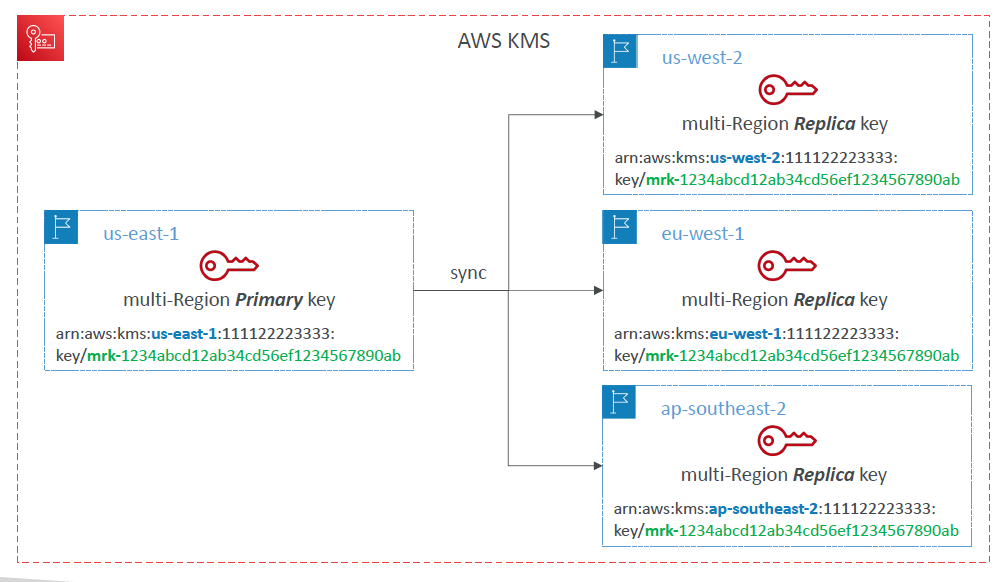

#### DynamoDB Global Tables and KMS Multi-Region Keys Client-Side encryption

- We can encrypt specific attributes client-side in our DynamoDB table using the Amazon DynamoDB Encryption Client
- Combined with Global Tables, the client-side encrypted data is replicated to other regions
- If we use a multi-region key, replicated in the same region as the DynamoDB Global table, then clients in these regions can use lowlatency API calls to KMS in their region to decrypt the data client-side
- Using client-side encryption we can protect specific fields and guarantee only decryption if the client has access to an API key

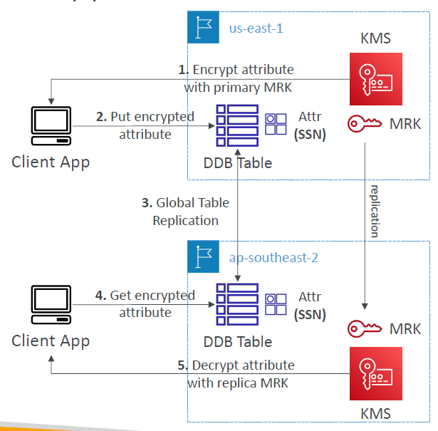

#### Global Aurora and KMS Multi-Region Keys Client-Side encryption

- We can encrypt specific attributes client-side in our Aurora table using the AWS Encryption SDK
- Combined with Aurora Global Tables, the client-side encrypted data is replicated to other regions
- If we use a multi-region key, replicated in the same region as the Global Aurora DB, then clients in these regions can use low-latency API calls to KMS in their region to decrypt the data client-side
- Using client-side encryption we can protect specific fields and guarantee only decryption if the client has access to an API key, we can protect specific fields even from database admins

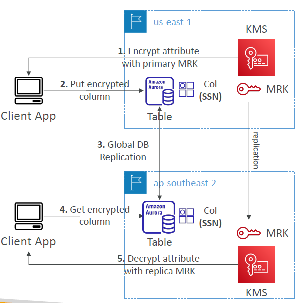

### S3 Replication Encryption Considerations

- Unencrypted objects and objects encrypted with SSE-S3 are replicated by default
- Objects encrypted with SSE-C (customer provided key) can be replicated
- For objects encrypted with SSE-KMS, you need to enable the option
- Specify which KMS Key to encrypt the objects within the target bucket
- Adapt the KMS Key Policy for the target key
- An IAM Role with kms:Decrypt for the source KMS Key and kms:Encrypt for the target KMS Key
- You might get KMS throttling errors, in which case you can ask for a Service Quotas increase
- You can use multi-region AWS KMS Keys, but they are currently treated as independent keys by Amazon S3 (the object will still be decrypted and then encrypted)

### AMI Sharing Process Encrypted via KMS

1. AMI in Source Account is encrypted with KMS Key from Source Account
2. Must modify the image attribute to add a Launch Permission which corresponds to the specified target AWS account
3. Must share the KMS Keys used to encrypted the snapshot the AMI references with the target account / IAM Role
4. The IAM Role/User in the target account must have the permissions to DescribeKey, ReEncrypted, CreateGrant, Decrypt
5. When launching an EC2 instance from the AMI, optionally the target account can specify a new KMS key in its own account to re-encrypt the volumes

### SSM Parameter Store

- Secure storage for configuration and secrets
- Optional Seamless Encryption using KMS
- Serverless, scalable, durable, easy SDK
- Version tracking of configurations / secrets
- Security through IAM
- Notifications with Amazon EventBridge
- Integration with CloudFormation

#### SSM Parameter Store Hierarchy

- /my-department/
  - my-app/
    - dev/
      - db-url
      - db-password
    - prod/
      - db-url
      - db-password
  - other-app/
- /other-department/
- /aws/reference/secretsmanager/secret_ID_in_Secrets_Manager
  - to access secrets of secrets manager through the parameter store by using this reference
- /aws/service/ami-amazon-linux-latest/amzn2-ami-hvm-x86_64-gp2 (public)

#### Standard and advanced parameter tiers

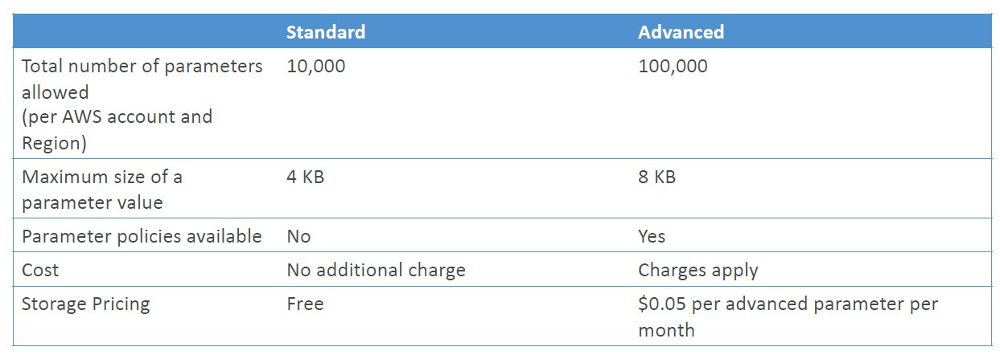

#### Parameters Policies (for advanced parameters)

- Allow to assign a TTL to a parameter (expiration date) to force updating or deleting sensitive data such as passwords
- Can assign multiple policies at a time

##### Commands

- Get parameters:

`aws ssm get-parameters --names parameter_name_1 parameter_name_2`

- Get parameters with decryption:

`aws ssm get-parameters --names parameter_name_1 parameter_name_2 --with-decryption`

- Get parameters by path

`aws ssm get-parameters-by-path --path parameter_path`

- Get parameters by path recursively

`aws ssm get-parameters-by-path --path parameter_path --recursive`

### AWS Secrets Manager

- Newer service, meant for storing secrets
- Capability to force rotation of secrets every X days
- Automate generation of secrets on rotation (uses Lambda)
- Integration with Amazon RDS (MySQL, PostgreSQL, Aurora)
- Secrets are encrypted using KMS
- Mostly meant for RDS integration

#### AWS Secrets Manager – Multi-Region Secrets

- Replicate Secrets across multiple AWS Regions
- Secrets Manager keeps read replicas in sync with the primary Secret
- Ability to promote a read replica Secret to a standalone Secret
- Use cases: multi-region apps, disaster recovery strategies, multi-region DB…

### AWS Certificate Manager (ACM)

- Easily provision, manage, and deploy TLS Certificates
- Provide in-flight encryption for websites (HTTPS)
- Supports both public and private TLS certificates
- Free of charge for public TLS certificates
- Automatic TLS certificate renewal
- Integrations with (load TLS certificates on)
  - Elastic Load Balancers (CLB, ALB, NLB)
  - CloudFront Distributions
  - APIs on API Gateway
- Cannot use ACM with EC2 (can’t be extracted)

#### ACM – Requesting Public Certificates

1. List domain names to be included in the certificate

   - Fully Qualified Domain Name (FQDN): corp.example.com
   - Wildcard Domain: \*.example.com

2. Select Validation Method: DNS Validation or Email validation

   - DNS Validation is preferred for automation purposes
   - Email validation will send emails to contact addresses in the WHOIS database
   - DNS Validation will leverage a CNAME record to DNS config (ex: Route 53)

3. It will take a few hours to get verified
4. The Public Certificate will be enrolled for automatic renewal

   - ACM automatically renews ACM-generated certificates 60 days before expiry

#### ACM – Importing Public Certificates

- Option to generate the certificate outside of ACM and then import it
- No automatic renewal, must import a new certificate before expiry
- ACM sends daily expiration events starting 45 days prior to expiration
  - The # of days can be configured
  - Events are appearing in EventBridge
- AWS Config has a managed rule named acm-certificate-expiration-check to check for expiring certificates (configurable number of days)

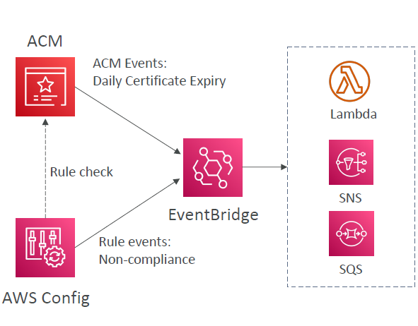

#### ACM – Integration with ALB

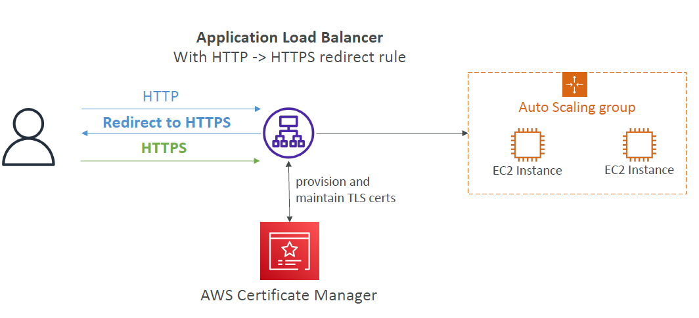

#### API Gateway - Endpoint Types

- Edge-Optimized (default): For global clients
  - Requests are routed through the CloudFront Edge locations (improves latency)
  - The API Gateway still lives in only one region
- Regional:
  - For clients within the same region
  - Could manually combine with CloudFront (more control over the caching strategies and the distribution)
- Private:
  - Can only be accessed from your VPC using an interface VPC endpoint (ENI)
  - Use a resource policy to define access

#### ACM – Integration with API Gateway

- Create a Custom Domain Name in API Gateway
- Edge-Optimized (default): For global clients
  - Requests are routed through the CloudFront Edge locations (improves latency)
  - The API Gateway still lives in only one region
  - The TLS Certificate must be in the same region as CloudFront, in us-east-1
  - Then setup CNAME or (better) A-Alias record in Route 53
- Regional:
  - For clients within the same region
  - The TLS Certificate must be imported on API Gateway, in the same region as the API Stage
  - Then setup CNAME or (better) A-Alias record in Route 53

### AWS WAF – Web Application Firewall

- Protects your web applications from common web exploits (Layer 7)
- Layer 7 is HTTP (vs Layer 4 is TCP/UDP)
- Deploy on
  - Application Load Balancer
  - API Gateway
  - CloudFront
  - AppSync GraphQL API
  - Cognito User Pool
- Define Web ACL (Web Access Control List) Rules:
  - IP Set: up to 10,000 IP addresses – use multiple Rules for more IPs
  - HTTP headers, HTTP body, or URI strings Protects from common attack - SQL injection and Cross-Site Scripting (XSS)
  - Size constraints, geo-match (block countries)
  - Rate-based rules (to count occurrences of events) – for DDoS protection
- Web ACL are Regional except for CloudFront
- A rule group is a reusable set of rules that you can add to a web ACL

#### WAF – Fixed IP while using WAF with a Load Balancer

- WAF does not support the Network Load Balancer (Layer 4)
- We can use Global Accelerator for fixed IP and WAF on the ALB

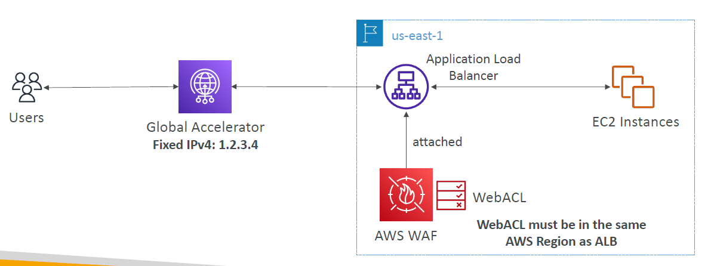

### AWS Shield: protect from DDoS attack

- DDoS: Distributed Denial of Service – many requests at the same time
- AWS Shield Standard:
  - Free service that is activated for every AWS customer
  - Provides protection from attacks such as SYN/UDP Floods, Reflection attacks and other layer 3/layer 4 attacks
- AWS Shield Advanced:
  - Optional DDoS mitigation service ($3,000 per month per organization)
  - Protect against more sophisticated attack on Amazon EC2, Elastic Load Balancing (ELB), Amazon CloudFront, AWS Global Accelerator, and Route 53
  - 24/7 access to AWS DDoS response team (DRP)
  - Protect against higher fees during usage spikes due to DDoS
  - Shield Advanced automatic application layer DDoS mitigation automatically creates, evaluates and deploys AWS WAF rules to mitigate layer 7 attacks

### AWS Firewall Manager

- Manage rules in all accounts of an AWS Organization
- Security policy: common set of security rules
  - WAF rules (Application Load Balancer, API Gateways, CloudFront)
  - AWS Shield Advanced (ALB, CLB, NLB, Elastic IP, CloudFront)
  - Security Groups for EC2, Application Load BAlancer and ENI resources in VPC
  - AWS Network Firewall (VPC Level)
  - Amazon Route 53 Resolver DNS Firewall
  - Policies are created at the region level
- Rules are applied to new resources as they are created (good for compliance) across all and future accounts in your Organization

### WAF vs. Firewall Manager vs. Shield

- WAF, Shield and Firewall Manager are used together for comprehensive protection
- Define your Web ACL rules in WAF
- For granular protection of your resources, WAF alone is the correct choice
- If you want to use AWS WAF across accounts, accelerate WAF configuration, automate the protection of new resources, use Firewall Manager with AWS WAF
- Shield Advanced adds additional features on top of AWS WAF, such as dedicated support from the Shield Response Team (SRT) and advanced reporting.
- If you’re prone to frequent DDoS attacks, consider purchasing Shield Advanced

### AWS Best Practices for DDoS Resiliency

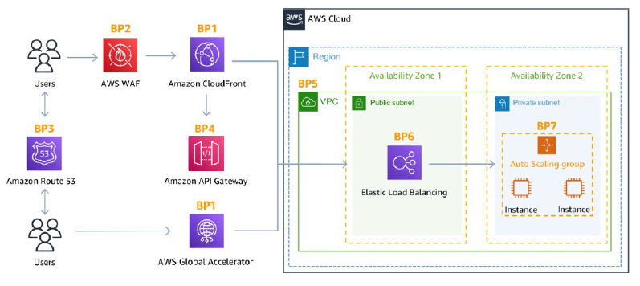

#### Edge Location Mitigation (BP1, BP3)

- BP1 – CloudFront
  - Web Application delivery at the edge
  - Protect from DDoS Common Attacks (SYN floods, UDP reflection…)
- BP1 – Global Accelerator
  - Access your application from the edge
  - Integration with Shield for DDoS protection
  - Helpful if your backend is not compatible with CloudFront
- BP3 – Route 53
  - Domain Name Resolution at the edge
  - DDoS Protection mechanism

#### Best Practices for DDoS mitigation

- Infrastructure layer defense (BP1, BP3, BP6)
  - Protect Amazon EC2 against high traffic
  - That includes using Global Accelerator, Route 53, CloudFront, Elastic Load Balancing
- Amazon EC2 with Auto Scaling (BP7)
  - Helps scale in case of sudden traffic surges including a flash crowd or a DDoS attack
- Elastic Load Balancing (BP6)
  - Elastic Load Balancing scales with the traffic increases and will distribute the traffic to many EC2 instances

#### Application Layer Defense

- Detect and filter malicious web requests (BP1, BP2)
  - CloudFront cache static content and serve it from edge locations, protecting your backend
  - AWS WAF is used on top of CloudFront and Application Load Balancer to filter and block requests based on request signatures
  - WAF rate-based rules can automatically block the IPs of bad actors
  - Use managed rules on WAF to block attacks based on IP reputation, or block anonymous Ips
  - CloudFront can block specific geographies
- Shield Advanced (BP1, BP2, BP6)
  - Shield Advanced automatic application layer DDoS mitigation automatically creates, evaluates and deploys AWS WAF rules to mitigate layer 7 attacks

#### Attack surface reduction

- Obfuscating AWS resources (BP1, BP4, BP6)
  - Using CloudFront, API Gateway, Elastic Load Balancing to hide your backend resources (Lambda functions, EC2 instances)
- Security groups and Network ACLs (BP5)
  - Use security groups and NACLs to filter traffic based on specific IP at the subnet or ENI-level
  - Elastic IP are protected by AWS Shield Advanced
- Protecting API endpoints (BP4)
  - Hide EC2, Lambda, elsewhere
  - Edge-optimized mode, or CloudFront + regional mode (more control for DDoS)
  - WAF + API Gateway: burst limits, headers filtering, use API keys

### Amazon GuardDuty

- Intelligent Threat discovery to protect your AWS Account
- Uses Machine Learning algorithms, anomaly detection, 3rd party data
- One click to enable (30 days trial), no need to install software
- Input data includes:
  - CloudTrail Events Logs – unusual API calls, unauthorized deployments
    - CloudTrail Management Events – create VPC subnet, create trail, …
    - CloudTrail S3 Data Events – get object, list objects, delete object, …
  - VPC Flow Logs – unusual internal traffic, unusual IP address
  - DNS Logs – compromised EC2 instances sending encoded data within DNS queries
  - Optional Features – EKS Audit Logs, RDS & Aurora, EBS, Lambda, S3 Data Events…
- Can setup EventBridge rules to be notified in case of findings
- EventBridge rules can target AWS Lambda or SNS
- Can protect against CryptoCurrency attacks (has a dedicated "finding" for it)

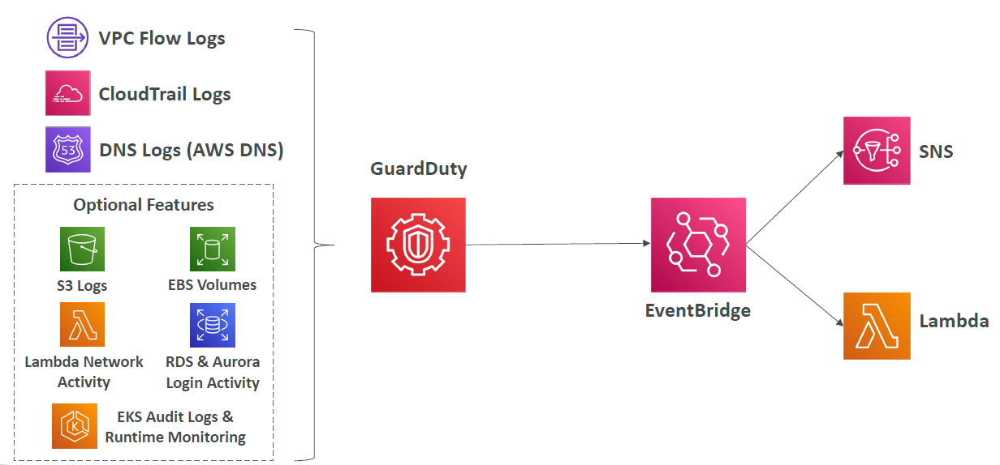

### Amazon Inspector

- Automated Security Assessments
- For EC2 instances
  - Leveraging the AWS System Manager (SSM) agent
  - Analyze against unintended network accessibility
  - Analyze the running OS against known vulnerabilities
- For Container Images push to Amazon ECR
  - Assessment of Container Images as they are pushed
- For Lambda Functions
  - Identifies software vulnerabilities in function code and package dependencies
  - Assessment of functions as they are deployed
- Reporting & integration with AWS Security Hub
- Send findings to Amazon Event Bridge

#### What does Amazon Inspector evaluate?

- Remember: only for EC2 instances, Container Images & Lambda functions
- Continuous scanning of the infrastructure, only when needed
- Package vulnerabilities (EC2, ECR & Lambda) – database of CVE
- Network reachability (EC2)
- A risk score is associated with all vulnerabilities for prioritization

### AWS Macie

- Amazon Macie is a fully managed data security and data privacy service that uses machine learning and pattern matching to discover and protect your sensitive data in AWS.
- Macie helps identify and alert you to sensitive data, such as personally identifiable information (PII)
