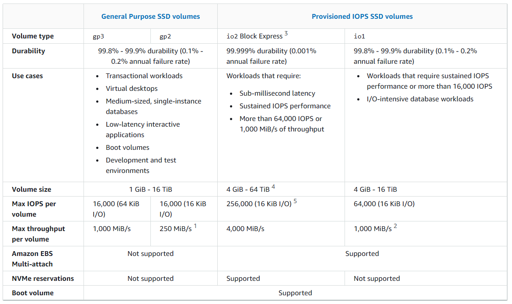
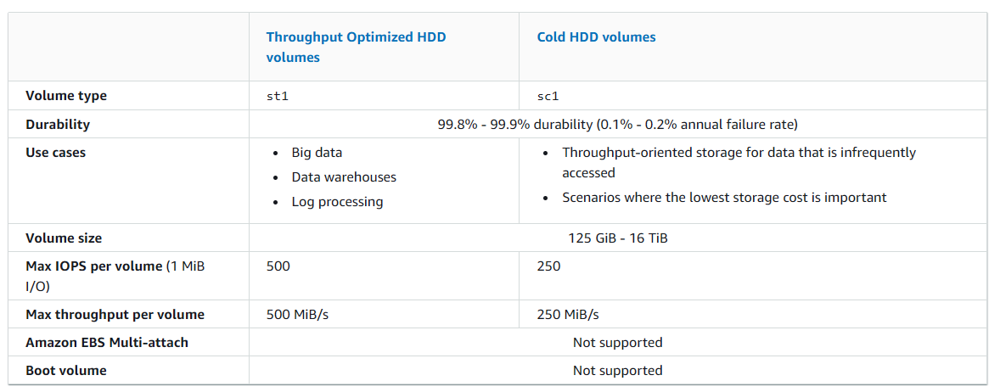

# Aurora

## Aurora replicas

- Independent endpoints in an Aurora DB cluster
- Best used for scaling read operations and increasing availability
- Up to 15 Aurora replicas to be distributed across the availability zones that a DB cluster spans within an AWS region
- Replica lag varies depending on the rate of database change
- Fully dedicated to read operations on your cluster volume

### Failover option

- Aurora Replicas can be used as failover targets. If the primary instance fails, an Aurora Replica is promoted to the primary instance

## What is the best solution to separate the read requests from the write requests?

Create a read replica and modify the application to use the appropriate endpoint.

# Elastic Beanstalk

## Supported load balancer type:

- Classic Load Balancer (deprecated)
- Network Load Balancer:
  - An network layer load balancer
  - Routes TCP request traffic to different ports on environment instances
  - Supports both **active** and **passive** health checks.
- Application Load Balancer:
  - An application layer load balancer
  - Routes HTTP or HTTPs request traffic to different ports on environment instances based on the request path

# AWS Fargate

# AWS FSx for Lustre

- Easy and cost effective to launch and run popular file systems
- Supports concurrent access
- Use it for workloads where speed matters
  - machine learning
  - high performance computing
  - video processing
  - financial modeling

## Integration

- S3

# AWS Global Accelerator

# EC2

## How to

### Create a copy of your EC2:

https://aws.amazon.com/premiumsupport/knowledge-center/copy-ami-region/

1. Create an AMI of your EC2 instance
2. Copy the AMI of your EC2 instance to another AWS Region
3. After the copy operation completes, launch a new EC2 instance from your AMI in the new AWS Region

### How do I attach backend instances with private IP addresses to my internet-facing load balancer in ELB?

https://repost.aws/knowledge-center/public-load-balancer-private-ec2

## Auto Scaling

## ELB

### Network Load Balancer

- Handle Layer 4 traffic

## Types

## Placement group

### Cluster placement groups - low latency and high throughput

- logical grouping of instances within a single AZ
- can span peered VPCs in the same region
- Instances in the same cluster placement group
  - higher per-flow throughput limit of up to 10 gbps for TCP/IP traffic
  - placed in the same high-bisection bandwidth segment of the network
- Recommended for application
  - benefit from low network latency
  - high network throughput
  - or both
  - when the majority of the network traffic is between the instances in the group

### Partition placement groups:

- Help reduce the likelihood of correlated hardware failures for your application
- each partition within a placement group has its own set of racks
  - each rack has its own network and power source
- Can be used to
  - Deploy large distributed and replicated workloads, such as
    - HDFS
    - HBase
    - Cassandra
- Recommended for applications
  - have a small number of critical instances that should be kept separate from each other

# EBS

## Types

### General Purpose SSD (gp3)

### General Purpose SSD (gp2)

### Provisioned IOPS SSD (io1)

### Provisioned IOPS SSD (io2)

### Cold HDD (sc1)

### Throughput Optimized HDD (st1)

Provide low-cost magnetic storage that is a good fit for large, sequential workloads, such as

- Amazon EMR
- ETL
- Data warehouse
- Log processing

#### Tips

- huge amount of data + sequential processing + consistent = EBS Throughput Optimized HDD

### Magnetic (standard)

## Metrics

### Solid state drive (SSD) volumes

### Hard disk drive (HDD) volumes

# API Gateway

# Amazon DynamoDB

key-value store + changeable schema = Amazon DynamoDB

- Fully managed
- multi-region
- multi-master
- durable db with built-in security, backup and restore
- in-memory caching
- key-value document db
- single-digit millisecond performance at any scale
- can handle more than 10 trillion requests per day
  - support peaks of more than 20 million requests per second

# Route 53

- CNAME
- Alias
- etc.

## Health check

- active-active failover
  - Use this failover configuration when you want all of your resources to be available the majority of the time, when a resource becomes unavailable, Route 53 can detect that it's unhealthy and stop including it when responding to queries
  - all the records that have the same name, the same type (such as A or AAAA), and the same routing policy (such as weighted or latency) are active unless Route 53 considers them unhealthy
- active-passive failover
  - Use an this failover configuration when you want a primary resource or group of resources to be available the majority of the time and you want a secondary resource or group of resources to be on standby in case all the primary resources become unavailable

# AWS database types

## Amazon Redshift

# S3

## Pre-signed URL

### Upload with pre-signed url

https://docs.aws.amazon.com/AmazonS3/latest/userguide/PresignedUrlUploadObject.html

## Tier

# VPC

## NAT Gateway

- Enable instances in a private subnet to connect to the internet or other AWS services
- Prevent the internet from initiating a connection with those instances

### Tips

- provide internet to private subnet = use NAT gateway

## VPC Flow logs

- Capture information about the IP traffic going to and from network interfaces in your VPC
- Can publish log to **Cloudwatch** logs or **S3**
- Can help with the following tasks
  - Diagnosing overly restrictive security group rules
  - Monitoring the traffic that is reaching your instance
  - Determining the direction of the traffic to and from the network interfaces

# Messaging

## SQS - decouple the web application from the database

## SNS

### 2 Types of message queues:

- Standard queues
  - offer maximum throughput
  - best-effort ordering
  - at least once delivery
- FIFO queues
  - guarantee the messages are processed **exactly once** in the **exact order** that they are sent

# Snowball Family

data transport solution that accelerates moving **terabytes to petabytes** of data into and out of AWS using storage appliances designed to be secure for **physical transport**

Using snowball helps eliminate challenges:

- high network costs
- long transfer times
- security concerns

# AWS Direct Connect

a cloud service solution that makes it easy to establish a dedicated network connection from your premises to AWS

- Establish private connectivity between AWS and your data center, office, or colocation environment

# CloudTrail

a service that enables governance, compliance, operational auditing, and risk auditing of your AWS account

# Amazon RDS (Relational Database Service)

# CloudFront

a fast content delivery network (CDN) service that securely delivers data, videos, applications, and APIs to customers globally with low latency, high transfer speeds, all within a developer-friendly environment

# Kinesis Firehose

the easiest way to reliably load streaming data into data lakes, data stores and analytics tools
