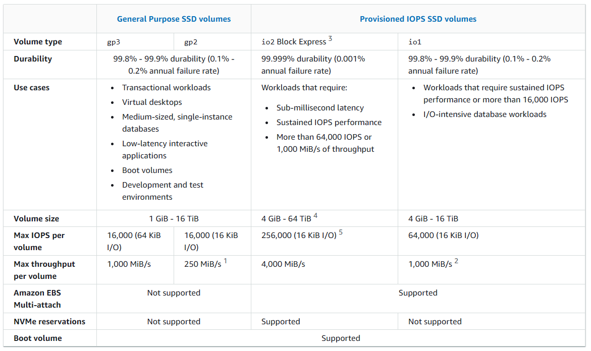
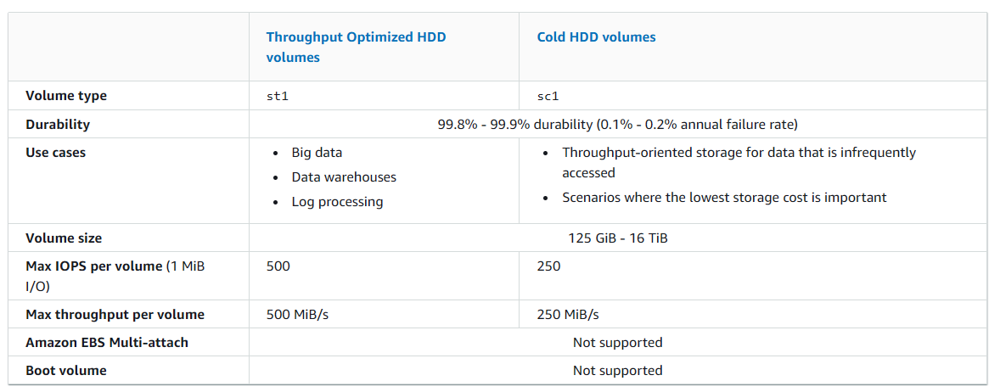

# Aurora

## DB Cloning feature

- copy-on-write protocol, in which data is copied only at the time the data changes, either on the source database or the clone database
- much faster than a manual snapshot of the DB cluster
- limited to 15 clones based on a copy, including clones based on other clones
- clone databases must be created in the same region as the source databases (**NO across AWS regions**)

## Backtracking

- "rewind" the DB cluster to any time you specify
- much faster than restoring a DB cluster via point-in-time restore or via manual DB cluster snapshot
- doesn't require a new DB cluster and rewinds the DB cluster in minutes

## Tips

- transactional + scalable database + high write consistency + linked tables = Amazon Aurora

## Aurora replicas

- Independent endpoints in an Aurora DB cluster
- Best used for scaling read operations and increasing availability
- Up to 15 Aurora replicas to be distributed across the availability zones that a DB cluster spans within an AWS region
- Replica lag varies depending on the rate of database change
- Fully dedicated to read operations on your cluster volume

### Failover option

- Aurora Replicas can be used as failover targets. If the primary instance fails, an Aurora Replica is promoted to the primary instance

## What is the best solution to separate the read requests from the write requests?

Create a read replica and modify the application to use the appropriate endpoint.

## Aurora Serverless

- on-demand
- auto-scaling
- auto start up, shut down
- cost-effective

# Elastic Beanstalk

## Supported load balancer type:

- Classic Load Balancer (deprecated)
- Network Load Balancer:
  - An network layer load balancer
  - Routes TCP request traffic to different ports on environment instances
  - Supports both **active** and **passive** health checks.
- Application Load Balancer:
  - An application layer load balancer
  - Routes HTTP or HTTPs request traffic to different ports on environment instances based on the request path

# AWS Fargate

# EFS

- Scale automatically
- Accessed concurrently by multiple EC2
- Supports traditional file system permissions
  - managed with **POSIX** permissions, which allows you to set access control on a file-by-file and directory-by-directory basis

## Lifecycle policies

By default:

- Transition into IA is set to 30 days since last access
  - Min: 1 day
  - Max: 365 days
- Transition into Archive is set to 90 days since last access
  - Min: 1 day (depending on Transition into IA's max day)
  - Max: 365 days
- Transition into Standard is set to None

## EFS Infrequent Access

a storage class that provides price/performance that is cost-optimized for files not accessed every day, with storage prices up to 92% lower compared to Amazon EFS Standard. The EFS IA storage class costs only $0.025/GB-month

To get started with EFS IA, simply enable EFS Lifecycle Management for your file system by selecting a lifecycle policy that matches your needs

# AWS FSx for Lustre

- Easy and cost effective to launch and run popular file systems
- Supports concurrent access
- Use it for workloads where speed matters
  - machine learning
  - high performance computing
  - video processing
  - financial modeling

## Integration

- S3

# FSx for windows file server

With Amazon FSx, you can leverage the rich feature sets and fast performance of widely-used open source and commercially-licensed file systems, while avoiding time-consuming administrative tasks like hardware provisioning, software configuration, patching, and backups

- Supports
  - DFS (Distributed File System) namespaces
  - DFS (Distributed File System) Replication (DFSR)
- Protocols
  - SMB
  - Windows NTFS

# AWS Global Accelerator

provides improved performance and availability by directing user traffic to the optimal AWS endpoint based on health, geography, and routing policies. It helps **reduce latency** by directing users to the nearest AWS edge location and then routing traffic to the appropriate region.

- Static IP Addresses: Provides two static IP addresses for whitelisting.
- Global Traffic Management: Routes traffic to the nearest or healthiest endpoint based on latency and health checks.
- Regional Failover: Automatically reroutes traffic to healthy endpoints if one region becomes unavailable.

# EC2

## Bastion host

Bastion Hosts are using the SSH protocol, which is a TCP based protocol on port 22

NOTE: An ALB operates at layer 7, only supports HTTP traffic, so ALB cannot be used for Bastion host

## Elastic Fabric Adapter

https://aws.amazon.com/hpc/efa/

a network interface for Amazon EC2 instances that enables customers to run applications requiring high levels of inter-node communications at scale on AWS. Its custom-built operating system (OS) bypass hardware interface enhances the performance of inter-instance communications, which is critical to scaling these applications

- Low-Latency Networking
- Scalable
- HPC-Specific Features

## Attributes

### DeleteOnTermination to root EBS volume

If the instance is running, you can set `DeleteOnTermination` to False/True using the command line

## Placement group

### cluster placement group

provides low latency and high throughput for instances deployed in a single AZ

### spread placement group

- a group of instances that are each placed on distinct racks
- each rack has its own network and power source
- recommended for applications that have a small number of critical instances that should be kept separate from each other
- Max of 7 running instances per AZ per group
- designed for small group of instances

### partition placement group

help reduce the likelihood of correlated hardware failures for your application

- divides each group into logical segments called partitions
- ensures that each partition within a placement group has its own set of racks
- Each rack has its own network and power source
- A partition placement group can have partitions in multiple Availability Zones in the same Region
- maximum of 7 partitions per Availability Zone
- designed for small group of instances

## Instance Types

### On-demand instances

- billed by hour or second
- offer the flexibility to start and stop instances as needed without long-term commitments

#### On-demand capacity reservations

### Spot instances

- can be interrupted with very short notice if AWS needs the capacity for other purposes

### Reserved instances

- cost-effective pricing model for long-term

## How to

### Create a copy of your EC2:

https://aws.amazon.com/premiumsupport/knowledge-center/copy-ami-region/

1. Create an AMI of your EC2 instance
2. Copy the AMI of your EC2 instance to another AWS Region
3. After the copy operation completes, launch a new EC2 instance from your AMI in the new AWS Region

### How do I attach backend instances with private IP addresses to my internet-facing load balancer in ELB?

https://repost.aws/knowledge-center/public-load-balancer-private-ec2

### Public load balancer with private EC2

https://repost.aws/knowledge-center/public-load-balancer-private-ec2

## Instance store

provides temporary block-level storage for your instance

ideal for temporary storage of information that changes frequently, such as buffers, caches, scratch data, and other temporary content, or for data that is replicated across a fleet of instances, such as a load-balanced pool of web servers.

## Auto Scaling

### launch configuration (retired)

One launch configuration can be used in multiple ASG, but you only can specify 1 launch configuration for an ASG.

Once a launch configuration is created, you can't modify it.

To change the launch configuration for an Auto Scaling group, you must create a launch configuration and then update your Auto Scaling group with it.

## default ASG configuration

### Default termination policy

1. identifies which AZ or Zones has the most instances and at least one instance that is not protected from scale in
2. It proceeds to evaluate unprotected instances within the identified AZ as follows:

Instances that use outdated configurations

- For groups that use a launch template – Determine whether any of the instances use outdated configurations, prioritizing in this order:

  1. First, check for instances launched with a launch configuration.

  2. Then, check for instances launched using a different launch template instead of the current launch template.

  3. Finally, check for instances using the oldest version of the current launch template.

- For groups that use a launch configuration – Determine whether any of the instances use the oldest launch configuration.

### Policy types

- Target Tracking Policy
  - allows you to define a target value for a specific metric, such as CPU utilization
- Simple scaling policy
  - adjusts the number of instances based on predefined thresholds

## ELB

- provides access logs that capture detailed information about requests sent to your load balancer
  - Each log contains information such as the time the request was received, the client‘s IP address, latencies, request paths, and server responses. You can use these access logs to analyze traffic patterns and troubleshoot issues

### Cross-zone

Example, an ELB is setup for 2 AZs. AZ-1 has 2 instances, AZ-2 has 8 instances.

- If cross zone is enabled, each instance will get 10% of the traffics.
- If cross zone is disabled, each AZ will have 50% of traffics
  - Each instance in AZ-1 will have 25% of the traffics
  - Each instance in AZ-2 will have 6.25% of the traffics

### Securing network traffic

#### Secure listener

- ALB: HTTPS listener
- NLB: TLS listener
- CLB: Both HTTPS and TLS listener

### Network Load Balancer

- Handle Layer 4 traffic
- can route traffic to targets based on IP addresses
- support cross-VPC routing if IP addresses are used
- by default, cross-zone load balancing is disabled

#### NLB with TCP listener

A Network Load Balancer can handle TCP traffic, but it does not terminate SSL/TLS connections itself

### Application Load Balancer

- Operates at the application layer (layer 7)
- can route traffic based on IP addresses.
- support cross-VPC routing if IP addresses are used
- by default, cross-zone load balancing is enabled

#### Access log

https://docs.aws.amazon.com/elasticloadbalancing/latest/application/load-balancer-access-logs.html

#### Connection log

https://docs.aws.amazon.com/elasticloadbalancing/latest/application/load-balancer-connection-logs.html

### Gateway Load Balancer

- by default, cross-zone load balancing is disabled

#### ALB with HTTPs listener

When you configure an ALB with an HTTPS listener, the load balancer handles the SSL/TLS encryption for incoming traffic. By installing SSL certificates on the ALB, you ensure that traffic between the client and the ALB is encrypted

## Types

## Placement group

### Cluster placement groups - low latency and high throughput

- logical grouping of instances within a single AZ
- can span peered VPCs in the same region
- Instances in the same cluster placement group
  - higher per-flow throughput limit of up to 10 gbps for TCP/IP traffic
  - placed in the same high-bisection bandwidth segment of the network
- Recommended for application
  - benefit from low network latency
  - high network throughput
  - or both
  - when the majority of the network traffic is between the instances in the group

### Partition placement groups:

- Help reduce the likelihood of correlated hardware failures for your application
- each partition within a placement group has its own set of racks
  - each rack has its own network and power source
- Can be used to
  - Deploy large distributed and replicated workloads, such as
    - HDFS
    - HBase
    - Cassandra
- Recommended for applications
  - have a small number of critical instances that should be kept separate from each other

# EBS

- Block storage
- Fault tolerant up to the loss of an instance

## EBS optimized instances

- provide dedicated capacity for Amazon EBS I/O
- optimized instances are designed for use with all EBS volume types.

## RAID Config Options

https://docs.aws.amazon.com/ebs/latest/userguide/raid-config.html

- RAID 0: when I/O performance is more important than fault tolerance
- RAID 1: when fault tolerance is more important than I/O performance

## EBS Data Lifecycle Manager (DLM)

- service provided by AWS that automates the creation, retention, and deletion of EBS snapshots.
- allows you to define lifecycle policies for your EBS volumes, such as creating snapshots at regular intervals (daily, weekly, etc.) and retaining them for a specified duration

## Types

https://docs.aws.amazon.com/ebs/latest/userguide/ebs-volume-types.html

### General Purpose SSD (gp3)

### General Purpose SSD (gp2)

### Provisioned IOPS SSD (io1/io2)

- Critical business applications with sustained IOPS performance
- Or applications that need more than 16,000 IOPS
- Great for databases workloads (sensitive to storage performance and consistency)
- io1 (4 GB - 16 TB):
  - Max PIOPS: 64,000 for **Nitro EC2 instances** & 32,000 for other
  - Can increase PIOPS independently from storage size
- io2 Block Express (4 GB - 64 TB):
  - Sub-millisecond latency
  - Max PIOPS: 256,000 with an IOPS:GB ratio of 1,000:1
- Supports EBS Multi-attach

### Cold HDD (sc1)

### Throughput Optimized HDD (st1)

Provide low-cost magnetic storage that is a good fit for large, **sequential workloads**, such as

- Amazon EMR
- ETL
- Data warehouse
- Log processing

cost-effective option for frequently accessed, throughput intensive workloads with large datasets and large I/O sizes, such as MapReduce, Kafka, log processing, data warehouse, and ETL workloads.

#### Tips

- huge amount of data + sequential processing + consistent = EBS Throughput Optimized HDD

### Magnetic (standard)

## Metrics

### Solid state drive (SSD) volumes

### Hard disk drive (HDD) volumes

# API Gateway

## Caching

- cache endpoint's responses
  - reduce the number of calls made to your endpoint and also improve the latency of requests to your API

# Amazon DynamoDB

## Encryption

Specify an encryption key when you create a new table or switch the encryption keys on an existing table.

- AWS owned key – **Default** encryption type. The key is owned by DynamoDB (no additional charge).

  - cannot view, manage, track, or audit the KMS key

- AWS managed key – The key is stored in your account and is managed by AWS KMS (AWS KMS charges apply).

- Customer managed key – The key is stored in your account and is created, owned, and managed by you. You have full control over the KMS key (AWS KMS charges apply).

## Capacity mode

### On-Demand

- Pay per request for the data reads and writes your app performs on your tables
- Suitable for
  - Create new tables with unkown workloads
  - have unpredictable application traffic
  - prefer the ease of paying for only what you use

### Provisioned

- you specify the number of data reads and writes per second that you require for your application
- you can use auto scaling to automatically adjust your table's capacity based on the specified utilization rate to ensure application performance while reducing costs
- Suitable for
  - have predictable application traffic
  - run applications whose traffic is consistent or ramps gradually
  - can forecast capacity requirements to control costs

## Global table

- fully managed
- maintains data consistency in database tables located in multiple regions
- all tables are master tables, data changes to tables in any region are synchronized with tables in other regions

## Read types

### Eventually consistent (default option)

- may return stale data

### Strongly consistent

- ensures that your application always reads the most recend data

## DynamoDB Stream

captures changes to items in a DynamoDB table and provides a log of these changes. When you enable DynamoDB Streams, you can configure it to capture item-level changes, including inserts, updates, and deletes.

## Tips

### key-value store + changeable schema = Amazon DynamoDB

- Fully managed
- multi-region
- multi-master
- durable db with built-in security, backup and restore
- in-memory caching
- key-value document db
- single-digit millisecond performance at any scale
- can handle more than 10 trillion requests per day
  - support peaks of more than 20 million requests per second

### data in chunks + little latency = NoSQL DB = DynamoDB

### fully managed + scalable + durable + flexible schema =Amazon DynamoDB

## Amazon DynamoDB Accelerator (DAX)

- Fully-managed, highly available, seamless inmemory cache for DynamoDB
- Help solve read congestion by caching
- Microseconds latency for cached data
- Doesn’t require application logic modification (compatible with existing DynamoDB APIs)
- 5 minutes TTL for cache (default)

## Auto scaling

Amazon DynamoDB auto scaling uses the AWS Application Auto Scaling service to dynamically adjust provisioned throughput capacity on your behalf, in response to actual traffic patterns

# Route 53

- CNAME
- Alias
- etc.

## Targets

- Alias records
  - CloudFront distribution
  - Elastic Beanstalk env
  - ELB
  - API Gateway
  - S3
  - VPC interface endpoint

## Health check

- active-active failover
  - Use this failover configuration when you want all of your resources to be available the majority of the time, when a resource becomes unavailable, Route 53 can detect that it's unhealthy and stop including it when responding to queries
  - all the records that have the same name, the same type (such as A or AAAA), and the same routing policy (such as weighted or latency) are active unless Route 53 considers them unhealthy
- active-passive failover
  - Use an this failover configuration when you want a primary resource or group of resources to be available the majority of the time and you want a secondary resource or group of resources to be on standby in case all the primary resources become unavailable

## Routing policies

- Simple routing policy – Use for a single resource that performs a given function for your domain, for example, a web server that serves content for the example.com website.
- Failover routing policy – Use when you want to configure active-passive failover.
- Geolocation routing policy – Use when you want to route traffic based on the location of your users.
- Geoproximity routing policy – Use when you want to route traffic based on the location of your resources and, optionally, shift traffic from resources in one location to resources in another.
- Latency routing policy – Use when you have resources in multiple AWS Regions and you want to route traffic to the region that provides the best latency.
- Multivalue answer routing policy – Use when you want Route 53 to respond to DNS queries with up to eight healthy records selected at random.
- Weighted routing policy – Use to route traffic to multiple resources in proportions that you specify.

## Private Host Zone

https://docs.aws.amazon.com/Route53/latest/DeveloperGuide/hosted-zone-private-creating.html

a container for records for a domain that you host in one or more Amazon virtual private clouds (VPCs)

For each VPC that you want to associate with the Route 53 hosted zone, change the following VPC settings to true:

- enableDnsHostnames
- enableDnsSupport

# AWS database types

## Amazon Redshift

- an enterprise-level, petabyte scale, fully managed data warehousing service
- designed for large scale data set storage and analysis
- cache the result and return the cached result when queries are re-run

### Concurrency scaling

- allows Amazon Redshift to handle an increased number of concurrent queries by temporarily adding more clusters to manage the load. When the number of queries exceeds the capacity of your main cluster, Redshift automatically provisions additional resources to handle the workload.

### To run different queries types (fast and slow) on big data

Use Redshift workload management (WLM)

# S3

## Object Lambda

- Use AWS Lambda Functions to change the object before it is retrieved by the caller application
- Only one S3 bucket is needed, on top of which we create S3 Access Point and S3 Object Lambda Access Points.
- Use Cases:
  - Redacting personally identifiable information for analytics or nonproduction environments.
  - Converting across data formats, such as converting XML to JSON.
  - Resizing and watermarking images on the fly using caller-specific details, such as the user who requested the object.

## Byte-Range Fetches

https://docs.aws.amazon.com/whitepapers/latest/s3-optimizing-performance-best-practices/use-byte-range-fetches.html

Using the Range HTTP header in a GET Object request, you can fetch a byte-range from an object, transferring only the specified portion

## Request header

- s3:x-amz-acl: to specify an ACL in the request
- aws:SecureTransport: to check if the request is sent through HTTP or HTTPS. When this key is true, it means that the request is sent through HTTPS.
- x-amz-server-side-encryption: to encrypt an object at the time of upload. This header tells S3 to encrypt the object using SSE-C, SSE-S3, or SSE-KMS.

## Metadata

cannot be encrypted

## Event Notification

### Destination

- SQS (Standard Queue only)
- SNS
- Lambda
- EventBridge

## Static website URL convention

https://docs.aws.amazon.com/AmazonS3/latest/userguide/WebsiteEndpoints.html

Depending on your Region, your Amazon S3 website endpoint follows one of these two formats.

- s3-website dash (-) Region ‐ http://bucket-name.s3-website-Region.amazonaws.com
- s3-website dot (.) Region ‐ http://bucket-name.s3-website.Region.amazonaws.com

## Storage class analysis

analyze storage access patterns to help you decide when to transition the right data to the right storage class

## Object Lock

- help prevent Amazon S3 objects from being deleted or overwritten for a fixed amount of time or indefinitely
- uses a write-once-read-many (WORM) model to store objects
- help meet regulatory requirements that require WORM storage
- help add another layer of protection against object changes or deletion.

## Glacier vault lock

- helps you to easily deploy and enforce compliance controls for individual S3 Glacier vaults with a Vault Lock policy
- can specify controls such as "write once read many" (WORM) in a Vault Lock policy and lock the policy from future edits
- After a Vault Lock policy is locked, the policy can no longer be changed or deleted.

## Cross-region replication

## Same Region replication (SRR)

automatically copy files from one bucket to another one as they are added to the source bucket

## Syc command

`aws s3 sync`

- uses the CopyObject APIs to copy objects between S3 buckets
- lists the source and target buckets to identify objects that are in the source bucket but that aren‘t in the target bucket
- identifies objects in the source bucket that have different LastModified dates than the objects that are in the target bucket
- sync command on a versioned bucket copies only the current version of the object—previous versions aren‘t copied
- preserves object metadata by default
- can resume

## Batch replication

a feature designed to replicate large amounts of data across S3 buckets in different regions.

- can replicate the following types of objects:
  - Objects that existed before a replication configuration was in place
  - Objects that have previously been replicated
  - Objects that have failed replication

## Transfer Acceleration

## Amazon S3 Transfer Acceleration

Speeds up uploads and downloads by routing traffic through optimized network paths using CloudFront’s edge locations.

## Tips

- S3 is eventually consistent, reading after writing may return old data.
  - S3 provides read-after-write consistency for PUTS of new objects in your S3 bucket in all Regions with one caveat. The caveat is that if you make a **HEAD or GET** request to a key name **before** the object is **created**, then **create** the object shortly after that, a subsequent **GET** might not return the object due to eventual consistency. Amazon S3 offers eventual consistency for overwrite PUTS and DELETES in all Regions

## Pre-signed URL

### Upload with pre-signed url

https://docs.aws.amazon.com/AmazonS3/latest/userguide/PresignedUrlUploadObject.html

## Storage class

- Amazon S3 Standard - General Purpose
- Amazon S3 Standard-Infrequent Access (IA)
  - min 30 days
  - Use Cases: Disaster Recovery, backups
- Amazon S3 One Zone-Infrequent Access
  - Use Cases: storing secondary backup copies of on-premises data, or data you can recreate
- Amazon S3 Glacier Instant Retrieval
  - Low-cost
  - Pricing: price for storage + object retrieval cost
  - Millisecond retrieval, great for data accessed once a quarter
  - Minimum storage duration of 90 days
- Amazon S3 Glacier Flexible Retrieval
  - Low-cost
  - Pricing: price for storage + object retrieval cost
  - Expedited (1 to 5 minutes), Standard (3 to 5 hours), Bulk (5 to 12 hours) – free
  - Minimum storage duration of 90 days
- Amazon S3 Glacier Deep Archive
  - Low-cost
  - Pricing: price for storage + object retrieval cost
  - Standard (12 hours), Bulk (48 hours)
  - Minimum storage duration of 180 days
- Amazon S3 Intelligent Tiering
  - Designed for 3 use cases:
    - Unpredictable workloads
    - Changing access patterns
    - Lack of experience with storage optimization

## Configuring a static website using a custom domain registered with Route 53

https://docs.aws.amazon.com/AmazonS3/latest/userguide/website-hosting-custom-domain-walkthrough.html

# VPC

## VPN

### Virtual Private Gateway (VPG)

A VPG is used to setup an AWS VPN which you can use in combination with Direct Connect to encrypt all data that traverses the Direct Connect link

This combination provides an IPsec-encrypted private connection that also reduces network costs, increases bandwidth throughput, and provides a more consistent network experience than internet-based VPN connections.

## Network Firewall

- stateful
- managed
- intrusion detection and prevention service
- supported by AWS Firewall Manager
- create within the VPC

- filter traffic at the perimeter of your VPC
  - filtering traffic going to and coming from
    - internet gateway
    - NAT gateway
    - VPN
    - AWS Direct Connect

## Internet Gateway

https://docs.aws.amazon.com/vpc/latest/userguide/VPC_Internet_Gateway.html

An internet gateway enables resources in your public subnets (such as EC2 instances) to connect to the internet if the resource has a public IPv4 address or an IPv6 address

## Transit Gateway

It is a network transit hub used to interconnect virtual private clouds (VPCs) and on-premises networks

for secure and highly available communication across VPCs

has no single point of failure or bandwidth bottleneck and can be managed in one place even if the number of connected VPCs increases

**Note**: AWS Transit Gateway can be used for both connecting **on-premises networks to your AWS environment** and for **connecting multiple VPCs within AWS**

## Route table

control the routing of network traffic within a VPC. They determine how traffic is directed between subnets and to/from the internet or other networks but do not provide instance-level traffic filtering or firewall capabilities

## Peering

allows you to route traffic between two VPCs using private IP addresses, avoiding the need for traffic to go over the internet

## default state of VPC security group

- There are no inbound rules and traffic will be implicitly denied
- There is an outbound rule that allows all traffic to all IP addresses

## Private Virtual Interface

A private virtual interface for **AWS Direct Connect** provides a dedicated, private connection between your on-premises network and your Amazon VPC. It allows you to route traffic to your VPC using private IP addresses, bypassing the public internet.

## VPC endpoint

### Types

- Gateway endpoint
  - Provide a private route to the specified AWS service without requiring an internet gateway or NAT device. Traffic between your VPC and the service stays within the Amazon network
- Interface endpoint
  - Create elastic network interfaces (ENIs) with private IP addresses in your VPC

## egress-only internet gateway

- allow outbound **IPv6** traffic from a VPC to the internet while blocking inbound traffic from the internet to the VPC.
- managed AWS service - cost-effective
  - Auto scale

## Security

- https://docs.aws.amazon.com/vpc/latest/peering/vpc-peering-security-groups.html

## NAT Gateway

- For IPv4
- Enable instances in a private subnet to connect to the internet or other AWS services
- Prevent the internet from initiating a connection with those instances

### Tips

- provide internet to private subnet = use NAT gateway

- An internet gateway must be attached to the VPC for any outbound connections to work.

## VPC Flow logs

- Capture information about the IP traffic going to and from network interfaces in your VPC
- Can publish log to **Cloudwatch** logs or **S3**
- Can help with the following tasks
  - Diagnosing overly restrictive security group rules
  - Monitoring the traffic that is reaching your instance
  - Determining the direction of the traffic to and from the network interfaces

# Messaging

## SQS - decouple the web application from the database

### Polling options:

- Short polling: Check new message frequently
- Long polling: Wait for the message

### Visibility timeout

- 30 seconds by default

### Queue types

#### Standard

#### Temporary queue

help you save development time and deployment costs when using common message patterns such as request-response

#### FIFO Queue

#### Delay Queue

postpone the delivery of new messages to a queue for a number of seconds

#### Dead-letter queue

messages that can‘t be processed (consumed) successfully

## SNS

- Good for sending notifications or messages to multiple endpoints
- does NOT guarantee message order
- NOT designed for high-throughput, ordered streaming data

### 2 Types of message queues:

- Standard queues
  - offer maximum throughput
  - best-effort ordering
  - at least once delivery
- FIFO queues
  - guarantee the messages are processed **exactly once** in the **exact order** that they are sent

# Snowball Family

data transport solution that accelerates moving **terabytes to petabytes** of data into and out of AWS using storage appliances designed to be secure for **physical transport**

Using snowball helps eliminate challenges:

- high network costs
- long transfer times
- security concerns

## Snowcone

- Smallest member of AWS Snow family of edge computing and data transfer devices
- portable, rugged, and secure
- pay only for the use of the device and for data transfer out of AWS
  - pay a service fee per job, includes
    - 5 days of device use
    - a per-day fee for every additional day you use the device before sending it back to AWS
    - For jobs longer than 30 days, you can select the monthly rental option and keep the device over the long term
- Data transferred offline into AWS with Snowcone **does not** incur any transfer fees.
- Only data transfer pricing with DataSync need to refer to DataSync pricing page
- Options
  - Snowcone
  - Snowcone SSD

### Use case

Collect, process and move data to AWS, either offline by shipping the device or online with **AWS DataSync**

## Snowball Edge

- Options
  - Compute optimized
    - 52 vCPUs, 42 TB of usable block or object storage, and an optional GPU for use cases such as advanced ML
    - full motion video analysis in disconnected environments
  - Storage optimized
    - 40 vCPUs of compute capacity coupled with 80 TB of usable block or S3-compatible object storage
    - well suited for local storage and large-scale data transfer
- pay a service fee per data transfer job
  - 10 days of on-site Snowball Edge device usage
  - Shipping days are not counted toward the 10 days. After the 10 days, you pay a low per-day fee for each additional day you keep the device

# AWS Direct Connect

a cloud service solution that makes it easy to establish a dedicated network connection from your premises to AWS

- Establish private connectivity between AWS and your data center, office, or colocation environment

# Site to Site VPN

enables you to securely connect your on-premises network or branch office site to your Amazon Virtual Private Cloud (Amazon VPC)

# CloudTrail

a service that enables governance, compliance, operational auditing, and risk auditing of your AWS account

- Event log files are encrypted using S3 server-side encryption (SSE)

## Data Event

- By default, data events are not logged (because high volume operations)
- Amazon S3 object-level activity (ex: `GetObject`, `DeleteObject`, `PutObject`): can separate Read and Write Events
- AWS Lambda function execution activity (the Invoke API)
- CloudTrail `PutAuditEvents` activity on a CloudTrail Lake channel that is used to log events from outside AWS
- Amazon SNS `Publish` and `PublishBatch` API operations on topics

## Management Events

- Operations that are performed on resources in your AWS account
- Examples:
  - Configuring security (IAM `AttachRolePolicy`)
  - Registering devices (for example, EC2 `CreateDefaultVPC`)
  - Configuring rules for routing data (Amazon EC2 `CreateSubnet`)
  - Setting up logging (AWS CloudTrail `CreateTrail`)
- By default, trails are configured to log management events.
- Can separate Read Events (that don’t modify resources) from Write Events (that may modify resources)

# Amazon RDS (Relational Database Service)

https://aws.amazon.com/rds/faqs/

## AWSAuthenticationPlugin

An AWS-provided plugin that works seamlessly with IAM to authenticate your IAM users.

Connect to the DB instance and issue the CREATE USER statement, as shown in the following example:

`CREATE USER jane_doe IDENTIFIED WITH AWSAuthenticationPlugin AS 'RDS';`

## Multi AZ

https://docs.aws.amazon.com/AmazonRDS/latest/UserGuide/Concepts.MultiAZ.html

- automatically provisions and maintains a synchronous standby replica in a different AZ
- Failover is automatically handled
- When failing over, Amazon RDS simply flips the canonical name record (CNAME) for your DB instance to point at the standby

### What will happen when the primary instance of the multi AZ config goes down?

CNAME record will be updated to point to the standby DB

### Apply operation system updates Steps

https://docs.aws.amazon.com/AmazonRDS/latest/UserGuide/USER_UpgradeDBInstance.Maintenance.html#USER_UpgradeDBInstance.Maintenance.Multi-AZ

1. Perform maintenance on the standby.
2. Promote the standby to primary.
3. Perform maintenance on the old primary, which becomes the new standby.

## Scenarios

### heavy read and write queries, and having throughput issues

- Run SELECT queries for stale data on read replica

because replicas might not always be up to date

## RDS maintenance

https://repost.aws/knowledge-center/rds-required-maintenance

### DB engine maintenance

Upgrades to the database engine level **require downtime**. Even if your RDS DB instance uses a Multi-AZ deployment, both the **primary and standby DB instances** upgrade at the same time. This causes downtime until the upgrade completes, and the duration of the downtime varies based on the size of your DB instance

## RDS Proxy

https://aws.amazon.com/rds/proxy/

- fully managed
- highly available
- makes app more scalable
- more resilient to db failures
- more secure
- allow applications to pool and share connections
- improve database efficiency and application scalability

## Security

### SSL/TLS

RDS creates an SSL certificate and installs the certificate on the DB instance when Amazon RDS provisions the instance.

These certificates are signed by a certificate authority

The SSL certificate includes the DB instance endpoint as the Common Name (CN) for the SSL certificate to guard against spoofing attacks.

### Encrypt read replica

- cannot create an encrypted read replica from an unencrypted master DB
- cannot enable encryption after launch time for the master DB instance

#### Steps

1. Take snapshot for the existing master DB instance
2. Encrypt the snapshot
3. Create new encrypted master DB from the snapshot
4. Create encrypted read replica

# CloudFront

a fast content delivery network (CDN) service that securely delivers data, videos, applications, and APIs to customers globally with low latency, high transfer speeds, all within a developer-friendly environment

## Feature

- Geo-restriction (geo-blocking): allows you to distribute or block content to users in specific regions

### Field-level encryption

- allows you to protect sensitive data by encrypting specific data fields in your requests before they are sent to your origin

### Origin groups

- allow you to configure a primary origin and a secondary (backup) origin
  - If the primary origin becomes unavailable, CloudFront automatically fails over to the secondary origin

### multiple origins based on the content type

## Tips

### Use CloudFront Signed Cookies restrict access to multiple files

CloudFront signed cookies allow you to control who can access your content when you don’t want to change your current URLs or when you want to provide access to multiple restricted files

### Use CloudFront Signed URL restrict access to a Single file

## Scenarios

### To deliver video on demand (VOD) streaming with CloudFront

https://docs.aws.amazon.com/AmazonCloudFront/latest/DeveloperGuide/on-demand-video.html

### Only allow user to access S3 via CloudFront

https://docs.aws.amazon.com/AmazonCloudFront/latest/DeveloperGuide/private-content-restricting-access-to-s3.html

#### 2 ways to send authenticated request to S3 origin

- Origin access control (OAC).
- Origin access identity

## CloudFront Functions

- Lightweight functions written in JavaScript
- For high-scale, latency-sensitive CDN customizations
- Sub-ms startup times, millions of requests/second
- Used to change Viewer requests and responses:
  - Viewer Request: after CloudFront receives a request from a viewer
  - Viewer Response: before CloudFront forwards the response to the viewer
- Native feature of CloudFront (manage code entirely within CloudFront)

# Kinesis Firehose

the easiest way to reliably load streaming data into data lakes, data stores and analytics tools

- NOT directly connect with databases or other data services
- Sources:
  - Kinesis Data Stream
  - Lambda
  - Custom App
- Destinations:
  - S3
  - Redshift
  - Elasticsearch
  - Splunk
  - Custom HTTP endpoints

# Kinesis Data Stream

## FAQ (might be important)

https://aws.amazon.com/kinesis/data-streams/faqs/

### How to handle `ProvisionedThroughputExceededException` and keep costs at a minimum?

Use batch messages

## Enhanced Fanout

## Tips

- IOT data + streams + Partition by equipment + s3 = Use Amazon Kinesis Data Streams

# Amazon Kubernetes - EKS

- managed service
- run Kubernetes on AWS
- Applications running on Amazon EKS are fully compatible with applications running on any standard Kubernetes environment

# AWS secrets manager

- auto rotation

# AWS parameter store

- manual rotation

# AWS Cloudformation

simplifies provisioning and management on AWS

## Tips

### administrate VPCs = Use AWS CloudFormation

# AWS Lex

a service for building conversational interfaces into any application using voice and text.

# AWS software version control

# AWS PrivateLink

## Components

## Tips

### allow the application to access service endpoints in the same region = Use AWS PrivateLink

# IAM

- Can create policies that include conditions based on tags

## Policies

### Type

#### identity-based

Attach managed and inline policies to IAM identities (users, groups to which users belong, or roles). Identity-based policies grant permissions to an identity.

#### resource-based

Attach inline policies to resources. The most common examples of resource-based policies are Amazon S3 bucket policies and IAM role **trust policies**. Resource-based policies grant permissions to the principal that is specified in the policy. Principals can be in the same account as the resource or in other accounts.

##### Trust policies

Trust policies define which principal entities (accounts, users, roles, and federated users) can assume the role

#### Permissions boundaries

Use a managed policy as the permissions boundary for an IAM entity (user or role). That policy defines the maximum permissions that the identity-based policies can grant to an entity, but does not grant permissions. Permissions boundaries do not define the maximum permissions that a resource-based policy can grant to an entity.

#### Organizations SCPs

Use an AWS Organizations service control policy (SCP) to define the maximum permissions for account members of an organization or organizational unit (OU). SCPs limit permissions that **identity-based policies** or **resource-based policies** grant to entities (users or roles) within the account, but **do not** grant permissions.

#### Access control lists (ACLs)

Use ACLs to control which principals in **other accounts** can access the resource to which the ACL is attached. ACLs are similar to resource-based policies, although they are the only policy type that does not use the JSON policy document structure. ACLs are cross-account permissions policies that grant permissions to the specified principal. ACLs **cannot** grant permissions to entities within the **same account**.

#### Session policies

Pass advanced session policies when you use the AWS CLI or AWS API to assume a role or a federated user. Session policies limit the permissions that the role or user's identity-based policies grant to the session. Session policies limit permissions for a created session, but do not grant permissions

## Tasks only root account user can do

### Account Management Tasks

- Change account name
- Change root password
- Change root email address
- Change AWS support plan
- Restore IAM user permissiosn
- Close AWS account

### AWS GovCloud (US) Tasks

- Register for GovCloud

### EC2 Tasks

- Register as a seller

### S3 Tasks

- Enable MFA on S3 bucket delete
- Edit or delete an S3 bucket policy that denies all principals

## IAM Identity Center (successor to AWS Single Sign-On)

- One login (single sign-on) for all your
  - AWS accounts in AWS Organizations
  - Business cloud applications (e.g., Salesforce, Box, Microsoft 365, …)
  - SAML2.0-enabled applications
  - EC2 Windows Instances
- Identity providers
  - Built-in identity store in IAM Identity Center
  - 3rd party: Active Directory (AD), OneLogin, Okta…

## Tips

### Every IAM user starts with no permissions

### SSO

- AWS Security Token Service (STS)
  - a web service that enables you to request temporary, limited-privilege credentials for IAM users or for users that you authenticate (such as federated users from an on-premise directory).

## Amazon Cognito

used for authenticating users to web and mobile apps

### Identity Pools

Cognito Identity Pools are used for granting access to AWS resources rather than handling user authentication

### User Pools

AWS Cognito User Pools provide user directory features including sign-up and sign-in services

# AWS Batch

eliminates the need to operate third-party commercial or open source batch processing solutions

# AWS Pen test

https://aws.amazon.com/security/penetration-testing/

# AWS Step Functions

orchestrates serverless workflows including coordination, state, and function chaining as well as combining long-running executions not supported within Lambda execution limits by breaking into multiple steps or by calling workers running on Amazon Elastic Compute Cloud (Amazon EC2) instances or on-premises

# AWS CodeCommit

fully managed source control service that allows you to host secure and scalable Git repositories

# AWS CodeStar

enables you to quickly develop, build, and deploy applications on AWS

# AWS CloudHSM

a cloud-based hardware security module (HSM) that enables you to easily generate and use your own encryption keys on the AWS Cloud

Security level 3

# AWS EMR

a web service that enables businesses, researchers, data analysts, and developers to easily and cost-effectively process vast amounts of data

EMR utilizes a hosted Hadoop framework running on Amazon EC2 and Amazon S3.

# AWS Opswork

a configuration management service that supports Chef and Puppet, which allows you to manage your infrastructure using your existing Chef recipes or Puppet modules

# AWS Directory Service

offers a managed Active Directory solution (AWS Managed Microsoft AD)

- allows you to connect your AWS resources with an existing on-prem Microsoft Active Directory or to set up new, stand-alone directory in the AWS Cloud

# Lambda

- Auto scale

## When to use

- File processing
- Stream processing
- Web Applications
- IoT backends
- Mobile backends

## Lambda Layer

Lambda layer is a .zip file archive that contains supplementary code or data. Layers usually contain library dependencies, a custom runtime, or configuration files

### Reasons why you might consider using layers:

- To reduce the size of your deployment packages
- To separate core function logic from dependencies
- To share dependencies across multiple functions
- To use the Lambda console code editor

# AWS WAF (Web Application Firewall)

designed to protect web applications by filtering and monitoring HTTP/HTTPS requests based on web security rules

It operates at the application layer (Layer 7 of the OSI model) and is typically used with services like Amazon CloudFront and API Gateway

Only supports **ALB**

- block common attack patterns

# Network ACL (Access Control List)

control traffic at the subnet level. They are stateless, meaning you need to define rules for both inbound and outbound traffic explicitly

# AWS Management consoles

# AWS Organization

- provides policy-based management for multiple AWS accounts
- can create member accounts that are part of the org and centrally manage the accounts

## PrincipalOrgID

PrincipalOrgId is used by specifying the Principal element in a resource-based policy. You can specify the organization ID in the condition element

## SCP (Service Control Policies)

manage permissions across multiple AWS accounts. They allow you to specify what actions are allowed or denied at the organizational level.

# AWS DataSync

a service for automating data transfer between on-premises storage and AWS services like S3 **over the internet** or **AWS Direct Connect**

- **Fully automates** and accelerates moving large active datasets to AWS
- Retry and network resiliency mechanisms
- Network optimizations
- Built-in task scheduling
- Monitoring via DataSync API and Console, CloudWatch metrics, events and logs
- Performs data integrity verification both during the transfer and at the end of the transfer
- Natively integrated with S3, EFS, FSx for Windows File Server, CLoudWatch, CloudTrail
  - seamless and secure access
  - detailed monitoring of the transfer
- capable of saturating a 10 Gbps network link
- DataSync works with the following on-premises storage systems:
  - Network File System (NFS)
  - Server Message Block (SMB)
  - Hadoop Distributed File Systems (HDFS)
  - Object storage

# AWS Systems Manager

If you had previously set up AWS Systems Manager to collect logs (e.g., by using the Systems Manager Agent (SSM Agent) and CloudWatch Logs), you might be able to retrieve logs from terminated instances. Systems Manager can manage and collect logs from instances, and if it was configured correctly, it could provide access to historical logs even if the instances have been terminated.

# AWS ElastiCache

can be used as a distributed in-memory cache for session management

## AWS ElastiCache for Redis

- high throughput
- low latency
- high availability (through replication and persistence options)
  - multi-az deployment option
- Supports various data structures

## AWS ElastiCache for Memcached

- high performance
- low latency
- DOES NOT have the advanced feature of Redis, such as persistence and complex data structure

## Redis vs Memcached

https://aws.amazon.com/elasticache/redis-vs-memcached/

# AWS Glue

serverless data integration service that makes it easy for analytics users to discover, prepare, move, and integrate data from multiple sources

- Provides Managed ETL service (runs on serverless Apache Spark Env)
- crawls your data sources
- identifies data formats
- suggests schemas to store your data
- automatically generates the code to run your data transformations and loading processes
- no infrastructure to manage
- provisions, configures, and scales the resources required to run your data integration jobs
- pay only for the resources your jobs use while running.

# AWS Neptune

# AWS SageMaker (for ML)

helps data scientists and developers to prepare, build, train, and deploy high-quality machine learning (ML) models quickly by bringing together a broad set of capabilities purpose-built for ML.

# AWS ECS

## Fargate

- use with ECS to run container without having to manage servers or clusters of EC2 instances
- No need to provision, configure, or scale clusters of VM to run containers
  - No need to to choose server types
  - No need to decide when to scale your clusters or optimize cluster packing

# AWS Cloud Map

- Fully managed solution
- map logical names to the backend services and resources that your app depend on
- helps your app discover resources using
  - AWS SDKs
  - RESTful API calls
  - DNS queries
- serves only healthy resources
  - DynamoDB tables
  - SQS
  - EC2
  - ECS

# Disaster Recovery

## Strategies

https://docs.aws.amazon.com/wellarchitected/latest/reliability-pillar/rel_planning_for_recovery_disaster_recovery.html

### Backup & Restore

- RPO in hours / RTO in 24 Hours
- Data backed up
- No services deployed
- Cost: $

- back up your data and applications into the recovery region

#### Process in the event of a disaster

1. Deploy your infrastructure (using infrastructure as code to reduce RTO)
2. Deploy your code
3. Restore the backed up data to recover from a disaster in the recovery region

### Pilot light

- RPO in minutes / RTO in 10s of minutes
- Data live
- Services idle
- Cost: $$

- A small version of the app is always running in the cloud
- Useful for the critical core (pilot light)
- Very similar to Backup and Restore
- Faster than Backup and Restore as critical systems are already up

#### Process

- Provision a copy of your core workload infrastructure in the recovery region
- Replicate your data into the recovery region and create backups of it there
- Resources required to support data replication and backup, such as databases and object storage, are always on
- Other elements such as application servers or serverless compute are not deployed, but can be created when needed with the necessary configuration and application code

### Warm Standby

- RPO in seconds / RTO in minutes
- Data live
- Services run reduced capacity
- Cost: $$$

- Full system is up and running, but at minimum size
- Upon disaster, we can scale to production load

#### Process

- Maintain a scaled-down but fully functional version of your workload always running in the recovery region
- Business-critical systems are fully duplicated and are always on, but with scaled down fleet
- Data is replicated and live in the recovery Region

### Multi-site active / active

- RPO near zero / RTO potentially zero
- Data live
- live services
- Cost: $$$$

#### Process

- Your workload is deployed to, and actively serving traffic from, multiple AWS Regions
- requires you to synchronize data across Regions
- Possible conflicts caused by writes to the same record in two different regional replicas must be avoided or handled

### Pilot light VS Warm standby

- Pilot light
- cannot process requests without additional action taken first
- require your to turn on servers, possibly deploy additional (non-core) infrastructure and scale up
- Warm standby
- can handle traffic (at reduced capacity levels) immediately
- only requires you to scale up (everything is already deployed and running)

# AWS EventBridge

recommended when you want to build an application that reacts to events from SaaS applications and/or AWS services

the only event-based service that integrates directly with third-party SaaS partners

# AWS Database Migration Service (AWS DMS)

## SOURCES:

- On-Premises and EC2 instances databases: Oracle, MS SQL Server, MySQL, MariaDB, PostgreSQL, MongoDB, SAP, DB2
- Azure: Azure SQL Database
- Amazon RDS: all including Aurora
- Amazon S3
- DocumentDB

## TARGETS:

- On-Premises and EC2 instances databases: Oracle, MS SQL Server, MySQL, MariaDB, PostgreSQL, SAP
- Amazon RDS
- Redshift, DynamoDB, S3
- OpenSearch Service
- Kinesis Data Streams
- Apache Kafka
- DocumentDB & Amazon Neptune
- Redis & Babelfish

## Ongoing replication, or change data capture (CDC)

- capture ongoing changes to the source data store while you are migrating your data to a target

# AWS Cost explorer optimization

help you identify underutilized resources by providing detailed cost and usage reports.

# AWS Compute Optimizer

provides recommendations for instance types based on your current utilization

# AWS Trust Advisor

inspects your AWS environment, and then makes recommendations when opportunities exist to **save money**, **improve system availability and performance**, or help **close security gaps**.

# Athena

- an interactive query service
  - can handle complex queries / analysis
- serverless
- makes it easy to analyze data directly in S3 using standard SQL
- pay only for the queries they run

## Use Cases

- process logs
- perform ad-hoc analysis
- run interactive queries

## Athena Federated Query

you can run SQL queries across data stored in relational, non-relational, object, and custom data sources.

# AWS Storage gateway

https://docs.aws.amazon.com/storagegateway/latest/vgw/WhatIsStorageGateway.html

a hybrid cloud storage service that connects on-premises environments with cloud storage
It is typically used for backup, disaster recovery, and archiving

### Tape gateway

provides a virtual tape library (VTL) that can be used to interface with your existing backup applications as if they were writing to physical tapes. It allows you to move from physical tapes to a virtual tape library in the cloud, minimizing disruption.

### S3 File Gateway

- Configured S3 buckets are accessible using the **NFS** and **SMB** protocol
- Most recently used data is cached in the file gateway
- Supports S3 Standard, S3 Standard IA, S3 One Zone A, S3 Intelligent Tiering
- Transition to S3 Glacier using a Lifecycle Policy
- Bucket access using IAM roles for each File Gateway
- SMB Protocol has integration with **Active Directory (AD)** for user authentication

### Volume Gateway

https://docs.aws.amazon.com/storagegateway/latest/vgw/WhatIsStorageGateway.html#volume-gateway

- **Block storage** using **iSCSI** protocol backed by S3
- Backed by EBS snapshots which can help **restore on-premises volumes**!
- Cached volumes: low latency access to most recent data
- Stored volumes: entire dataset is on premise, scheduled backups to S3

#### Cached volume

https://docs.aws.amazon.com/storagegateway/latest/vgw/StorageGatewayConcepts.html#storage-gateway-cached-concepts

- S3 as primary data storage
- retain frequently accessed data locally in the storage gateway
- minimize the need to scale your on prem storage infrastructure
- providing you app with low-latency access to the frequently accessed data
-

# CloudWatch

## Dashboard

You can share your CloudWatch dashboards with people who do not have direct access to your AWS account.

This enables you to share dashboards across teams, with stakeholders, and with people external to your organization. You can even display dashboards on big screens in team areas or embed them in Wikis and other webpages.

## CloudWatch Alarm Actions

- Stop, Terminate, Reboot, or Recover an EC2 Instance
- Trigger Auto Scaling Action
- Send notification to SNS (from which you can do pretty much anything)

## CloudWatch Logs agents

can be installed on an EC2 instance

NOTE: Replaced by CloudWatch agent

# Quicksight

for the visual representation of data through Dashboards, graphs and various other modes. It has a rich feature set that helps analyze data and the complex relationships that exist between different data features

Non SQL query based analysis

- integrated with AWS CloudTrail

# Security Hub

provides you with a comprehensive view of your security state in AWS and helps you assess your AWS environment against security industry standards and best practices.

# AWS Firewall Manager

security management service that allows you to centrally configure and manage firewall rules across your accounts and applications in AWS Organization

# AWS Macie

# Amazon Quantum Ledger Database

- has a built-in immutable journal that stores an accurate and sequenced entry of every data change
  - the journal is append-only
  - the journal cannot be overwritten or deleted

# AWS Lake Formation

a service that makes it easy to set up a secure data lake in days. A data lake is a centralized, curated, and secured repository that stores all your data, both in its original form and prepared for analysis. With AWS Lake Formation, you can import data from MySQL, PostgreSQL, SQL Server, MariaDB, and Oracle databases running in Amazon Relational Database Service (RDS) or hosted in EC2. Both bulk and incremental data loading are supported.

Use Case: Lake Formation is ideal for creating a centralized data repository where you can aggregate data from multiple sources, including Amazon RDS, and prepare it for Machine Learning analysis. It provides tools to manage data access, ensure data quality, and integrate with other AWS analytics services.

## tag-based access control

With Lake Formation tag-based access control, you can manage permissions using tags and grant cross-account permissions

# AWS Compute Optimizer

helps you identify the optimal AWS resource configurations, such as

- Amazon Elastic Compute Cloud (EC2) instance types
- Amazon Elastic Block Store (EBS) volume configurations
- AWS Lambda function memory sizes

using machine learning to analyze historical utilization metrics. AWS Compute Optimizer provides a set of APIs and a console experience to help you reduce costs and increase workload performance by recommending the optimal AWS resources for your AWS workloads.

# AWS Control Tower

https://docs.aws.amazon.com/controltower/latest/userguide/what-is-control-tower.html

automates the setup of a new landing zone using best practices blueprints for identity, federated access, and account structure.

## Landing Zone

A landing zone is a well-architected, multi-account environment that's based on security and compliance best practices. It is the enterprise-wide container that holds all of your organizational units (OUs), accounts, users, and other resources that you want to be subject to compliance regulation. A landing zone can scale to fit the needs of an enterprise of any size.

# AWS AppSync

https://docs.aws.amazon.com/appsync/latest/devguide/what-is-appsync.html

AWS AppSync enables developers to connect their applications and services to data and events with secure, serverless and high-performing GraphQL and Pub/Sub APIs. You can do the following with AWS AppSync:

- Access data from one or more data sources from a single GraphQL API endpoint.
- Combine multiple source GraphQL APIs into a single, merged GraphQL API.
- Publish real-time data updates to your applications.
- Leverage built-in security, monitoring, logging, and tracing, with optional caching for low latency.
- Only pay for API requests and any real-time messages that are delivered.

# AWS Config

Tracks changes in the configuration of your AWS resources, and it regularly sends updated configuration details to an S3 that you specify. For each resource type that AWS Config records, it sends a configuration history file every 6 hours

# AWS Amplify - web and mobile applications

- A set of tools and services that helps you develop and deploy scalable full stack web and mobile applications
- Authentication, Storage, API (REST, GraphQL), CI/CD, PubSub, Analytics, AI/ML Predictions, Monitoring, …
- Connect your source code from GitHub, AWS CodeCommit, Bitbucket, GitLab, or upload directly

# AWS CodeDeploy

CodeDeploy is a deployment service that automates application deployments to Amazon EC2 instances, on-premises instances, serverless Lambda functions, or Amazon ECS services.

# AWS Service Catalog

AWS Service Catalog enables organizations to create and manage catalogs of IT services that are approved for use on AWS. It allows centrally managed service portfolios, which clients can use on a self-service basis.
