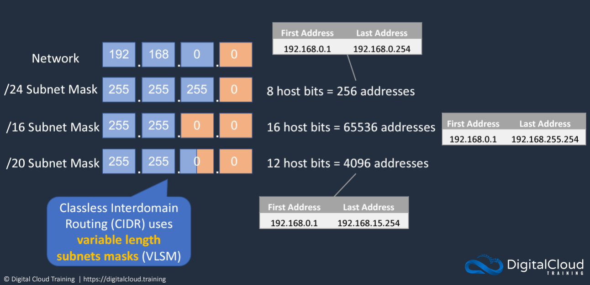

# Classes of IPv4 Address

## Class A

Address: 10.0.0.0

Subnet Mask: 255.0.0.0

- First Assignable address = 10.0.0.1
- Last assignable address = 10.255.255.254
- Total networks = 126
- Usable addresses per network = 16,777,214

## Class B

Address:

| Class | Address     | Subnet Mask   | Description                                                                                                                                                                            |
| ----- | ----------- | ------------- | -------------------------------------------------------------------------------------------------------------------------------------------------------------------------------------- |
| A     | 10.0.0.0    | 255.0.0.0     | <ul><li>First Assignable address = 10.0.0.1</li><li>Last assignable address = 10.255.255.254</li><li>Total networks = 126</li><li>Usable addresses per network = 16,777,214</li></ul>  |
| B     | 172.16.0.0  | 255.255.0.0   | <ul><li>First Assignable address = 176.0.0.1</li><li>Last assignable address = 176.16.255.254</li><li>Total networks = 16,382</li><li>Usable addresses per network = 65,534</li></ul>  |
| C     | 192.168.0.0 | 255.255.255.0 | <ul><li>First Assignable address = 192.168.0.1</li><li>Last assignable address = 192.168.0.254</li><li>Total networks = 2,097,150</li><li>Usable addresses per network = 254</li></ul> |

# Private IP Address Ranges

The following addresses are reserved for private use according to IETF RFC-1918

- 10.0.0.0 -> 10.255.255.255
- 172.16.0.0 -> 172.32.255.255
- 192.168.0.0 -> 192.168.0.255

# Classless Interdomain Routing (CIDR)

## Example

