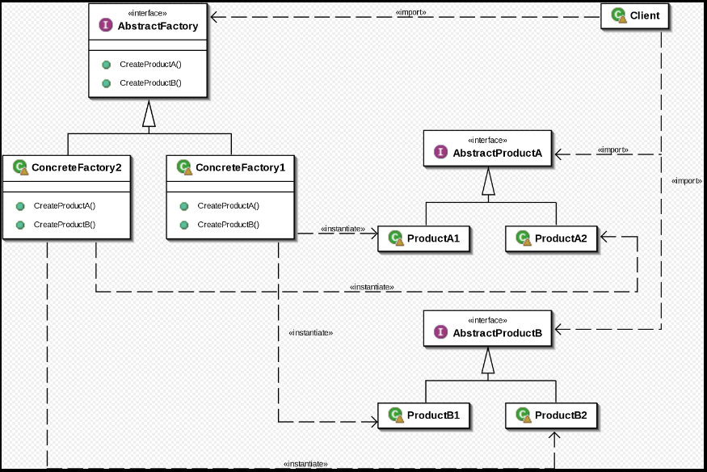

# 动机
在软件系统中, 经常面临着“一系列相互依赖的对象”的创建工作; 同时, 由于需求的变化, 往往存在更多系列对象的创建工作

如何应对这种变化?

如何绕过常规的对象创建方法(new), 提供一种“封装机制“来避免客户程序和这种”多系列具体对象创建工”的紧耦合?

# 意图 (Intent)
提供一个借口, 让该接口负责创建一系列“相关或者相互依赖的对象”, 无需制定它们具体的类 - 《设计模式》GoF

# UML / Structure
