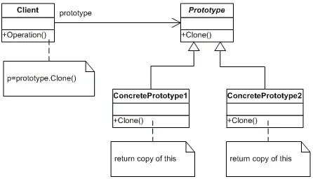

# 动机
在软件系统中, 经常面临着“某些结构复杂的对象”的创建工作; 由于需求的变化, 这些对象经常面临着剧烈的变化, 但是他们却拥有比较稳定一致的接口.

如何应对这种变化? 如何向“客户程序”隔离出“这些易变对象”, 从而使得“依赖这些易变对象的客户程序”不随着需求改变而改变?

# 意图
使用圆形实例指定创建对象的种类, 然后通过拷贝这些原型来创建新的对象 - 《设计模式》GoF

# 结构

# Prototype模式的几个要点

* Prototype模式用羊用于隔离类对象的使用者和具体类型(易变类)之间的耦合关系, 它同样要求这些“易变类”拥有“稳定的接口”
* Prototype模式对于“如何创建易变类的实体对象”采用“原型克隆”的方法来做, 它使得我们可以非常灵活地动态创建“拥有某些稳定接口”的新对象- 所需工作仅仅是注册一个新类的对象(即原型), 然后在任何需要的地方不断的Clone
* Prototype模式中的Clone方法可以利用.NET中的Object类的`MemberwiseClone()`方法或者序列化来实现深拷贝