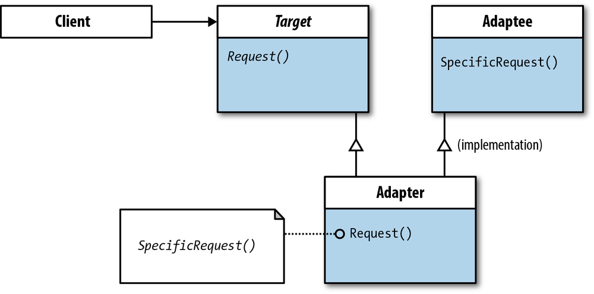

# 动机
在软件系统中, 由于应用环境的变化, 常常需要将“一些现存的对象”放在新的环境中应用, 但是新环境要求的接口是这些现存对象所不满足的.

如何应对这种“迁移的变化”? 如何既能利用现有对象的良好实现, 同时又能满足新的应用环境所要求的接口?

# 意图
将一个类的接口转换成客户希望的另一个接口. Adapter模式使得原本由于接口不兼容而不能一起工作的那些类可以一起工作. - 《设计模式》GoF

# 结构
## 对象适配器 (object adapter)

## 类适配器 (class adapter)

# Adapter模式的几个要点
* Adapter模式主要应用于“希望复用一些现存的类, 但是接口又与复用环境要求不一致的情况”, 在遗留代码复用、类库迁移等方面非常有用.
* GoF23 定义了两种Adapter模式的实现结构: 对象适配器和类适配器. 但类适配器采用“多继承”的实现方式, 带来了不良的高耦合, 所以一般不推荐使用. 对象适配器采用“对象组合”的方式, 更符合松耦合精神.
* Adapter模式可以实现的非常灵活, 不必拘泥于Gof23中定义的两种结构. 例如, 完全可以将Adapter模式中的“现存对象”作为新的接口方法参数, 来达到适配的目的.
* Adapter模式本身要求我们尽可能的使用“面向接口的编程“风格, 这样才能在后期很方便地适配.

# .NET框架中的Adapter应用 (Maybe Old)
* 在.NET中复用COM对象:
  * COM对象不符合.NET对象的接口
  * 使用tlbimp.exe来创建一个Runtime Callable Wrapper(RCW)以使其符合.NET对象的接口.
* .NET数据访问类(Adapter变体):
  * 各种数据库并没有提供DataSet接口
  * 使用DbDataAdapter可以将任何各数据库访问/存取适配到一个DataSet对象上
* 集合类中对现有对象的排序(Adapter变体):
  * 现有对象微实现IComparable接口
  * 实现一个排序适配器(继承IComparer接口), 然后在其Compare方法中对两个对象进行比较.