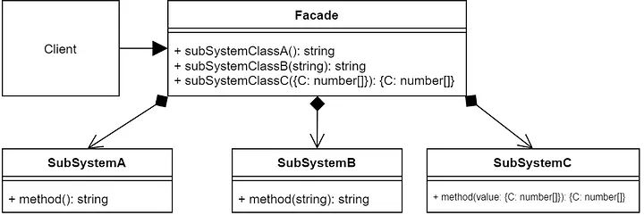

# 系统的复杂度
假设我们需要开发一个坦克模拟系统用于模拟坦克车在各种作战环境中的行为, 其中坦克系统由引擎、控制器、车轮、车身等各子系统构成

```c#
public class Wheel
{
  public void WAction1() {...}
  public void WAction2() {...}
}

public class Engine
{
  public void EAction1() {...}
  public void EAction2() {...}
}

public class Bodywork
{
  public void BAction1() {...}
  public void BAction2() {...}
}

public class Controller
{
  public void CAction1() {...}
  public void CAction2() {...}
}
```
# 动机
组件的客户和组件中各个复杂的子系统有了过多的耦合, 随着外部客户程序和各子系统的演化, 这种过多的耦合面临很多变化的挑战.

如何简化外部客户程序和系统间的交互接口? 如何将外部客户程序的演化和内部子系统的变化之间的依赖相互解耦?

# 结构


# Facade模式的几个要点
* 从客户程序的角度看, Facade模式不仅简化了整个组件系统的接口, 同时对于组件内部与外部客户程序来说, 从某种程度上也达到了一种“解耦”的效果 - 内部子系统的任何变化不会影响到Facade接口的变化

* Facade设计模式更注重从架构的层次去看整个系统, 而不是单个类的层次. Facade很多时候更是一种结构设计模式

* 注意区分Facade模式、Adapter模式、Bridge模式与Decorator模式. Facade注重简化接口, Adapter模式注重转换接口, Bridge模式注重分离接口(抽象)与其实现, Decorator模式注重稳定接口的前提下为对象扩展功能.