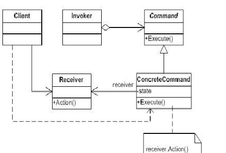

# 耦合与变化

耦合是软件不能抵御变化灾难的根本性原因. 不仅实体对象与实体对象之间存在耦合关系, 实体对象与行为操作之间也存在耦合关系.

# 动机

在软件构建过程中, “行为请求者”与“行为实现者”通常呈现一种“紧耦合”. 但在某些场合 - 比如需要对行为进行“记录、撤销/重做(undo/redo)、事务”等处理, 这种无法抵御变化的紧耦合是不适合的.

在这种情况下, 如何将“行为请求者”与“行为实现者“解耦? 将一组行为抽象为对象, 可以实现二者之间的松耦合.

# 意图

将一个请求封装为一个对象, 从而使你可用不同的请求对客户程序进行参数化; 对请求排队或记录请求日志, 以及支持可撤销的操作. - 《设计模式》GoF

# 结构

# Command模式的几个要点
* Command模式的根本目的在于将“行为请求者”与“行为实现者”解耦, 在面向对象语言中, 常见的实现手段是“将行为抽象为对象”.
* 实现Command接口的具体命令对象ConcreteCommand有时候根据需要可能会保存一些额外的状态信息.
* 通过使用Composite模式, 可以将多个“命令”封装为一个"复合命令“MacroCommand
* Command模式与C#中的Delegate有些类似. 但两者定义行为接口的规范有所区别: Command以面向对象中的”接口-实现”来定义行为接口规范, 更严格, 更符合抽象原则; Delegate以函数签名来定义行为接口规范, 更灵活, 但抽象能力比较弱.

