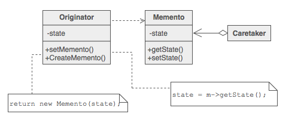

# 动机

在软件构建过程中, 某些对象的状态在转换过程中, 可能由于某种需要, 要求程序能够回溯到对象之前处于某个点时的状态, 便会暴露对象的细节实现.

如何实现对象状态的良好保存与恢复? 但同时又不会因此而破坏对象本身的封装性?

# 意图

在不破坏封装性的前提下, 捕获一个对象的内部状态, 并在该对象之外保存这个状态. 这样以后就可以将该对象恢复到原先保存的状态 - 《设计模式》GoF

# 结构

# Memento模式的几个要点
* 备忘录(Memento)存储原发器(Originator)对象的内部状态, 在需要时恢复原发器状态. Memento模式适用于“由原发器管理, 却又必须存储在原发器之外的信息”
* 在实现Memento模式中, 要防止原发器意外的对象访问备忘录对象. 备忘录对象有两个接口, 一个为原发器使用的宽接口; 一个为其他对象使用的窄接口
* 在实现Memento模式时, 要考虑拷贝对象状态的效率问题, 如果对象开销比较大, 可以采用某种增量式改变来改进Memento模式
