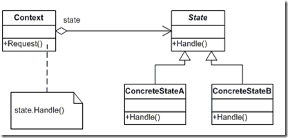

# 动机

在软件构建过程中, 某些对象的状态如果改变, 其行为也会随之而发生变化, 比如文档处于制度状态, 其支持的行为和读写状态支持的行为就可能完全不同.

如何在运行时根据对象的状态来透明地更改对象的行为? 而不会为对象操作和状态转化之间引入紧耦合?

# 意图

允许一个对象在其内部状态改变时改变它的行为. 从而使对象看起来似乎修改了其行为 - 《设计模式》GoF

# 结构

# State模式的几个要点
* State模式将所有与一个特定状态相关的行为都放入一个State的子类对象中, 在对象状态切换时, 切换相应的对象; 但同时维持State的接口, 这样实现了具体操作与状态转换之间的解耦
* 为不同的状态引入不同的对象是的状态转换变得更加明确, 而且可以保证不会出现状态不一致的情况, 因为转换时原子性的 - 即要么彻底转换, 要么不转换
* 如果State对象没有实例变量, 那么各个上下文可以共享同一个State对象, 从而节省对象开销.