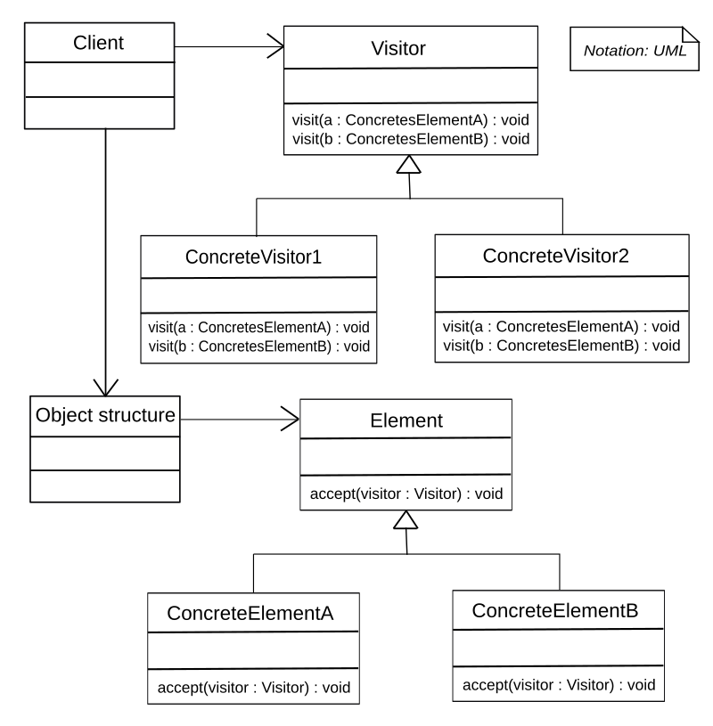

# 动机
在软件构建过程中, 由于需求的改变, 某些类层次结构中常常需要增加新的行为(方法), 如果直接在基类中做这样的更改, 将会给子类带来很繁重的变更负担, 甚至破坏原有设计

如何在不更改类层次结构的前提下, 在运行时根据需要透明地为类层次结构上的各个类动态添加新的操作, 从而避免上述问题?

# 意图

表示一个作用于某对象结构中的各元素的操作. 它可以在不改变各元素的类的前提下定义作用于这些元素的新的操作. - 《设计模式》GoF

# 结构

# Visitor模式的几个要点
* Visitor模式通过所谓双重分发(double dispatch)来实现在不更改Element类层次结构的前提下, 在运行时透明地为类层次结构上的各个类动态天假新的操作.
* 所谓双重分发即Visitor模式中间包括了两个多态分发(注意其中的多态机制): 第一个为accept方法的多态辨析; 第二个为visit方法的多态辨析.
* Visitor模式的最大缺点在于扩展类层次结构(增添新的Element子类), 会导致Visitor类的改变. 因此Visitor模式适用于“Element类层次结构问题, 而其中的操作却经常面临频繁改动”