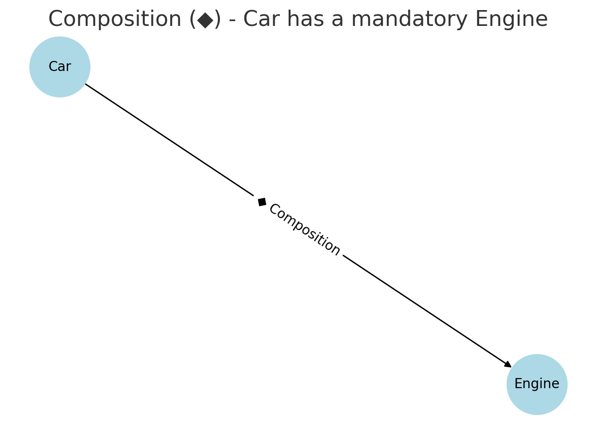

# Fundamentals
## Relationships
### Composition (◆) - “Car has a mandatory Engine”


- Car has an Engine that cannot exist independently.
- When a Car is destroyed, the Engine is also destroyed.
- UML Notation: Solid diamond (◆).
- **Key Takeaway**: Car owns Engine entirely. The engine cannot exist without the car.
```c#
public class Engine
{
    public void Start() => Console.WriteLine("Engine started");
}

public class Car
{
    private readonly Engine _engine; // Composition: Engine is a mandatory part of Car

    public Car()
    {
        _engine = new Engine(); // Engine instance is created inside Car
    }

    public void StartCar()
    {
        _engine.Start();
        Console.WriteLine("Car started");
    }
}

// Usage
var myCar = new Car();
myCar.StartCar();
```

### Aggregation (◇) - “Employee has a shared Department”


-	Employee is associated with a Department.
-	The Department can exist independently of Employee.
-	UML Notation: Hollow diamond (◇).
- **Key Takeaway**: Department exists independently of Employee, and multiple employees can share the same department.

```c#
public class Department
{
    public string Name { get; set; }

    public Department(string name)
    {
        Name = name;
    }
}

public class Employee
{
    public string Name { get; set; }
    public Department Department { get; set; } // Aggregation: Employee has a reference to Department

    public Employee(string name, Department department)
    {
        Name = name;
        Department = department;
    }

    public void ShowDetails()
    {
        Console.WriteLine($"{Name} works in {Department.Name} department.");
    }
}

// Usage
var itDepartment = new Department("IT");
var employee1 = new Employee("Alice", itDepartment);
var employee2 = new Employee("Bob", itDepartment); // Multiple employees share the department

employee1.ShowDetails();
employee2.ShowDetails();
```

### Generalization (△) - “Dog is an Animal”

-	Dog is a type of Animal.
-	Uses inheritance (Dog extends Animal).
-	UML Notation: Hollow triangle (△).
- **Key Takeaway**: Dog inherits from Animal, following the Is-A relationship.
```c#
public class Animal
{
    public virtual void Speak()
    {
        Console.WriteLine("Animal makes a sound");
    }
}

public class Dog : Animal
{
    public override void Speak()
    {
        Console.WriteLine("Dog barks");
    }
}

public class Cat : Animal
{
    public override void Speak()
    {
        Console.WriteLine("Cat meows");
    }
}

// Usage
Animal myDog = new Dog();
myDog.Speak(); // Output: Dog barks

Animal myCat = new Cat();
myCat.Speak(); // Output: Cat meows
```

### Dependency (→) - “Service uses Database”

-	Service depends on Database, but it does not own it.
-	The Database instance can be passed to multiple services.
-	UML Notation: Dashed arrow (→).
- **Key Takeaway**: Service depends on Database, but Service does not own Database. The dependency is temporary.
- 
```c#
public class Database
{
    public void Connect()
    {
        Console.WriteLine("Database connected.");
    }
}

public class Service
{
    public void PerformTask(Database db)
    {
        db.Connect(); // Service is dependent on Database
        Console.WriteLine("Service is performing a task.");
    }
}

// Usage
var database = new Database();
var service = new Service();

service.PerformTask(database);
```

# Pattern Classification
## From the perspective of Purpose
- **Creational**: provide various object creation mechanisms, which increase flexibility and reuse of existing code.

- **Structural**: explain how to assemble objects and classes into larger structures, while keeping these structures flexible and efficient.

- **Behavioral**: are concerned with algorithms and the assignment of responsibilities between objects.

## From the perspective of scope:
- **Class patterns** handle static relationships between classes and subclasses
- **Object patterns** handle dynamic relationships between objects